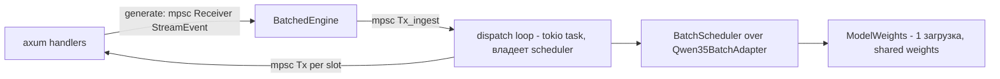

# Batch integration — 4 слота поверх `qwen35-batch` (BD-007)

Статус: дизайн к интеграции (фаза 4 дорожной карты). Цель: обернуть
`BatchScheduler` + `Qwen35BatchAdapter` из крейта `qwen35-batch` в тот же
`trait Engine` (docs/engine-api.md), что реализует single-slot engine —
HTTP-слой не должен знать, какой engine под ним.

## 1. Что уже есть в форке (переиспользуем, не дублируем)

Источник: `/Volumes/Askid Dev/Projects/candle-fork/qwen35-batch/`.

| Компонент | Файл | Что даёт |
|---|---|---|
| `Slot`, `SlotStatus` | `src/slot.rs` | FSM IDLE→PREFILL→DECODE→FINISHED, per-slot bookkeeping (prefill_done, generated, index_pos) |
| `BatchModel` | `src/model.rs` | Трейт: `prefill_chunk` / `decode_batch` / `reset_slot` / `vocab_size` |
| `BatchScheduler<M>` | `src/scheduler.rs` | Очередь `VecDeque<SlotRequest>`, admit из очереди в idle-слоты, `step()` = 1 prefill-чанк ИЛИ 1 batched decode-шаг |
| `Qwen35BatchAdapter` | `src/real/adapter.rs` | `BatchModel` над `ModelWeights`: prefill per-slot через `forward()`, seed в batched buffers (`seed_slot_batched`), decode через `forward_decode_batch([B,1], positions, slots)` |
| `ModelWeights` | `src/real/model_weights.rs` | `from_gguf` / `from_gguf_zero_copy`, `forward(x, index_pos)`, `snapshot_state`/`restore_state`, `clear_state_batched`. `DECODE_BATCH_CAPACITY = 4` (model_weights.rs:1411) — хардкод, совпадает с QWEN36_SLOTS=4 |
| Tokenizer | `src/real/tokenizer.rs` | `load_from_gguf_path`, `build_chatml_text`, `encode_no_think`, `decode_text`, `strip_thinking` |
| Сэмплер | `src/model.rs` | `GreedySampler` (argmax) и трейт `Sampler` |

Валидация механики: `tests/real_qwen35_batch.rs` (parity batched-vs-sequential
bit-exact, batch shrink regression, throughput B=1..4 на реальной Qwen3.5-4B).

## 2. Архитектура обёртки



Ключевое: модель **не Send-friendly для произвольного доступа** (Metal/CUDA
contexts), все вызовы модели сериализованы через ОДИН выделенный
tokio-task (dispatch loop). HTTP-хендлеры с ним общаются только каналами.

### 2.1. Потоки / tasks

- **HTTP tasks** (axum): вызывают `Engine::generate` → получают
  `mpsc::Receiver<StreamEvent>` сразу. Запрос уходит в `tx_ingest`.
- **Dispatch loop** (один `tokio::spawn`, длинноживущий): единственный владелец
  `BatchScheduler<Qwen35BatchAdapter>` и таблицы слотов. Цикл:
  `tokio::select!` на `tx_ingest.recv()` (новые запросы/отмены) и на
  «сделать шаг». Модель вызывается синхронно внутри task'а; GPU-вызовы
  блокирующие → **один шаг scheduler'а = одна итерация**, между шагами
  точки `await` для ingest. Prefill длинного prompt'а — один вызов
  (PREFILL_CHUNK=usize::MAX в форке); прерывание prefill'а не поддерживается
  (потолок форка, см. §7).
- Тяжёлая загрузка GGUF — в `BatchedEngine::load()` (блокирующая, вызывается
  из main до старта axum, в `tokio::task::spawn_blocking`).

### 2.2. Структуры данных

```rust
// В BatchedEngine:
struct BatchedEngine {
    tx_ingest: mpsc::Sender<IngestMsg>,   // в dispatch loop
    info: ModelInfo,
}

enum IngestMsg {
    Admit(AdmitReq),                       // новый запрос
    Cancel { req_id: u64 },                // клиент отключился (Drop guard)
}

struct AdmitReq {
    req_id: u64,
    prompt: Vec<u32>,        // ChatML + no-think, уже токенизирован, уже sliding-window
    params: GenParams,
    out: mpsc::Sender<StreamEvent>,
    // span/log fields
}

// В dispatch loop:
struct SlotBinding {
    req_id: u64,
    out: mpsc::Sender<StreamEvent>,
    params: GenParams,
    prompt_tokens: usize,
    completion_tokens: usize,
    // incremental decode state:
    text_buf: String,          // накопленный текст для stop-строк и стриминга
    last_emitted_chars: usize, // курсор: сколько text_buf уже ушло в Delta
    stop_hit: bool,
    truncated: bool,
}
// Таблицы:
//   bindings: [Option<SlotBinding>; QWEN36_SLOTS] — слот → активный запрос
//   pending: VecDeque<AdmitReq>                   — очередь backpressure (>4)
//   queued_req_ids: HashSet<u64>                  — для Cancel до admit'а
```

`BatchScheduler` форка владеет своей внутренней очередью `VecDeque<SlotRequest>`
и слотами; поверх него `pending` — наша очередь уровня запроса (нужна, т.к. у
форка `submit(prompt, max_new)` не принимает per-request сэмплинг/каналы).

### 2.3. Жизненный цикл запроса (маппинг на форк)

1. `generate(messages, params)`:
   - `build_chatml_text` → sliding window (BD-017: system сохраняется, режем
     старые user/assistant пары, до `QWEN36_CTX - max_tokens`) →
     `encode_no_think` → `AdmitReq` в `tx_ingest`; возвращаем `Receiver`.
2. Dispatch loop принимает `Admit`:
   - есть idle-слот → `sched.submit(prompt, max_new)` (форк admit'нит слот,
     IDLE→PREFILL) → `bindings[idx] = Some(...)`.
   - нет idle → `pending.push_back` (backpressure, §2.5). Ответ клиенту ещё не
     идёт — канал просто молчит до первого Delta.
3. Каждая итерация loop'а, когда есть активные слоты:
   - `sched.step()`:
     - `DidPrefill{first_token_emitted}` → если emitted: забрать первый токен
       слота (sampling — см. §3), streaming decode → `Delta`.
     - `DidDecode(b)` → per active slot: sampled token → incremental
       `decode_text` → `Delta` по курсору `last_emitted_chars`.
     - `Idle` → `tokio::task::yield_now()` (или короткий sleep 1ms — на CPU
       fallback step без работы не должен крутить busy-loop).
4. Слот → FINISHED (EOS | max_tokens | stop-строка): отправить
   `Done{finish_reason, prompt_tokens, completion_tokens, truncated}`,
   `sched` сам держит слот в Finished; мы вызываем приватный reset через
   паттерн из `run_with_collection` — см. §3 «сбор Finished».
   `bindings[idx] = None`, admit следующего из `pending`.
5. Ошибка модели на шаге (anyhow::Error из `step()`): всем активным слотам
   `Error(e.to_string())`, слоты в reset (state под вопросом — conservative:
   `model.clear_state_batched()` + per-slot `reset_slot`), цикл продолжается.
   Процесс не падает (BD-008).

### 2.4. Маршрутизация StreamEvent per slot

`Slot.idx` стабилен → `bindings[idx].out`. Incremental decode: tokenizer
decode последнего куска токенов через `decode_text`; эмитим только прирост
строки (suffix после `last_emitted_chars`). Stop-строки из `params.stop`
проверяем по `text_buf` на каждом шаге (cross-token boundary: держим хвост
`max(stop.len())-1` chars неэмитнутым, пока не доказано отсутствие совпадения —
стандартный holdback, TODO-якорь в коде).

EOS токена в текст не попадает: `decode_text(.., skip_special=true)`.

### 2.5. Backpressure (>4 одновременных)

- `pending: VecDeque<AdmitReq>` без лимита длины по умолчанию; опциональный
  потолок `QWEN36_MAX_QUEUE` (default 64) — сверх него `generate` сразу
  возвращает `Err` → HTTP 429/503 (решает HTTP-слой; в скелете — 503).
- Каналы `mpsc` bounded: `tx_ingest` capacity = max_queue; per-slot `out`
  capacity 64 события — если клиент медленный и не читает SSE,
  `try_send` → при переполнении считаем клиента отвалившимся → Cancel слота
  (иначе один «мёртвый» SSE-клиент остановит весь батч). Это и есть защита
  от head-of-line blocking.

### 2.6. Отмена запроса (drop клиента)

- На стороне handler: `DropGuard` — когда `Receiver` дропнут (клиент
  отключился, axum закрыл SSE), отправляем `IngestMsg::Cancel{req_id}`
  (best-effort, `try_send`).
- В dispatch loop: если req в `pending` — удалить из очереди. Если req уже в
  слоте (PREFILL/DECODE) — пометить binding как cancelled: форк не умеет
  выкидывать слот из батча mid-step; на ближайшем Finished/следующем шаге
  после текущего decode-шага слот принудительно переводим в Finished
  (перестаём эмитить, освобождаем слот). Прерывание mid-prefill — потолок
  форка (prefill неделим), см. §7.
- `out.try_send` ошибка `Closed` → тоже Cancel (дубль-защита без DropGuard).

### 2.7. Snapshot / restore state — где живёт

Вся механика state уже в форке; сервер её НЕ реализует:

- Prefill: `Qwen35BatchAdapter::prefill_chunk` — `reset_for_prefill`
  (clear single-stream state) → `forward()` → `snapshot_state(device, pos)` →
  `slot_snaps[idx]`.
- Переход в decode: `decode_batch` при первом шаге слота вызывает
  `ModelWeights::seed_slot_batched(device, slot, snap)` — DeltaNet state в
  slot-регион batched GPU-буфера, KV в `kv_cache_batched[slot]`.
- Decode: `forward_decode_batch(tokens[B,1], positions[B], slots[B])`;
  persistent state в batched buffers, slot-indirection через `slots[]`
  (batch shrink после раннего EOS — регрессия покрыта тестом форка).
- Освобождение слота: `BatchModel::reset_slot(idx)` (снимок+seed флаги) +
  scheduler `Slot::reset()`. Полный `clear_state_batched` — только при ошибке.

Серверный код об этом знает только как о TODO-anchors: вызовы спрятаны в
`Qwen35BatchAdapter` (см. src/engine_batched.rs TODO-F1..F4).

### 2.8. Таймауты

- Per-request общий deadline: нет жёсткого таймаута в v1 (генерации 8-16K
  токенов могут идти минутами; BD-008 про стабильность). Мягкий watchdog:
  если слот не эмитил ни одного токена `QWEN36_REQ_TIMEOUT` (default 600s) —
  Cancel + `Error("timeout")`. Реализация: `last_progress: Instant` в
  SlotBinding, проверка раз в N итераций.
- TTFT гарантии нет: queued-запрос ждёт слот. Метрика очереди — в логах
  (stdout, BD-014).

### 2.9. Конфиг

| Параметр | env | default |
|---|---|---|
| Слоты | `QWEN36_SLOTS` | 4 (макс = DECODE_BATCH_CAPACITY форка = 4) |
| Длина очереди | `QWEN36_MAX_QUEUE` | 64 |
| Watchdog молчания слота | `QWEN36_REQ_TIMEOUT` | 600 (сек) |

Если `QWEN36_SLOTS > 4` — clamp до 4 с warning в stdout (ограничение форка).

## 3. Сэмплинг per request — разрыв с форком

Форк: `BatchScheduler` держит ОДИН `Box<dyn Sampler>` (greedy) на весь батч;
наши запросы имеют per-request `GenParams` (t/top_p/top_k/min_p/penalties/seed).

Вариант v1 (выбран): **sampling в сервере, не в форке.** Форк сэмплирует
токен внутри `step()` из логитов — но scheduler не отдаёт логиты наружу.
Поэтому для сервера нужен один из:

- (a) Вариант с минимальным патчем форка: новый `Sampler`, который **возвращает
  заранее выбранный токен** — т.е. сервер сам держит логиты? Нет, логиты не
  выходят из step.
- (b) Реальный путь: в сервере использовать форк через свой `Sampler`-shim,
  который по `slot_idx` (недоступен в `Sampler::sample(&[f32])` — сигнатура
  без слота!) — тоже не сходится.

**Вывод:** нужна точка расширения в форке: `Sampler::sample_indexed(&mut self,
slot_idx, logits)` или `BatchScheduler::step_with(&mut self, sampler: &mut dyn
IndexedSampler)`. Это единственное изменение форка, требуемое интеграцией
(помечено TODO-F5 в скелете; патч маленький, кандидат на отдельный PR в форк).
До патча скелет компилируется и работает на greedy (потолок: все слоты greedy,
пресеты BD-016 не применяются — приемлемо для первого прогона стабильности,
где важна механика, не сэмплинг).

penalties (presence/repetition) и seed — в том же indexed sampler'е; stop —
уже серверный (по тексту), от форка не зависит.

## 4. Сбор Finished-слотов (API-зазор форка)

`BatchScheduler::step()` намеренно НЕ сбрасывает Finished (caller-обязанность,
см. `run_with_collection`). Серверный цикл повторяет этот паттерн per-step:
после каждого `step()` пройтись по `sched.slots()`, у Finished — прочитать
`generated_tokens()`, отправить `Done`, вызвать `Slot::reset()`. Нужен
публичный доступ к слотам у форка (сейчас `slots` — приватное поле;
`run_with_collection` внутри крейта). Второе мини-изменение форка:
`pub fn slots_mut(&mut self) -> &mut [Slot]` (TODO-F6). Альтернатива без
патча: не использовать `step()` напрямую, а вести свой dispatch поверх
`BatchModel`-трейта (переписать ~80 строк scheduler'а в сервере) — отвергнуто:
дублирование уже проверенной parity-механики.

## 5. Поток ошибок

| Сбой | Реакция |
|---|---|
| Ошибка `step()` (GPU OOM, kernel) | `Error` всем активным, reset всех слотов + `clear_state_batched`, loop жив |
| Переполнение `out`-канала слота | Cancel слота (slow/dead client) |
| `pending` полон | `generate` → Err → HTTP 503 |
| Watchdog молчания | Cancel + `Error("timeout")` |
| Cancel mid-prefill | отложена до конца prefill (потолок форка) |

## 6. Конфиг-стенд v1 (BD-008)

См. tests/stability_plan.md + scripts/stability_smoke.sh: 4 curl-клиента,
8-16K токенов, контроль процесса и VRAM (nvidia-smi на yttri-win).

## 7. Известные потолки (форка, не сервера)

1. Prefill неделим (PREFILL_CHUNK=usize::MAX): длинный prompt одного клиента
   блокирует decode остальных на время prefill. Mitigation позже: чанк-чекпойнты
   GDN state (форк, beyond scope v1).
2. Cancel mid-prefill невозможен (см. 1).
3. `DECODE_BATCH_CAPACITY = 4` хардкод — QWEN36_SLOTS ≤ 4.
4. Один `Sampler` на батч → нужен indexed-sampler патч (§3).
5. `slots` приватны → нужен accessor (§4).
6. Batched DeltaNet state fp32 без batch-оси на CPU fallback — скорость CPU
   multi-slot низкая (time-multiplex), для критерия v1 не важно (CUDA/Metal).

## 8. План интеграции (порядок)

1. Форк: два мини-патча (indexed sampler, `slots_mut`). Отдельный PR, parity
   тесты форка должны остаться зелёными.
2. Сервер: заменить TODO-F1..F6 в `src/engine_batched.rs` реальными вызовами;
   подключить `qwen35-batch` path-dep (feature real-model + cuda/metal).
3. Прогон `scripts/stability_smoke.sh` на yttri-win (критерий BD-008).
4. Rebase single-slot engine-агента: HTTP-слой переключается на BatchedEngine
   без изменений (тот же trait Engine).
