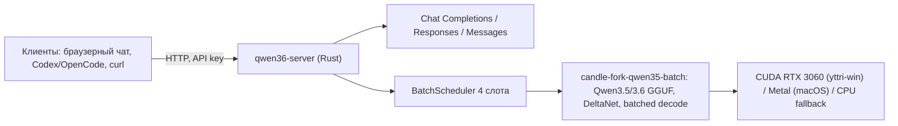

# PROJECT BRIEF — Qwen3.6 27B 2-bit inference server (candle)

Версия 1.0 · 2026-08-07 · Статус: черновик к утверждению

Сопутствующие документы: [interview-log.md](interview-log.md) · [decisions.md](decisions.md) · [open-questions.md](open-questions.md) · [research.md](research.md)

## 1. Суть проекта

Rust-сервер инференса **Qwen3.6-27B** (GGUF, 2-bit) на **собственном candle-форке** (candle-fork-qwen35-batch), с тремя API-интерфейсами и веб-чатом. Целевая площадка — Windows-машина yttri-win (RTX 3060 12 GB). Модель обслуживает **4 одновременных клиента** через готовый batch-планировщик из qwen35-batch.

llama.cpp осознанно НЕ используется как компонент — только как эталон для parity/бенчей (BD-001).

## 2. Проблема и мотивация

- Qwen3.6-27B — текущая сильная открытая coding-модель (agentic coding, thinking preservation), но серверной обвязки на candle для неё нет.
- Владелец уже вложился в candle-форки: реальный GGUF-инференс Qwen3.5-4B, batched decode (Metal+CUDA), валидация на RTX 3060. Проект конвертирует эти наработки в полноценный сервис.
- Статус-кво альтернативы (llama.cpp, LM Studio) отвергнуты: свои разработки считаются лучше и дают контроль над стеком.

## 3. Пользователи

- **Владелец (Askid)** — единственный разработчик и основной пользователь: агентное кодирование, тесты инференс-стека.
- **Клиенты-агенты** (Codex/OpenCode/курсоры) — через OpenAI/Anthropic-совместимые API в LAN.
- Доступ: один мастер-ключ (BD-005), LAN-only, HTTP (BD-006).

## 4. Решение (видение v1)

- **Модель**: unsloth/Qwen3.6-27B-GGUF, стартовый квант **UD-Q2_K_XL (11.8 GB)** → фаза 2: IQ2 (BD-003).
- **Контекст**: 81 920 токенов на старте (BD-009); нативный потолок модели 262 144.
- **Переполнение**: sliding window — system сохраняется, старые пары режутся, `truncated: true` (BD-017).
- **Режимы**: thinking / non-thinking + 3 пресета сэмплинга из model card (BD-016).

## 5. API-поверхность (v1)

| Эндпоинт | Спека | Объём v1 |
|---|---|---|
| `POST /v1/chat/completions` | OpenAI | полный: stream SSE, tools + tool_choice, usage |
| `POST /v1/responses` | OpenAI Responses | базовый: input→output, SSE, store=false (BD-012) |
| `POST /v1/messages` | Anthropic | полный: stream, tools, `anthropic-version` |
| `GET /v1/models` | OpenAI + ext | id/object/created/owned_by + контекст, квант, слоты, режимы (BD-015) |
| `GET /` (static) | — | веб-чат |

Аутентификация: `Authorization: Bearer <master-key>` (BD-005). Vision-запросы → 400 (BD-004).

## 6. Веб-чат (v1)

Статичная страница от того же сервера: ввод API-ключа (localStorage), стрим ответов, **скорость генерации tok/s**, **прогресс-бар заполнения контекста (N / 81 920)**, сворачиваемые thinking-блоки, переключатель thinking/instruct, полные настройки сэмплинга (temperature, top_p, top_k, min_p, presence_penalty, repetition_penalty, max_tokens), история чатов в браузере.

## 7. Объём v1 (scope)

**Must:**
- Q2_K_XL text-only single-slot инференс Qwen3.6-27B на candle-форке (Win/CUDA + macOS/Metal + CPU fallback)
- Три API + /v1/models по разделу 5
- Веб-чат по разделу 6
- 4 слота через BatchScheduler (BD-007)
- Sliding window + `truncated: true`
- Сборка cargo build на yttri-win, модели на D: (BD-018)

**Should:**
- Parity-замеры против llama.cpp (методика из проекта Qwen3.5 4b)
- Замеры скорости/VRAM (вехи, не критерии — BD-008)

**Out (v1):**
- Vision (OQ-2), MTP speculative (OQ-3), полный Responses API (OQ-6), IQ2-ядра (OQ-1), TLS/мультиключи/лимиты per-key

## 8. Данные и приватность

На диске только GGUF-модель (D: на yttri-win). Логи — stdout. Чаты — localStorage браузера. PII/комплаенс неприменимы (локальный сервис, BD-014).

## 9. Интеграции и окружение

- HF: скачивание GGUF (unsloth/Qwen3.6-27B-GGUF).
- candle-fork-qwen35-batch как path-зависимость (BD-010).
- yttri-win (192.168.2.89): Windows, RTX 3060 12 GB, диск D:.
- Клиенты: OpenAI SDK, Anthropic SDK, браузер.

## 10. Критерий успеха (v1)

Единственный критерий (BD-008): **4 слота одновременно выдерживают длинные генерации (8-16K токенов) без падений и утечек VRAM** на yttri-win.

Скорость и API-совместимость — вехи, не критерии.

## 11. Риски

1. **Качество 2-bit неприемлемо** (главный, BD-020) → отступление на UD-IQ3_XXS (12 GB) или 4-bit; методика judge-замеров уже есть в проекте Qwen3.5 4b.
2. VRAM 12 GB впритык при 4 слотах × 81K контекста (OQ-4) → уменьшить слоты/контекст; IQ2_XXS (9.39 GB) освобождает ~2.4 GB.
3. IQ2-ядра сложнее оценки → отложены в фазу 2 (BD-019), v1 не заблокирован.

## 12. Дорожная карта

1. **Фаза 1**: Q2_K_XL, single-slot, text-only → инференс дышит.
2. **Фаза 2**: три API + /v1/models + мастер-ключ.
3. **Фаза 3**: веб-чат со всеми метриками.
4. **Фаза 4**: 4 слота (BatchScheduler), стабильность = критерий v1.
5. **Фаза 5**: IQ2-ядра (CPU dequant + CUDA/Metal matmul), переход на IQ2_XXS/IQ2_M.

## 13. Открытые вопросы

См. [open-questions.md](open-questions.md): IQ2-ядра, vision, MTP, VRAM-бюджет, качество 2-bit, полный Responses.
