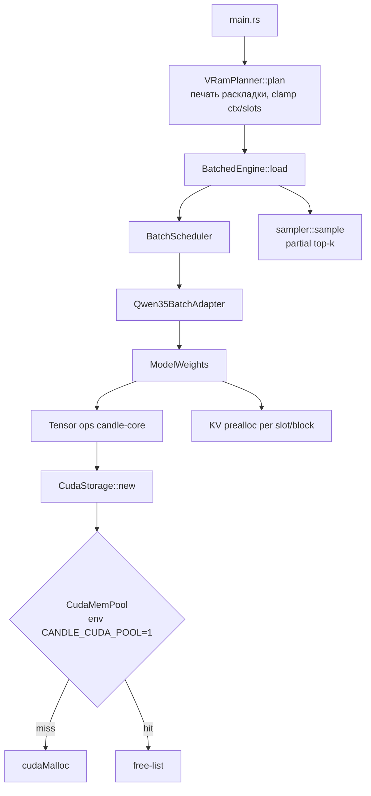

# Plan: CUDA memory management и decode performance

**Date:** 2026-08-10
**Status:** 📝 Planning
**Priority:** P0
**Specification:** [docs/specs/2026-08-10-cuda-memory-decode-perf.md](../specs/2026-08-10-cuda-memory-decode-perf.md)

## Goal

Убрать `cudaMalloc` из hot path decode, автоматически укладывать сервер в VRAM карты, ускорить sampler. Целевые метрики — spec §13.

## Current state

- `candle-core/src/cuda_backend/mod.rs` — `CudaStorage` аллоцирует через `dev.alloc` напрямую; пула нет. `CudaDevice` доступен в каждом alloc callsite. Metal-арена (T-269) — образец паттерна, но Metal-only.
- `qwen35-batch/src/real/model_weights.rs` — KV batched buffers (cap 512, рост с копией), GQA expand `broadcast_as().contiguous()` per slot/step, embedding `tok_embeddings.forward` → CPU F32 → `to_device` каждый шаг.
- `qwen35-batch/src/scheduler.rs` — PREFILL_CHUNK=512; `decode_batch` собирает per-step входы.
- `Qwen3.6 27B/src/sampler.rs` — `sort_unstable_by` полного вектора 248 320 логитов на токен/слот.
- `Qwen3.6 27B/src/config.rs` — `QWEN36_CTX` (81920), `QWEN36_SLOTS` (4) без VRAM-валидации.
- Trace-канал уже есть: `QWEN36_TRACE=1` → `[step]`/`[fdb]`/`[hb]` маркеры.

## Solution architecture



Ключевые точки:
- **Пул — в candle-core, не в сервере**: перехват на уровне `CudaStorage` allocation (единая точка для всех тензоров). Env `CANDLE_CUDA_POOL=1` (default ON для нашего сервера, OFF = старое поведение для revert).
- **VRamPlanner — в сервере** (`src/vram_plan.rs`): читает `total_vram` через `nvidia-smi --query-gpu=memory.total` (Windows/Linux одинаково; CUDA API из candle не торчит наружу — не добавляем зависимость).
- Размеры компонентов — из GGUF metadata (уже парсится в `ModelProfile`) + формулы KV/state из параметров модели.

## Solution

### candle-core (форк) — Memory pool

#### Files:
- [ ] `candle-core/src/cuda_backend/mem_pool.rs` — NEW: `CudaMemPool { buckets: Mutex<HashMap<SizeClass, Vec<CudaSlice>>>, stats }`. SizeClass = округление вверх до 2^N KiB (min 1 MiB, max 512 MiB; больше — passthrough к драйверу).
- [ ] `candle-core/src/cuda_backend/mod.rs` — точка перехвата в `CudaStorage` allocation: `pool.get_or_alloc(bytes)` / `pool.release(buf)` на Drop. Env `CANDLE_CUDA_POOL` (default on), счётчики `allocs/hits/misses/bytes_reserved`.
- [ ] `candle-core/src/cuda_backend/mod.rs` — `pub fn cuda_pool_stats() -> PoolStats` для trace.

#### Data structures (pseudocode):

```pseudo
CudaMemPool {
    free: Mutex<HashMap<u64 /*size_class*/, Vec<CudaSlice<u8>>>>,
    stats: AtomicPoolStats,
}

fn alloc(bytes) -> CudaSlice:
    sc = size_class(bytes)            // next_pow2, clamp [1MiB, 512MiB]
    if sc > MAX: return driver_alloc  // большие буфера не пулим
    if let Some(buf) = free[sc].pop(): stats.hit++; return buf
    stats.miss++; return driver_alloc(sc)

fn release(buf):                     // из Drop CudaStorage
    free[size_class(buf)].push(buf)  // без лимита в v1; trim по high-water позже [ASSUMPTION: фрагментация под контролем — наши размеры повторяются]
```

### qwen35-batch (форк) — KV + GQA + embedding

#### Files:
- [ ] `qwen35-batch/src/real/model_weights.rs` — `seed_slot_batched`: преаллокация KV на `min(ctx, attn_window)` вместо cap=512; удаление ветки роста из decode path.
- [ ] `qwen35-batch/src/real/model_weights.rs` — `forward_attn_decode_batch`: GQA expand без `contiguous()` где matmul допускает strides; если нет — один расширенный буфер на батч, переиспользуемый (кандидат в пул автоматически).
- [ ] `qwen35-batch/src/real/model_weights.rs` — `forward_decode_batch_inner`: embedding gather на device (убрать `emb_cpu.to_device` H2D sync; QuantizedEmbedding.forward на CUDA, fallback CPU для CPU-устройства).

### qwen36-server — планер + sampler

#### Files:
- [ ] `src/vram_plan.rs` — NEW: `VramPlan::compute(total_vram, model_bytes, model_meta, req_ctx, req_slots) -> Plan { ctx, slots, report }`. Чтение total: `nvidia-smi --query-gpu=memory.total --format=csv,noheader,nounits` (Windows/Linux); macOS/Metal — skip (unified memory).
- [ ] `src/config.rs` — интеграция планера: после `from_env`, clamp с печатью раскладки (формат — spec §8). Fail, если 1 слот × ctx 2048 не влезает (сообщение с MiB-дефицитом).
- [ ] `src/sampler.rs` — замена полной сортировки: `select_nth_unstable_by` на top_k (k ≤ 64) или двухпроходный top-p порог; penalties применяются до отбора (как сейчас).
- [ ] `src/engine_batched.rs` — trace: печать `PoolStats` по `[hb]` при trace=1.

#### Псевдокод планера:

```pseudo
fn compute(total_mib, model: &ModelProfile, req: (ctx, slots)) -> Plan:
    weights = file_bytes_on_device(model)        // сумма тензоров, грузящихся в VRAM
    kv_per_slot = attn_blocks × 2 × kv_heads × head_dim × 2B × min(ctx, window)
    state_per_slot = delta_blocks × (ssm + conv) bytes
    workspace = 512 MiB                          // cuBLAS + scratch + logits [ASSUMPTION]
    budget = 0.90 × total
    for (ctx, slots) in descent(req.ctx, req.slots):   // ctx: 81920→…→2048; slots: 4→1
        need = weights + slots × (kv + state) + workspace
        if need ≤ budget: return Plan{ctx, slots, report(need)}
    bail("не хватает {need - budget} MiB даже для 1 слота × 2048")
```

## Implementation phases

### Phase 1: Наблюдаемость + планер + sampler (estimate: 3 h)
- [ ] `src/vram_plan.rs` — планер + unit-тесты формул (KV/state bytes) → `Qwen3.6 27B/src/vram_plan.rs`
- [ ] `src/config.rs` — интеграция clamp + раскладка в stdout → `Qwen3.6 27B/src/config.rs`
- [ ] [P] `src/sampler.rs` — partial top-k + property-тест (argmax-parity со старым sampler на random logits) → `Qwen3.6 27B/src/sampler.rs`
- **Independent check:** старт на yttri-win: строка `[vram] plan:` в логе; nvidia-smi ≤ 90% после 4×256 токенов; `cargo test --features metal` зелёные.

### Phase 2: CUDA memory pool (estimate: 6 h)
- [ ] `mem_pool.rs` + перехват alloc/free → `candle-core/src/cuda_backend/`
- [ ] `cuda_pool_stats()` + печать в `[hb]` trace → `engine_batched.rs`
- [ ] Тест: unit (alloc/release/reuse), интеграция: 4×256 decode на yttri-win с `QWEN36_TRACE=1` — misses стабилизируются после прогрева, hits/шаг > 95%.
- **Independent check:** `run_iq_tests.bat` 12/12 + bench: B=4 короткий контекст ≤ 115 ms/step (baseline 175).

### Phase 3: KV prealloc + GQA + embedding (estimate: 4 h)
- [ ] KV преаллокация на seed_slot → `model_weights.rs`
- [ ] GQA expand без per-step contiguous → `model_weights.rs`
- [ ] Embedding на device → `model_weights.rs`
- [ ] Parity: `real_qwen35_batch` (batched == sequential) на yttri-win.
- **Independent check:** B=2 KV 5.4K ≤ 0.27 s/токен (baseline 0.35); mt-тест (14K промпт) без OOM.

### Phase 4: Замеры на 4090 + решение по fused kernels (estimate: 2 h)
- [ ] Матрица: {IQ2_XXS, Q4_K_M} × {B=1, B=4} × {ctx 1K, 8K} на 4090; сравнение с llama.cpp (parity-методика из брифа).
- [ ] Go/no-go на FR-020/021 (fused DeltaNet) по остаточному профилю.
- **Independent check:** таблица метрик в README; решение зафиксировано в decisions.

### Phase 5: Stability smoke + polish (estimate: 2 h)
- [ ] `scripts/stability_smoke.sh` на yttri-win: 4 слота × 8K (BD-008), 3 прогона.
- [ ] Все тесты обоих репо; уборка trace-шума.
- **Independent check:** BD-008 PASS ×3.

**Total: ~17 h**

## Traceability: Requirements → Tasks

| Requirement | Phase | Tasks |
|-------------|-------|-------|
| FR-001 (pool) | 2 | mem_pool.rs, перехват, статистика |
| FR-002 (планер) | 1 | vram_plan.rs, config.rs |
| FR-003 (sampler) | 1 | sampler.rs partial top-k |
| FR-010 (KV) | 3 | seed_slot_batched prealloc |
| FR-011 (GQA) | 3 | forward_attn_decode_batch |
| FR-012 (embedding) | 3 | forward_decode_batch_inner |
| FR-020/021 (fused DeltaNet) | 4 | go/no-go по замерам |
| FR-022 (счётчики) | 2 | pool stats → trace |

## Complexity & principle deviations

| Deviation | Principle / simpler alternative | Why justified |
|-----------|--------------------------------|---------------|
| Свой пул в candle-core | «Минимум кода»; альтернатива — внешний crate | Готовых allocator-shim для cudarc нет; паттерн уже доказан Metal-ареной в этом же форке |

## Risks and mitigations

| Risk | Likelihood | Impact | Mitigation |
|------|------------|--------|------------|
| Пул держит VRAM (reserved не возвращается) → меньше запас | Medium | Medium | Верхняя граница reserved + trim при подходе к 95%; env-revert |
| Partial top-k меняет выбор токена vs полная сортировка (NaN/ties) | Low | Medium | Property-тест argmax-parity + seeded сравнение на 10K векторах |
| KV prealloc на 8192 × 4 слота сам по себе 2.1 GB → OOM на 12 GB | Medium | High | Планер (Phase 1) считает KV под ctx ДО загрузки; на 12 GB ctx снижается |
| Strided matmul для GQA не поддержан cublas layout | Medium | Low | Fallback: один переиспользуемый expand-буфер (пулится) |

## Dependencies

### Packages / Libraries
- Новых нет. `nvidia-smi` присутствует на обеих CUDA-машинах.

### Related tasks
- MoE 35B-A3B план (`candle-fork docs/plans/2026-08-08-qwen36-35b-a3b-moe-server.md`) — memory planner там заменяется/переиспользуется этим VRamPlanner.

## Deferred questions

| Question | Why deferred | When the answer is needed | Who decides |
|----------|--------------|---------------------------|-------------|
| Size classes пула и trim-политика | Нужен профиль аллокаций после Phase 2 | Перед мерджем Phase 2 | Askid |
| Fused DeltaNet (PTX vs rewrite) | Зависит от остаточного профиля | Phase 4 | Askid |

## Plan decisions

| # | Question | Decision | Date |
|---|----------|----------|------|
| PD-001 | Где жить пулу: сервер vs candle-core | candle-core (перехват в CudaStorage — единая точка, все тензоры покрыты) | 2026-08-10 |
| PD-002 | Чтение total VRAM: CUDA API vs nvidia-smi | nvidia-smi subprocess (0 новых зависимостей; обе целевые ОС имеют утилиту) | 2026-08-10 |
| PD-003 | Порядок фаз | Наблюдаемость первой — иначе эффект пула не измерить | 2026-08-10 |

## Tech Debt

| # | Description | Phase | Priority |
|---|-------------|-------|----------|
| TD-001 | Single-slot decode attention остаётся F32 (drift-комментарий не оспорен) | — | Low |
