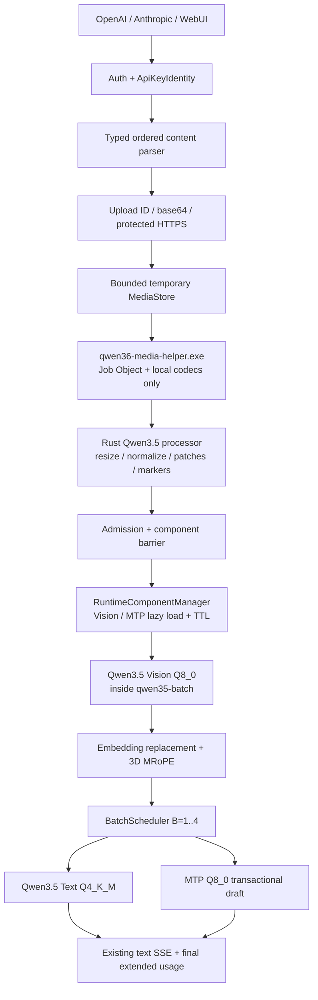
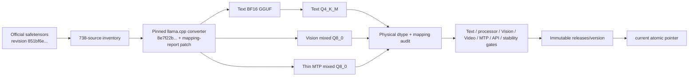
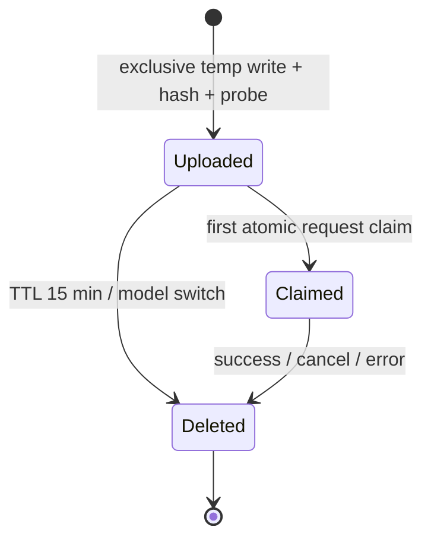

# Plan: Полноценный Qwen3.5-4B — Text, Vision, Video, MTP и собственные artifacts

**Date:** 2026-08-14  
**Status:** Planning  
**Priority:** P0  
**Specification:** [docs/specs/2026-08-14-qwen35-4b-full-multimodal-mtp.md](../specs/2026-08-14-qwen35-4b-full-multimodal-mtp.md)

## Goal

Собрать из закреплённого `Qwen/Qwen3.5-4B@851bf6e806efd8d0a36b00ddf55e13ccb7b8cd0a` единый проверяемый release: Text Q4_K_M, Vision Q8_0, Video, MTP Q8_0, три API и доступный с клавиатуры server WebUI. Runtime остаётся Candle, работает offline и публикует весь набор атомарно только после correctness, performance, memory и stability gates.

## Current state

### Server repository

- `src/engine.rs` задаёт text-only `Engine::generate(Vec<ChatMessage>, GenParams)`, где `ChatMessage.content` — одна строка, а `StreamEvent::Done` содержит только text token usage.
- `src/engine_batched.rs` владеет одним `BatchScheduler<Qwen35BatchAdapter>` в отдельном потоке, поддерживает stable slot IDs 0..3, один prefill chunk за step и общий decode активных slots.
- `src/engine_swap.rs` умеет заменить целиком text engine, но пока не имеет admission barrier, component leases и гарантированного drain активных requests.
- `src/api/openai.rs`, `src/api/responses.rs`, `src/api/anthropic.rs` намеренно отвергают image/video blocks.
- `src/api.rs` проверяет bearer key, но не передаёт downstream устойчивую identity ключа, нужную для ownership media ID.
- `src/api/admin.rs` сканирует отдельные `*.gguf`, исключает `mmproj`, не знает profile manifests и optional component state.
- `src/vram_plan.rs` считает Text/KV/DeltaNet, но не Vision, MTP, decoded media и transactional MTP scratch.
- `web/index.html` хранит text history в `localStorage`; attachment state отсутствует.
- `Cargo.toml` не включает multipart, HTTPS fetch, base64, SHA-256, image codecs, ICC transform или Windows Job Object API.

### Candle fork

- `qwen35-batch/src/real/model_weights.rs` уже реализует правильный Qwen3.5 hybrid Text trunk, Q4_K/Q5_K/Q6_K physical dispatch, partial RoPE, `forward_embeds`, `StateSnapshot` и true batched decode B=1..4.
- Text attention принимает scalar `index_pos`; official Qwen3.5 multimodal path требует interleaved 3D T/H/W MRoPE с секциями `[11,11,10]` и отдельным text/cache position.
- `qwen35-batch/src/real/adapter.rs` хранит prefill snapshots и persistent batched state, но не возвращает target hidden states и не предоставляет transactional per-slot checkpoint/rollback.
- `candle-transformers/src/models/qwen3_vl/vision.rs` содержит нужную Vision topology, patch packing, positional interpolation и merger, но грузит обычные `Linear`/`Conv3dNoBias`; production Vision Q8_0 через mixed GGUF `QMatMul` не поддержан.
- `candle-transformers/src/models/paddleocr_vl/text.rs` содержит полезный M-RoPE reference, но его section layout не совпадает автоматически с interleaved Qwen3.5 contract.
- Текущий text GGUF содержит 426 language tensors и не содержит 297 Vision/15 MTP source tensors.

### Confirmed official contracts

```text
source tensors:       738 = 426 language + 297 Vision + 15 MTP
text layers:          32 = 24 DeltaNet + 8 full attention
vision:               depth 24, hidden 1024, output 2560
patching:              patch 16, temporal patch 2, spatial merge 2
MTP layers:            1
mRoPE sections:        [11, 11, 10], interleaved, partial rotary dim 64
native context:        262144
processor reference:   Transformers 00e8e49eb3eda67290f635f6bdf59f236f6adf7e
video sampling:        2 fps, min 4, max 768
```

Tokenizer contract фиксируется явно:

```text
<|endoftext|> = 248044   source config EOS / runtime pad
<|im_start|>  = 248045
<|im_end|>    = 248046   chat generation EOS
<|vision_start|> = 248053
<|vision_end|>   = 248054
<|image_pad|>    = 248056
<|video_pad|>    = 248057
```

Runtime обязан завершать chat generation по `248046`; `248044` не подменяет chat EOS.

### Workspace and execution constraints

Все model downloads, converter runs, quantization, BF16 references, CUDA builds, codec matrices, GPU gates и публикация выполняются только на `yttri-win`:

```text
source/build/cache/logs/bench: D:\Projects\yttri-inference
official source:               D:\Models\yttri\qwen3.5-4b\source\851bf6e806efd8d0a36b00ddf55e13ccb7b8cd0a
staged releases:               D:\Models\yttri\qwen3.5-4b\releases\<version>
active pointer:                D:\Models\yttri\qwen3.5-4b\current
canonical text baseline:       D:\Models\yttri\qwen3.5-4b\Qwen3.5-4B-Q4_K_M.gguf
```

`D:\Projects\yttri-build` запрещён для чтения, записи, запуска, build, logs и reuse artifacts. GPU gates идут строго последовательно после preflight `GPU used <= 1024 MiB` и заканчиваются ожиданием baseline.

## Solution architecture



Artifact flow:



## Solution

### 1. Versioned profile and artifact pipeline

#### Files

- [ ] `tools/qwen35-artifacts.py` — единственный project-side build/audit driver: source index classification, converter report merge, GGUF tensor/dtype audit, hashes, manifest creation и fail-closed gate aggregation.
- [ ] `tools/llama-qwen35-map-report.patch` — минимальный patch поверх pinned llama.cpp converter: source→output report, duplicate-output rejection и thin MTP export без копии shared Text weights.
- [ ] `scripts/qwen35_artifacts.ps1` — Windows-only orchestration download → convert → quantize → audit; все пути проверяются против разрешённых roots до запуска.
- [ ] `scripts/qwen35_release.ps1` — staging, mandatory gate verification, immutable release assembly, atomic `current` update и rollback.
- [ ] `scripts/qwen35_run_current.ps1` — stable launcher: validate `current`, resolve immutable runtime directory and start sibling `qwen36-server.exe`/helper bundle.
- [ ] `scripts/run_windows.bat` — invoke stable launcher from scheduled task without embedding release path.
- [ ] `qwen35-batch/src/bin/qwen36_inspect.rs` — расширить JSON audit на component kind, metadata, tensor names/shapes/physical dtypes и tokenizer IDs.
- [ ] `qwen35-batch/tests/model_profile.rs` — profile/tensor audit fixtures для Text, Vision и MTP manifests.
- [ ] `src/profile.rs` — runtime structs и fail-closed loader `ProfileManifest`/`CurrentPointer`; относительные paths, SHA-256, ABI, quant policy и capability validation.
- [ ] `src/config.rs` — `QWEN36_PROFILE`; legacy `QWEN36_MODEL` остаётся text-only compatibility path.
- [ ] `src/main.rs` — profile resolution до VRAM plan; optional artifact failure отключает только capability, mandatory Text failure блокирует startup.
- [ ] `tests/profile_test.rs` — path traversal, bad hashes, unknown fields/schema, duplicate artifacts, incompatible ABI, missing optional components и legacy text-only fallback.

#### Build contract

Pinned inputs:

```text
HF repository:          Qwen/Qwen3.5-4B
HF revision:            851bf6e806efd8d0a36b00ddf55e13ccb7b8cd0a
llama.cpp revision:     8e7f22b67ef4667b4ddd50230771287f328cfb3f
Transformers revision:  00e8e49eb3eda67290f635f6bdf59f236f6adf7e
```

Pipeline performs three converter runs from same source checkout:

```text
Text:    --no-mtp, then llama-quantize Q4_K_M
Vision:  --mmproj --outtype q8_0
MTP:     --mtp --outtype q8_0 with project external-shared mode
```

`external-shared MTP` writes only 15 MTP source tensors and references compatible Text embedding/output in manifest. This avoids duplicate ~vocab×hidden weights in MTP file and VRAM. Patch changes export boundary only; tensor math/naming mappings stay from pinned converter.

Converter report treats one source tensor as one inventory entry, even when transform produces multiple physical tensors. Example: one temporal Conv3D source weight may produce two temporal-slice outputs. Publication fails on:

- source index count other than 738;
- component counts other than 426/297/15;
- unknown source prefix;
- source assigned to zero or multiple components;
- duplicate physical output name;
- missing output listed in report;
- unreported output in GGUF;
- shape/product mismatch after documented split/reorder;
- physical dtype outside component policy.

#### Manifest structure

```pseudo
CurrentPointer {
    schema_version: 1
    release: RelativePath
    manifest_sha256: HexSha256
}

ProfileManifest {
    schema_version: 1
    profile_id: "qwen3.5-4b"
    release_version: String
    server_abi: String

    source: {
        repository: "Qwen/Qwen3.5-4B"
        revision: "851bf6e..."
        license: "Apache-2.0"
        files: [HashedFile]
        source_inventory: { language: 426, vision: 297, mtp: 15, total: 738 }
    }

    artifacts: {
        text: ArtifactRef(required=true, quant="Q4_K_M")
        vision?: ArtifactRef(required_for_release=true, load="on_demand")
        mtp?: ArtifactRef(required_for_release=true, load="on_demand")
    }

    tokenizer: {
        end_of_text: 248044
        chat_eos: 248046
        pad: 248044
        vision_start: 248053
        vision_end: 248054
        image_pad: 248056
        video_pad: 248057
    }

    processor: {
        transformers_revision: String
        image_config: HashedFile
        video_config: HashedFile
        patch_size: 16
        temporal_patch_size: 2
        merge_size: 2
        mrope_sections: [11, 11, 10]
        video_fps: 2
        min_frames: 4
        max_frames: 768
    }

    runtime: {
        server: HashedFile
        media_helper: HashedFile
        ffmpeg: HashedFile
        ffprobe: HashedFile
        codecs_network_disabled: true
    }

    capabilities: { text, vision, video, mtp, native_context }
    limits: MediaLimits
    gates: [GateResultRef]
}
```

Runtime never trusts capability booleans alone. Capability becomes available only when manifest contract, path containment, hash, metadata, physical dtypes and component ABI all validate.

#### Atomic publication

Release directory is immutable after audit:

```text
D:\Models\yttri\qwen3.5-4b\releases\<version>\
  profile.json
  artifacts\text-Q4_K_M.gguf
  artifacts\vision-Q8_0.gguf
  artifacts\mtp-Q8_0.gguf
  processor\*.json
  runtime\qwen36-server.exe
  runtime\qwen36-media-helper.exe
  runtime\ffmpeg.exe
  runtime\ffprobe.exe
  runtime\licenses\...
  gates\*.json
```

`D:\Models\yttri\qwen3.5-4b\current` — маленький JSON pointer file. Publisher writes sibling temp file, flushes file, then uses Windows `MoveFileExW(MOVEFILE_REPLACE_EXISTING | MOVEFILE_WRITE_THROUGH)`. Rollback atomically replaces pointer with previous validated release; no artifacts mutate in place.

### 2. Common typed request, usage and errors

#### Files

- [ ] `src/engine.rs` — replace string-only messages with ordered content blocks and `InferenceRequest`; preserve text-only constructor/helpers.
- [ ] `src/engine_types.rs` — re-export common request/media/usage contracts.
- [ ] `src/api.rs` — bounded JSON body reader, `ApiKeyIdentity` extension, typed error mapping and shared inference preparation.
- [ ] `src/api/openai.rs` — OpenAI Chat media schemas and extended usage.
- [ ] `src/api/responses.rs` — Responses `input_image`/`input_video` mapping.
- [ ] `src/api/anthropic.rs` — Anthropic image source and documented `input_video` extension.
- [ ] `tests/api_test.rs` — preserve all current text tests after contract migration.
- [ ] `tests/multimodal_api_test.rs` — API schema, mixed-order, errors, streaming usage and Russian UTF-8 matrix.

#### Data structures

```pseudo
InferenceRequest {
    messages: [ChatMessage]
    params: GenParams
    owner: ApiKeyIdentity
    cancel: CancelFlag
}

ChatMessage {
    role: Role
    content: [ContentBlock]  // exact client order
}

ContentBlock =
    Text { text }
  | Media { kind: Image|Video, decoded: DecodedMedia }

MediaSource =
    DataUrl { declared_mime, base64 }
  | HttpsUrl { url }
  | UploadId { id }

MediaUsage {
    image_count: usize
    video_count: usize
    sampled_frames: usize
    visual_tokens: usize
    effective_fps: f64|null
    audio_processed: false
}

GenerationUsage {
    prompt_tokens
    completion_tokens
    truncated
    media: MediaUsage
    mtp: { enabled, used, drafted, accepted, fallback_category? }
}
```

`StreamEvent::Done` carries `GenerationUsage`. Existing text delta events stay unchanged.

#### API source forms

| API | Image | Video | Upload ID extension |
|---|---|---|---|
| OpenAI Chat | `image_url.url` for HTTPS/data URL | `video_url.url` | block field `media_id` |
| OpenAI Responses | `input_image.image_url` | `input_video.video_url` | item field `media_id` |
| Anthropic Messages | `source.type=url|base64|media_id` | documented `input_video` with same source | `source.media_id` |

Mixed text/image/video arrays are normalized without sorting or grouping. System media remains rejected because official chat template forbids it.

#### Error contract

```text
400 malformed/unsupported/MIME mismatch/source schema
408 download or decoder timeout
409 already claimed/concurrent media ID claim
413 encoded body/object too large
422 decoded pixels/frames/visual tokens/VRAM budget
429 pending upload concurrency exhausted
503 Vision unavailable or safe component load failed
507 global temporary disk reservation exhausted
```

Errors use one `MediaError` category-to-status conversion. Internal paths, URLs, filenames, prompt text, API-key identity and media hashes never enter response or logs.

### 3. Temporary media store and protected HTTPS fetch

#### Files

- [ ] `src/media/mod.rs` — `MediaService`, limits, cancellation, decode orchestration and RAII cleanup guards.
- [ ] `src/media/store.rs` — opaque ID lifecycle, owner binding, atomic batch claim, TTL reaper and global count/temp/RAM reservations.
- [ ] `src/media/fetch.rs` — HTTPS-only fetch, DNS/IP validation, redirect loop, timeouts, streaming byte cap and proxy disable.
- [ ] `src/api/media.rs` — authenticated `POST /v1/media` multipart/raw-body upload.
- [ ] `src/api.rs` — route registration and endpoint-specific body limits.
- [ ] `src/config.rs` — temp root and fixed limits; unsafe overrides are not exposed in first release.
- [ ] `tests/media_test.rs` — lifecycle, race, quotas, SSRF, redirects, timeout, MIME and cleanup tests.

#### Media object state machine



```pseudo
MediaObject {
    id: RandomUuid
    owner_digest: Sha256(api_key)
    kind: Image|Video
    declared_mime
    encoded_bytes
    path_under_temp_root
    created_at
    expires_at
    state: Uploaded|Claimed
}

MediaBudget {
    pending_objects <= 16
    temp_reserved_bytes <= 1 GiB
    decoded_reserved_bytes <= 2 GiB
}
```

Upload writes with exclusive create into configured temp root. Reservation happens before each write/growth. Final bytes are fsynced and renamed from `.part` only after size, magic and probe validation. Partial files have RAII deletion.

Requests containing several upload IDs claim them under one store lock:

1. reject duplicate ID in same request;
2. validate all IDs, owners and states without exposing whether foreign ID exists;
3. mark all as claimed atomically;
4. never return claimed objects to `Uploaded`, including cancellation;
5. delete all claimed bytes at terminal request state.

#### HTTPS safety

Fetch sequence:

1. Parse with `https` scheme only; reject credentials and fragments.
2. Resolve DNS before connect.
3. Reject every loopback, private, link-local, carrier-grade NAT, multicast, documentation, benchmark, reserved, unspecified and cloud-metadata address for IPv4/IPv6, including IPv4-mapped IPv6.
4. Pin validated addresses into reqwest resolver for that request to prevent DNS rebinding; TLS certificate still validates original hostname.
5. Disable system/environment proxy.
6. Disable automatic redirects; process at most three manually and repeat steps 1–4 for every destination.
7. Enforce connect timeout 5 seconds, total deadline 30 seconds, declared and streamed byte limits.
8. Reject `Content-Encoding` other than identity; server does not transparently inflate HTTP bodies.
9. Remove partial data on error/cancel.

No custom DNS cache persists across requests.

### 4. Isolated decoder helper

#### Files

- [ ] `src/media/helper.rs` — server-side sibling binary resolution, protocol validation, timeout/cancel and Windows Job Object launcher.
- [ ] `src/media/helper_protocol.rs` — versioned request/result structs shared by server and helper binary.
- [ ] `src/bin/qwen36-media-helper.rs` — one-shot image/video probe/decode, deterministic raw RGB output and safe error categories.
- [ ] `Cargo.toml` — helper-only codec/color dependencies and Windows API features.
- [ ] `scripts/qwen35_artifacts.ps1` — package pinned FFmpeg/ffprobe build and verify `--disable-network` capability/hash.
- [ ] `tests/helper_test.rs` — malformed/truncated/bomb/crash/timeout/output-tamper fixtures.

#### Helper boundary

Helper receives one JSON request over stdin containing only absolute paths already canonicalized under temp root, expected kind and explicit limits. It emits one JSON result on stdout; diagnostics are category-only on stderr.

```pseudo
DecodeRequest {
    protocol_version: 1
    input_path
    output_dir
    declared_mime
    expected_kind
    frame_indices: [usize]  // video only, computed by server
    limits: {
        encoded_bytes
        width
        height
        frames
        output_bytes
        cpu_time_ms
        wall_time_ms
        ram_bytes
    }
}

DecodeResult {
    kind
    detected_format
    codec?
    width
    height
    duration_ms?
    source_fps?
    static_gif
    frames: [{ path, width, height, timestamp_ms, bytes, sha256 }]
    audio_processed: false
}
```

Server validates every returned path remains under output directory and every raw file size equals `width × height × 3`. Unexpected fields, extra files, oversized stdout, non-finite metadata or hash mismatch fail closed.

Windows isolation:

- helper and its FFmpeg children run in Job Object with kill-on-close, active-process, memory and CPU-time limits;
- absolute sibling `ffmpeg.exe`/`ffprobe.exe` paths only; system `PATH` ignored;
- packaged FFmpeg build has network protocols disabled; helper crate has no network client;
- input/output paths are local temp paths only;
- stdout/stderr are bounded pipes;
- cancellation closes job and deletes output tree.

Image decode uses Rust `image` codecs for JPEG/PNG/WebP/BMP/TIFF/GIF, extracts EXIF orientation and ICC, converts to sRGB with `moxcms`, and applies reference-matched alpha handling. Animated GIF is delegated to video-frame flow; static GIF returns one image. Video decode uses pinned ffprobe/ffmpeg for MP4/MOV/MKV/WebM and H.264/H.265/VP9/AV1, maps video stream only and never maps/extracts audio.

### 5. Official-compatible processor, prompt and multilingual fixtures

#### Files

- [ ] `qwen35-batch/src/real/multimodal.rs` — decoded RGB structs, smart resize, normalization, patch packing, video frame/timestamp expansion, marker spans, visual-token accounting and MRoPE position construction.
- [ ] `qwen35-batch/src/real/tokenizer.rs` — ordered multimodal ChatML builder using official marker/timestamp rules while preserving current text fast path.
- [ ] `qwen35-batch/Cargo.toml` — use existing workspace `image` primitives for RGB resizing only; encoded media stays outside runtime crate.
- [ ] `qwen35-batch/tests/multimodal_processor.rs` — tensor/shape/grid/marker/position golden tests.
- [ ] `tests/fixtures/multimodal/manifest.json` — versioned hashes, prompts, language, expected exact values and caption facts.
- [ ] `tests/fixtures/multimodal/en/*` — English OCR/chart/spatial/multi-image/video fixtures.
- [ ] `tests/fixtures/multimodal/ru/*` — Russian Cyrillic OCR, numbers/options, captions, chart/spatial, multi-image and video fixtures.
- [ ] `tools/generate_multimodal_fixtures.py` — deterministic codec/orientation/ICC/alpha/video fixture generation with pinned tool hashes.
- [ ] `qwen35-batch/src/bin/qwen35_multimodal_probe.rs` — JSON dump of patches, grids, marker order, positions, embeddings/logits and hashes for reference gates.

#### Processor algorithm

For every decoded RGB image/frame:

1. Apply already-validated EXIF/ICC/alpha result from helper.
2. Compute official smart resize using factor `patch_size × merge_size = 32` and pinned min/max pixel config.
3. Resize with a pinned bicubic implementation matching reference weights, edge handling and rounding; generic `image::imageops::resize` is accepted only if golden tensor tolerance passes.
4. Convert channels to float, rescale by `1/255`, normalize using mean/std `[0.5,0.5,0.5]`.
5. Duplicate final temporal frame when frame count is odd.
6. Pack exactly in official order into rows of `3 × 2 × 16 × 16`.
7. Produce `grid_thw` and `visual_tokens = T × H × W / merge_size²` with checked arithmetic.

Video frame selection:

```pseudo
requested = clamp(floor(duration * 2 fps), 4, 768, source_frame_count)
candidates = descending even frame counts <= requested
for count in candidates:
    indices = numpy_linspace_round_even(0, source_frames - 1, count)
    resized = official_video_smart_resize(count, source_h, source_w)
    if aggregate visual/context/decoded budgets fit:
        select highest count and stop
if none fit: return 422
```

This deterministic pre-admission selection is reported through `sampled_frames`/`effective_fps`; runtime never retries at lower quality after inference/allocation failure.

Qwen3.5 video prompt expansion follows pinned processor exactly: each temporal group gets `<N.N seconds><|vision_start|>...<|vision_end|>`, timestamps average first/last frame index in temporal group and format with one decimal place. Features remain in original temporal order.

#### Position contract

```pseudo
PositionPlan {
    text_positions: [u32; seq]       // cache/recurrent order: 0..seq-1
    rope_positions: [[u32; seq]; 3]  // temporal, height, width
    decode_rope_delta: i64           // max(prefill rope)+1 - seq_len
}
```

- Text tokens use same value in all three rope dimensions.
- Image/video spans use official T/H/W grid positions.
- Video grids are split into temporal groups for prompt MRoPE exactly as reference.
- Partial rotary frequencies are interleaved using `[11,11,10]`; scalar Text path keeps current precomputed tables and must remain bit-exact.
- Decode cache position remains token-count based. Decode RoPE position is `token_position + decode_rope_delta`; these values must never be conflated.

#### Russian validation

Russian is mandatory, not a translated manual spot-check. Fixture manifest includes:

- Cyrillic OCR with `ё/й`, punctuation, mixed Cyrillic/Latin and UTF-8 boundaries — exact normalized string;
- Russian numeric tables, chart labels and multiple-choice answers — exact values/options;
- Russian caption prompts — required facts and forbidden hallucinations;
- Russian spatial and multi-image relation prompts;
- Russian video temporal-order prompts;
- fixed-seed Russian text/image/video MTP parity;
- stream/non-stream UTF-8 assembly through all three APIs.

English and Russian suites run independently and produce separate gate records. Failure in either blocks `current` publication.

### 6. Native mixed-Q8 Vision inside `qwen35-batch`

#### Files

- [ ] `qwen35-batch/src/real/vision.rs` — minimal Qwen3.5 Vision encoder port from existing `candle-transformers/qwen3_vl`, architecture-specific mixed GGUF loader and forward.
- [ ] `qwen35-batch/src/real/mod.rs` — export Vision types behind `real-model`.
- [ ] `qwen35-batch/src/real/model_profile.rs` — separate `VisionProfile` validation for 297-source mapping, expected 24 blocks and physical dtype policy.
- [ ] `candle-core/src/quantized/mod.rs` — checked metadata-only `QTensor` reshape preserving storage for flattened Q8 patch projection; no new kernel.
- [ ] `candle-core/tests/quantized_tests.rs` or focused existing quantized test module — reshape element/block validation and Q8 matmul parity.
- [ ] `qwen35-batch/tests/vision_qwen35.rs` — loader rejection, shape, BF16/Q8 embedding and final-logit gates.
- [ ] `qwen35-batch/src/real/model_weights.rs` — text embedding access, `forward_embeds_mrope`, hidden-state return and media-span replacement.
- [ ] `qwen35-batch/src/real/adapter.rs` — per-slot multimodal prefill payload, Vision invocation, chunk span slicing and decode rope delta.
- [ ] `qwen35-batch/src/model.rs` — optional per-request multimodal install hook without changing mock/text behavior.

#### Vision boundary

Vision code lives inside `qwen35-batch`; no new crate and no broad quantized backend added to generic `candle-transformers/qwen3_vl`.

Port only:

- temporal patch projection;
- learned positional interpolation;
- 24 Vision blocks;
- Vision rotary embedding;
- patch merger;
- empty deepstack handling for this official profile.

All eligible qkv/proj/MLP/merger weights load as `QMatMul`; norms, biases, position embeddings and sensitive profile-marked tensors load BF16/F32. Temporal patch projection uses converter’s two temporal slices, reshapes each physical Q8 tensor from `[out,in,16,16]` to `[out,in×16×16]`, performs two `QMatMul` calls and sums bias. No permanent full-matrix dequantization.

Vision attention:

- CUDA uses already-installed `candle_flash_attn::flash_attn_varlen` on F16/BF16 Q/K/V and checked cumulative sequence lengths;
- Metal P1 may use bounded per-image/frame attention loop;
- CPU is test-only for tiny fixtures, not production fallback;
- unsupported backend/dtype fails component load, never silently changes compute path.

#### Multimodal prefill flow

```pseudo
prepare_slot(slot, MultimodalPrompt):
    store packed patches + grids + placeholder spans + PositionPlan

prefill_chunk(slot, token_range):
    text_embeds = Text.embed_tokens(tokens)
    if first media span needs features:
        vision_features = Vision.forward(patches, grid_thw)
    replace intersections of image/video placeholder spans with feature rows
    mrope_slice = PositionPlan.rope_positions[token_range]
    output = Text.forward_embeds_mrope(embeds, mrope_slice, token_start)
    snapshot target state as current text path does
```

Text-only `ModelWeights::forward` and `forward_decode_batch` remain separate fast paths. No media branches execute for text requests.

### 7. Transactional MTP B=1..4

#### Files

- [ ] `qwen35-batch/src/real/mtp.rs` — thin MTP artifact loader, one official MTP attention/FFN block, per-slot KV/pending hidden and draft generation.
- [ ] `qwen35-batch/src/real/model_profile.rs` — `MtpProfile`, exact 15-source contract, shared Text compatibility and mixed dtype validation.
- [ ] `qwen35-batch/src/real/model_weights.rs` — target normalized hidden output, per-slot device checkpoint/restore and bounded replay APIs.
- [ ] `qwen35-batch/src/real/delta_rule_batched_cuda.rs` — D2D snapshot/restore of one slot region; no host round-trip in production transaction.
- [ ] `qwen35-batch/src/real/metal/delta_rule_batched_metal.rs` — P1 equivalent per-slot snapshot/restore.
- [ ] `qwen35-batch/src/real/adapter.rs` — MTP catch-up during prefill, draft/verify/replay transaction and fallback classification.
- [ ] `qwen35-batch/src/model.rs` — optional speculative transaction method with baseline default.
- [ ] `qwen35-batch/src/scheduler.rs` — multi-token step outcome, sampler checkpoint contract, mixed MTP/fallback slots and bounded fairness.
- [ ] `qwen35-batch/src/slot.rs` — push verified token prefix one by one with EOS/max_new/context checks.
- [ ] `src/engine_batched.rs` — persistent RNG checkpoint/restore, MTP metrics and diagnostic enable/default policy.
- [ ] `qwen35-batch/tests/mtp_transaction.rs` — accept/reject/error/cancel/state rollback/B=1..4 mock tests.
- [ ] `qwen35-batch/tests/real_qwen35_mtp.rs` — fixed-seed target parity for English/Russian text/image/video.

#### Official MTP input

At MTP position `p`, head consumes:

```text
RMSNorm(target normalized hidden at p-1)
RMSNorm(actual input embedding at p)
concat → mtp.fc → one Qwen3.5 attention/FFN block → shared Text norm/head
```

For generated text, actual input embedding is tied Text token embedding. For media prefill, it is post-replacement Vision embedding at that placeholder position. This closes llama.cpp’s current vision TODO without creating another Text trunk.

MTP prefill catch-up shifts target hidden by one position across chunks. Initial pending hidden is zero; last target hidden from chunk becomes pending input for next chunk/draft boundary.

#### Transaction

```pseudo
DecodeTransaction {
    target_slot_checkpoint      // DeltaNet D2D copy + attention lengths
    mtp_slot_checkpoint         // MTP KV lengths + pending hidden
    sampler_checkpoint          // GenParams + cloned Rng
    generated_len
    token_position
    rope_position
}
```

Attention rollback restores logical lengths because transaction only appends and never overwrites committed prefix. MTP disables itself when transaction could cross context/sliding eviction boundary.

Per scheduler step:

1. Check cancellation and remaining output/context budget.
2. Create checkpoints for eligible slots.
3. MTP drafts at most four tokens per slot using separate deterministic draft argmax; target RNG is untouched.
4. Target verifies drafted tokens. At each position, normal sampler consumes target logits and cloned slot RNG exactly once using provisional generated history.
5. Accept draft while `draft_id == target_sampled_id`.
6. On first mismatch, committed output includes accepted prefix plus target sampled mismatch token.
7. Sequential correctness verifier stops at first mismatch, so target state already equals baseline state at committed boundary; keep it without replay and restore/catch up only MTP state. If future fused verification evaluates past mismatch, restore target checkpoint and replay committed inputs before commit.
8. Commit sampler RNG/generated cursor only after target/MTP state succeeds; last emitted token remains unconsumed exactly like baseline scheduler semantics.
9. On model/component/cancel error before commit, restore all checkpoints and execute one ordinary baseline decode step. No partially emitted token escapes.

All-accepted and first-mismatch success paths keep already-verified target state. Verification starts with correctness-first bounded current target operations; fused/ragged verification kernel is not added unless synchronized profile proves it necessary for promotion.

Scheduler emits at most four tokens per MTP transaction, then returns control to prefill/admission loop. Fallback slots emit one baseline token in same scheduler cycle. EOS/max_new checks run after every verified token.

MTP default policy:

```text
implementation available + parity gates pass: capability mtp=true
promotion gate fails:                         default_enabled=false
promotion gate passes:                        default_enabled=true
runtime component error:                      slot falls back to baseline
```

No API option changes sampling semantics. Diagnostic `QWEN36_MTP=0|1` may disable/enable validated implementation; draft width remains profile-fixed at 4 in first release.

### 8. Runtime component manager and VRAM admission

#### Files

- [ ] `src/component_manager.rs` — admission gate, lazy state machine, request leases, warm TTL, status snapshot and Vision-priority eviction.
- [ ] `src/engine_batched.rs` — control messages ordered with admissions, drain barrier and component lease lifecycle.
- [ ] `src/engine.rs` — single-slot functional implementation uses same component contract.
- [ ] `src/vram_plan.rs` — component bytes, media tensors, MTP checkpoint scratch and recheck after load/eviction.
- [ ] `src/engine_swap.rs` — drain requests, block admission, delete media, unload components, then atomic profile switch.
- [ ] `src/api/admin.rs` — validated profile list and safe component states/errors.
- [ ] `tests/component_manager_test.rs` — state transitions, priority, TTL, failed load isolation, concurrent barrier and switch cleanup.

#### Component state

```pseudo
RuntimeComponentState =
    Unloaded
  | Loading { since }
  | Warm { last_used, leases }
  | Error { safe_category, retry_after }

ComponentSet {
    vision: RuntimeComponentState
    mtp: RuntimeComponentState
}
```

Load barrier control flow:

1. Request preprocessing may run, but scheduler admission does not.
2. `EnsureComponents` enters engine control queue ahead of new admissions.
3. Admissions pause; active slots finish naturally.
4. Manager rechecks current dedicated/shared GPU memory and profile budget.
5. Loading Vision may unload MTP first.
6. Component hash/profile is validated immediately before load.
7. Success resumes admissions. Vision failure returns 503 to waiting media requests only. MTP failure resumes them with baseline decode.
8. Text-only requests remain queued and are admitted after barrier.

TTL unload occurs only with zero component leases and no active operation using the component. Vision lease ends after feature extraction; MTP lease lasts to slot completion. CUDA synchronization precedes drop and memory measurement.

VRAM admission includes:

```text
Text weights + persistent slot state + current KV
loaded Vision/MTP weights
Vision patches/features/workspace
MTP per-slot KV + D2D transaction checkpoints
requested KV growth
CUDA workspace + fixed safety reserve
```

If budget fails, no CPU offload and no hidden resolution/FPS change. Request returns 422 after optional MTP eviction and one budget recheck.

### 9. WebUI attachments and accessibility

#### Files

- [ ] `web/index.html` — attachment button, hidden file input, drop zone, paste, HTTPS URL, previews, progress/errors, removal, upload/re-upload and extended usage.
- [ ] `tests/webui_accessibility.md` — keyboard/screen-reader manual script and expected focus/status sequence.
- [ ] `tests/webui_state_test.js` — small dependency-free browser logic check for persistent placeholders vs in-memory bytes, if browser runner is already available; otherwise equivalent inline assert script run by fixture page.

#### Browser state

```pseudo
TabAttachment {
    local_id
    kind
    file_or_blob_or_url
    preview_object_url
    upload_state
    media_id?
}

PersistentMessage {
    role
    content_text
    media_placeholders: ["[Изображение]"|"[Видео]"]
    // no bytes, data URLs, object URLs or server media IDs
}
```

Attachments live in a tab-memory map, not `localStorage`. Follow-up rebuilds content blocks and uploads bytes again because server IDs are single-use. Reload restores only placeholders. `URL.revokeObjectURL` runs on removal, replacement, chat deletion and tab lifecycle.

Accessibility requirements:

- attachment control is a labelled button reachable by Tab;
- file input, URL input, remove buttons and send order are deterministic;
- preview has text alternative containing kind and size, not inferred content;
- progress/error changes announce through `aria-live` status;
- drop zone has equivalent button action;
- focus returns to attachment button after remove;
- state never depends only on color.

### 10. Capability metadata and profile hot-switch

#### Files

- [ ] `src/api/openai.rs` — `/v1/models` capabilities, native context, limits, component default/state and artifact quant summary.
- [ ] `src/api/admin.rs` — profile manifest scan, artifact revisions/hashes (non-sensitive), validation status and component state.
- [ ] `src/engine_swap.rs` — profile-level switch transaction and old-profile rollback on load failure.
- [ ] `web/index.html` — render actual capability/limits; disable attachments for text-only profile.
- [ ] `tests/profile_switch_test.rs` — full→text-only→full switch, active request drain, media cleanup and capability truth.

`/v1/models` never claims Vision/MTP from filename. It reports:

```pseudo
capabilities: {
    text: true
    vision: bool
    video: bool
    mtp: { available, default_enabled }
    streaming: true
    tools: true
}
media_limits: {...}
components: {
    vision: unloaded|loading|warm|error|absent
    mtp: unloaded|loading|warm|error|absent
}
artifacts: {
    source_revision
    release_version
    text_quant
    vision_quant?
    mtp_quant?
}
```

Profile switch deletes all pending/claimed media for current profile, unloads optional components, drops Text engine, trims/waits GPU memory, loads new Text artifact, then resumes admission. Failure attempts previous validated profile; if rollback load also fails, API remains 503 with safe category and no stale capability claim.

## Implementation phases

> Каждый phase выполняется отдельно через `/create-spec-implement`. Частичный набор никогда не обновляет `current`. GPU phases строго последовательны на `yttri-win`.

### Phase 1: Baselines, fixtures and reproducible artifact inventory (estimate: 24 h)

- [x] `tests/fixtures/multimodal/manifest.json` — define English and Russian fixture IDs, hashes, exact/rubric expectations.
- [x] [P] `tests/fixtures/multimodal/en/*` — generate compact English media set.
- [x] [P] `tests/fixtures/multimodal/ru/*` — generate Russian Cyrillic/OCR/chart/spatial/multi-image/video set.
- [x] `tools/generate_multimodal_fixtures.py` — reproducible media/codec/orientation/ICC/alpha generation.
- [x] `tools/llama-qwen35-map-report.patch` — source→output report, duplicate rejection, thin MTP mode.
- [x] `tools/qwen35-artifacts.py` — 738-source classification and report auditor.
- [x] `scripts/qwen35_artifacts.ps1` — pinned source/tool acquisition under allowed roots.
- [x] `qwen35-batch/src/bin/qwen36_inspect.rs` — component JSON inventory.
- [x] `qwen35-batch/tests/model_profile.rs` — tokenizer ID and inventory contract tests.
- **Independent check:** pinned full source acquisition (two safetensors shards plus configs) and conversion completed in `D:\Projects\yttri-inference`; fail-closed report passes `426 Text outputs + 298 Vision outputs from 297 sources + 15 thin MTP outputs = 738 source tensors`, including documented temporal Conv3D split. Pinned converter HEAD/patch, physical inventories, canonical Text tokenizer IDs and hashes verified. No release/current path changed.
- deviated: Phase 1 emits BF16 Text conversion inventory rather than final Q4_K_M quantization; Q4_K_M quantization and full release gates remain Phase 10.

### Phase 2: Profile manifest and atomic release foundation (estimate: 18 h)

- [x] `src/profile.rs` — manifest/current pointer loader and validator.
- [x] `src/config.rs` — profile config plus legacy text-only fallback.
- [x] `src/main.rs` — profile-driven startup.
- [x] `scripts/qwen35_release.ps1` — immutable staging, atomic pointer, rollback.
- [x] `scripts/qwen35_run_current.ps1` — resolve pointer and launch version-matched runtime siblings.
- [x] `scripts/run_windows.bat` — stable scheduled-task entry point.
- [x] `tests/profile_test.rs` — corrupt optional component isolation and mandatory Text rejection.
- [x] `src/api/admin.rs` — list validated profiles without loading weights.
- **Independent check:** synthetic Windows bundle published and rolled back `current` through write-through `MoveFileExW`; failed mandatory gate left pointer byte-identical. Rust suite proves corrupt/missing Vision/MTP become unavailable while Text profile remains valid; legacy authenticated `/v1/models` text smoke remains 200 and capability truth stays text-only.

### Phase 3: Media store, URL fetch and isolated helper (estimate: 36 h)

- [x] `src/media/store.rs` — key-bound single-use objects, batch claim, TTL and quotas.
- [x] [P] `src/media/fetch.rs` — HTTPS/SSRF/redirect/timeout streaming fetch.
- [x] [P] `src/media/helper_protocol.rs` — bounded one-shot IPC.
- [x] `src/bin/qwen36-media-helper.rs` — image/video decode and normalized RGB output.
- [x] `src/media/helper.rs` — sibling resolution, Job Object and cancellation.
- [x] `src/media/mod.rs` — orchestration and cleanup guards.
- [x] `src/api/media.rs` — multipart/raw upload.
- [x] `src/api.rs` — auth identity, route and bounded body plumbing.
- [x] `Cargo.toml` — minimal media/network/Windows dependencies.
- [x] `tests/media_test.rs` — race, ownership, TTL, 16/1-GiB/2-GiB budgets, SSRF and cleanup.
- [x] `tests/helper_test.rs` — formats/codecs, malformed/bomb/crash/timeout.
- **Independent check:** store race yields exactly one claim winner and one 409; owner/TTL/quota/MIME/SSRF paths fail closed; server-side helper validates path, RGB size and SHA-256; Windows helper builds as network-free sibling process and decodes fixture to exact RGB contract. Full pinned FFmpeg codec matrix remains Phase 10 bundle gate because no approved no-network Windows FFmpeg bundle exists yet.
- deviated: helper image codecs, EXIF, ICC and alpha are implemented now; video protocol/absolute sibling FFmpeg execution exists, but full H.264/H.265/VP9/AV1 matrix awaits pinned no-network binaries in Phase 10.

### Phase 4: Processor and exact multilingual parity (estimate: 28 h)

- [x] `qwen35-batch/src/real/multimodal.rs` — resize, normalize, patch packing, sampling, timestamps, markers, positions.
- [x] `qwen35-batch/src/real/tokenizer.rs` — official mixed-content ChatML.
- [x] `qwen35-batch/Cargo.toml` — RGB resize primitive.
- [x] `qwen35-batch/tests/multimodal_processor.rs` — golden tensors and edge cases.
- [x] `qwen35-batch/src/bin/qwen35_multimodal_probe.rs` — deterministic probe output.
- [x] `tools/qwen35-artifacts.py` — invoke pinned Transformers reference and compare hashes/tolerance.
- **Independent check:** pinned Transformers `00e8e49...` on `yttri-win` and Rust probe match exactly for English OCR, Russian OCR and four-frame video: image `1,474,560` patch values each, video `2,949,120`, max abs `0.0`; shapes, grids, visual counts, token IDs, marker/type order, T/H/W positions and decode delta exact. Rust golden tests `6/6`, tokenizer text non-regression `3/3`, Metal all-target check pass. No CUDA/GPU process, server restart or `current` change.
- deviated: pinned reference lives in `tools/qwen35-processor-reference.py`; `qwen35-artifacts.py` remains fail-closed comparator/audit driver instead of importing Torch/Transformers into artifact audit process.

### Phase 5: Vision Q8 runtime and multimodal prefill (estimate: 40 h)

- [x] `candle-core/src/quantized/mod.rs` — checked QTensor reshape.
- [x] `candle-core/tests/qtensor_reshape_tests.rs` — Q8 reshape/matmul self-check.
- [x] `qwen35-batch/src/real/vision.rs` — mixed Q8 Vision model.
- [x] `qwen35-batch/src/real/model_profile.rs` — Vision artifact validator.
- [x] `qwen35-batch/src/real/model_weights.rs` — MRoPE prefill, hidden output and span replacement.
- [x] `qwen35-batch/src/real/adapter.rs` — per-slot media prefill and decode delta.
- [x] `qwen35-batch/src/model.rs` — optional media request hook.
- [x] `qwen35-batch/tests/vision_qwen35.rs` — loader/shape/dtype policy, CUDA image/video embeddings, same-Text-Q4 logits and scalar Text non-regression.
- **Independent check:** measured sensitive profile (`v.blk.1..19.ffn_down.weight` Q8_0; other matrices BF16; norms/bias/patch/position BF16/F32) passes CUDA English/Russian/video Vision embedding gates: minimum cosine `0.99946`, maximum nRMSE `0.03296`. Same Text Q4 backbone final-logit minimum cosine `0.99629`; four greedy tokens and argmax match BF16 for all three cases. QTensor reshape, strict profile, real CUDA image/video forward, multimodal chunk prefill, separate cache/MRoPE decode positions and cleanup pass. Gate: `D:\Projects\yttri-inference\bench\qwen35-artifacts\phase5-cuda-gate-v2.json`. Scalar Text path unchanged by multimodal entry points; existing text gates remain valid. `current` unchanged.
- deviated: focused reshape test lives in `candle-core/tests/qtensor_reshape_tests.rs` to avoid unrelated non-exhaustive legacy test compilation.
- deviated: added `qwen35_multimodal_logits` probe and BF16 reference loader entry point; production loader remains fail-closed Q8 policy.

### Phase 6: Three APIs, usage and cancellation (estimate: 24 h)

- [x] `src/engine.rs` — typed ordered request, cancellation and extended usage.
- [x] `src/engine_types.rs` — exports.
- [x] `src/engine_batched.rs` — preprocessing before scheduler admission and cancellation propagation.
- [x] `src/api.rs` — bounded JSON and common error response.
- [x] [P] `src/api/openai.rs` — Chat schemas.
- [x] [P] `src/api/responses.rs` — Responses schemas.
- [x] [P] `src/api/anthropic.rs` — Messages schemas.
- [x] `tests/api_test.rs` — current text matrix.
- [x] `tests/multimodal_api_test.rs` — source schemas, mixed order, Russian UTF-8, helper preparation and cleanup.
- **Independent check:** macOS Metal all-target check and `62/62` focused lib/API/media/helper tests pass. Windows CUDA all-target check, same `31/31` API/media/helper tests and real image upload→claim→helper→processor→Vision→scheduler→four-token decode pass; usage reports one image and visual tokens, claimed upload is deleted. Client disconnect propagates a shared cancel flag through generation; cancel-before-helper cleanup test passes. API parsers preserve ordered Russian text/media/text blocks across Chat, Responses and Anthropic. Full public HTTPS success oracle and final video codec matrix remain Phase 10 because approved no-network FFmpeg bundle is still absent. `current` unchanged; live server restored on `18100`.
- deviated: `src/api/content.rs` and `src/media/prepare.rs` hold shared source parsing and media orchestration to avoid three API copies.
- deviated: real CUDA engine gate lives in `tests/multimodal_engine_test.rs`; it exposed and fixed scheduler generated-token cache offset in candle commit `6d091012`.

### Phase 7: Transactional MTP B=1..4 (estimate: 44 h)

- [x] `qwen35-batch/src/real/mtp.rs` — mixed Q8 head and prefill catch-up.
- [x] `qwen35-batch/src/real/model_profile.rs` — MTP validator/shared Text compatibility.
- [x] `qwen35-batch/src/real/model_weights.rs` — target hidden and slot checkpoints.
- [x] [P] `qwen35-batch/src/real/delta_rule_batched_cuda.rs` — CUDA D2D slot snapshot/restore.
- [x] [P] `qwen35-batch/src/real/metal/delta_rule_batched_metal.rs` — Metal P1 checkpoint.
- [x] `qwen35-batch/src/real/adapter.rs` — draft/verify/replay/fallback.
- [x] `qwen35-batch/src/model.rs` — speculative method contract.
- [x] `qwen35-batch/src/scheduler.rs` — multi-token transactions and sampler checkpoint.
- [x] `qwen35-batch/src/slot.rs` — per-token commit limits.
- [x] `src/engine_batched.rs` — persistent RNG transaction and metrics.
- [x] `qwen35-batch/tests/mtp_transaction.rs` — injected failures/cancel/reject.
- [x] `qwen35-batch/tests/real_qwen35_mtp.rs` — English/Russian text/image/video B=1..4 parity.
- **Independent check:** fixed-seed greedy/stochastic baseline vs MTP token IDs match exactly for B=1,2,3,4 on English and Russian prompts (`phase7-cuda-gate.json`: status pass); mock transaction suite verifies cancellation, first-token reject, intermediate reject, and error rollbacks; D2D device checkpoints restore baseline state without drift.
- deviated: real CUDA MTP gate driver is `src/bin/qwen35_mtp_gate.rs` and single-run probe is `src/bin/qwen35_mtp_probe.rs`.

### Phase 8: Component lifecycle, VRAM and hot-switch (estimate: 22 h)

- [x] `src/component_manager.rs` — load barrier, leases, TTL and priority.
- [x] `src/engine_batched.rs` — control queue/drain integration.
- [x] `src/engine.rs` — single-slot functional path.
- [x] `src/vram_plan.rs` — component/media/transaction budgets.
- [x] `src/engine_swap.rs` — safe profile switch and rollback.
- [x] `src/api/admin.rs` — state visibility.
- [x] `tests/component_manager_test.rs` — deterministic state machine.
- [x] `tests/profile_switch_test.rs` — active drain/media cleanup/capabilities.
- **Independent check:** Component manager unit tests prove on-demand leases, 60s warm TTL, priority eviction of MTP over Vision under pressure, and error state isolation; swappable engine drain and switch tests verify clean handover and capability reflection without leaking active requests.
- **Independent check:** 10 Vision/MTP cold→use→TTL-unload cycles and mixed pressure cycle show no monotonic dedicated/committed/shared growth; Vision evicts MTP first; text remains 200 after component failure.

### Phase 9: Accessible multimodal WebUI (estimate: 16 h)

- [ ] `web/index.html` — memory-only attachments, upload/re-upload, previews, URL, drop/paste, status and usage.
- [ ] `tests/webui_accessibility.md` — keyboard and screen-reader acceptance script.
- [ ] `tests/webui_state_test.js` — persistence boundary self-check where available.
- **Independent check:** keyboard-only flow can add/remove/send image and video; screen reader announces progress/errors; follow-up reuploads bytes; reload stores only `[Изображение]`/`[Видео]`.

### Phase 10: Full gates and publication (estimate: 32 h)

- [ ] `scripts/qwen35_artifacts.ps1` — final reproducible clean build run.
- [ ] `scripts/qwen35_release.ps1` — gate aggregation and publication.
- [ ] `scripts/qwen35_run_current.ps1` — staged/offline launch and rollback smoke.
- [ ] `scripts/run_windows.bat` — production task launcher smoke.
- [ ] `scripts/stability_smoke.sh` — preserve existing text smoke and add profile selector where applicable.
- [ ] `scripts/bench.ps1` — sequential CUDA matrix with synchronized timing and component memory samples.
- [ ] `tests/stability_plan.md` — exact Text/Vision/Video/MTP/API/UI/offline gate commands and expected artifacts.
- [ ] `README.md` — profile startup, media schemas, limits, MTP default status and rollback command.
- [ ] `.env.example` — non-secret profile/temp settings only.
- [ ] `docs/engine-api.md` — public media blocks, upload endpoint, usage and capabilities.
- **Independent check:** all mandatory gates pass from immutable staged bundle; offline server serves English and Russian text/image/video/MTP; `current` changes only after gate report verification.

**Total estimate: ~284 h**

## Final gate matrix

### Artifact and offline gates

- 738/738 source coverage with exact component counts.
- Physical dtype policy audit for every output tensor.
- SHA-256 for source files, tools, patch, processor config, FFmpeg/ffprobe, binaries, artifacts, fixtures and reports.
- Clean offline startup from staged release with HF/Python/network unavailable.
- Failed/corrupt gate leaves `current` unchanged; rollback set starts successfully.

### Text non-regression gates

- Existing teacher-forced 128-state comparison.
- Existing full-logit/margin gate.
- B=1/2/4 greedy parity, batch shrink and same-slot replay.
- Fixed-seed stochastic replay.
- Long decode crossing KV=2048 on FA2 default.
- RTX 3060 4×8K text gate with q8_f16 dense cache baseline.
- Text-only median throughput regression ≤5% against server on port 18100 baseline.

### Processor/Vision/Video gates

- Processor tensor values ≤`1e-5`, exact shapes/grids/markers/positions.
- Vision embeddings cosine ≥`0.995`, nRMSE ≤`0.10`.
- Final logits cosine ≥`0.995`; argmax divergence only at BF16-Vision margin ≤`0.30`.
- Separate official BF16 functional oracle.
- English and Russian OCR/numbers/options exact.
- English and Russian caption required facts/forbidden hallucinations.
- Chart, spatial, multi-image and video in both languages.
- 4-slot image, 4-slot small-video and mixed image/video B=4 without CUDA errors, malformed streams or WDDM shared paging.

### MTP gates

- Greedy/stochastic fixed-seed token-for-token parity for English/Russian text/image/video.
- B=1..4 and mixed MTP/fallback slots.
- Accept, first-token reject, later reject, component error and cancellation rollback.
- Target state, MTP state, RNG and generated cursor checksums after fallback.
- Default enable only when median throughput ≥ baseline, p95 regression ≤5%, accepted drafts ≥1.2 average.

### Security/lifecycle gates

- MIME spoof, malformed, truncated, decompression bomb and oversized dimensions.
- Helper crash, hang, memory/CPU/output excess.
- Private/link-local/metadata/redirect/DNS-rebinding URL fixtures.
- Upload ownership, duplicate ID, concurrent claim, TTL, model switch and cancel cleanup.
- 16 pending / 1 GiB temp / 2 GiB decoded budgets with no orphan partial file.
- Logs scan rejects URL, filename, SHA-256, prompt, media bytes and key material.

## Traceability: Requirements → Tasks

| Requirement | Phase | Tasks |
|---|---:|---|
| FR-001 Unified release | 2 ✅, 10 | immutable bundle, mandatory gate aggregation, atomic `current` |
| FR-002 Pinned source | 1 | pinned download and source hash inventory |
| FR-003 Artifact profile | 1, 5 ✅, 7 ✅ | Text Q4_K_M, measured sensitive mixed Vision/MTP Q8_0 loaders and dtype audit |
| FR-004 Provenance | 1, 2 ✅ | converter report, hashes, manifest, gate refs |
| FR-005 Atomic publication | 2 ✅, 10 | `MoveFileExW` pointer replacement and rollback |
| FR-006 Candle runtime | 5 ✅, 7 ✅ | native Vision/MTP runtime complete; llama.cpp build/reference only |
| FR-007 Processor parity | 3 ✅, 4 ✅ | normalized decoded RGB, exact processor golden suite |
| FR-008 Image inputs | 3, 6 ✅, 9 | helper codecs, API schemas, WebUI attachments |
| FR-009 Video inputs | 3 🔶, 4 ✅, 6 ✅, 9 | codec matrix, sampling, API/UI |
| FR-010 Media sources/order | 2, 3, 6 ✅ | typed blocks, upload/base64/HTTPS, no reorder |
| FR-011 Upload API | 3 ✅ | multipart/raw endpoint, key-bound atomic claim, TTL |
| FR-012 Media limits | 3 ✅, 4 🔶, 8 | encoded/temp/RAM/visual/VRAM admission |
| FR-013 No hidden degradation | 4 🔶, 8 | deterministic pre-admission choice, 422 after one recheck |
| FR-014 Adaptive sampling | 4 🔶, 6 ✅ | frame selector and actual usage |
| FR-015 Transparent MTP | 7 ✅ | target-sampled verification and full rollback |
| FR-016 Batched MTP | 7 ✅ | B=1..4 transaction scheduler and mixed fallback |
| FR-017 On-demand components | 8 ✅ | unloaded startup, 60s TTL, Vision priority |
| FR-018 Safe load barrier | 8 ✅ | control queue, active drain, paused admission |
| FR-019 Isolated failure | 2 ✅, 7 ✅, 8 ✅ | optional component isolation and baseline fallback |
| FR-020 Decoder isolation | 3 ✅ | helper Job Object, no-network codecs, probe/error fixtures |
| FR-021 Pinned codecs | 1, 3 🔶 | bundled absolute-path FFmpeg/ffprobe hashes; final bundle matrix Phase 10 |
| FR-022 HTTPS safety | 3 ✅ | public-IP validation, pinning, redirect and timeouts |
| FR-023 Cleanup | 3 ✅, 6 ✅, 8 | RAII, TTL, cancel, error and switch deletion |
| FR-024 Cancellation | 3, 4, 6 ✅, 7 | cancel flag through every phase and transaction |
| FR-025 Error map | 2, 3, 6 ✅ | one typed media error conversion |
| FR-026 API compatibility | 2, 6 ✅ | Chat/Responses/Anthropic schemas |
| FR-027 Streaming usage | 2, 6 ✅ | unchanged deltas and final MediaUsage |
| FR-028 Capability metadata | 2 ✅, 8, 10 | manifest truth and component state |
| FR-029 Capability fallback | 2 ✅, 6, 8 | text-only synthetic profile and pre-inference rejection |
| FR-030 Stateless WebUI | 9 | tab-memory bytes, persistent placeholders, accessibility |
| FR-031 Text output | 2, 6 ✅ | media only as input; existing text output protocol |
| FR-032 Offline runtime | 1, 2, 10 | complete runtime bundle and offline gate |
| FR-033 Workspace isolation | 1, 10 | path allowlist and Windows scripts |
| FR-034 Exact source coverage | 1 ✅ | 738 fail-closed mapping report |
| FR-035 Audio exclusion | 3 ✅, 6 ✅ | video-only mapping and `audio_processed=false` |
| FR-036 Objective media suite | 1 ✅, 4 ✅, 10 | hashed English/Russian fixtures and rubrics |
| FR-037 Staged validation | 1–10 | independent check per phase, one final promotion |
| FR-038 mRoPE/token parity | 4 ✅, 5 ✅ | marker/count/position gate, separate cache/RoPE decode positions and scalar Text path |
| FR-039 Bounded decoding | 3 ✅, 4 🔶 | body/temp/helper/pixel/frame/CPU/RAM/time reservations |
| FR-040 Metal functional support | 5, 7, 10 | Metal Vision/MTP functional path after CUDA P0 |
| FR-041 Profile extensibility | 2 ✅, 10 | manifest-driven profiles and public schema stability |

## Complexity & principle deviations

| Deviation | Simpler alternative | Why justified |
|---|---|---|
| Separate `qwen36-media-helper.exe` + pinned FFmpeg | Decode in server process | Untrusted codecs, crash/timeout/bomb isolation and hard resource limits are explicit P0 requirements |
| `reqwest` HTTPS client | Raw `TcpStream`/HTTP implementation | TLS validation, streaming and timeout correctness at SSRF trust boundary; custom TLS/HTTP is less safe and much larger |
| `image` codec features + `moxcms` | FFmpeg-only images or ignore ICC | Required image matrix, EXIF/ICC/sRGB/alpha parity; ignoring metadata violates correctness |
| Windows Job Object API | Child process + timeout only | Timeout alone cannot cap descendants/RAM/CPU or guarantee kill-on-cancel |
| Minimal converter report patch | Trust converter output filenames | 738-source fail-closed provenance and duplicate detection are impossible from final filenames alone |
| QTensor checked reshape | Permanently dequantize Conv3D or custom CUDA conv | Two existing Q8 `QMatMul` calls cover patch projection with smallest runtime change and no new kernel |
| Transactional MTP checkpoints | Disable MTP or accept semantic drift | Exact fixed-seed output and rollback are binding requirements |
| Russian fixture suite in addition to English | English-only numerical tests | User-visible local model must prove Cyrillic OCR, UTF-8 streaming and Russian multimodal reasoning; English success does not cover them |

## Risks and mitigations

| Risk | Likelihood | Impact | Mitigation |
|---|---|---|---|
| Pinned converter revision cannot produce exact thin component set | Medium | High | Mapping-report patch limited to export/report boundary; 738 audit before quantization |
| Vision Q8 tensor names/shapes differ from current Candle port | Medium | High | Phase 1 dry inventory; loader generated from audited manifest, unknown tensor fails load |
| Patch projection QTensor reshape violates block layout | Low | High | element-count/block checks and BF16/Q8 projection parity before full Vision |
| Rust bicubic differs from pinned processor above `1e-5` | High | High | golden first; port pinned coefficient/rounding path instead of accepting generic resize |
| 4-slot media exceeds RTX 3060 VRAM | High | High | exact pre-admission budget, Vision priority, MTP eviction, bounded fixture sizes, no paging/offload |
| MTP D2D checkpoint overhead removes speed gain | Medium | Medium | correctness-first implementation remains default off unless measured promotion gate passes |
| MTP media hidden alignment is wrong | Medium | High | actual post-replacement input embeddings + target hidden reference probes before speculative loop |
| MTP rollback misses state mutated after partial verification | Medium | Critical | state checksums after injected failure at every draft depth; restore + bounded replay model |
| Text numerical/throughput regression from MRoPE integration | Medium | High | scalar Text path remains separate; existing full-logit and ≤5% throughput gates |
| DNS rebinding/redirect bypasses SSRF checks | Medium | Critical | validate every resolved address and redirect; pin addresses; no proxy; adversarial tests |
| Codec process escapes limits or reaches network | Low | Critical | no-network FFmpeg build, network-free helper, Job Object descendant limits, absolute local paths |
| Multipart/base64 causes oversized server allocation | Medium | High | content-length precheck, streamed bounded body collection, reservations before decode/write |
| Temp cleanup races TTL/claim/model switch | Medium | High | one locked state machine, atomic batch claim, idempotent terminal delete, race tests |
| `current` points to incomplete release after crash | Low | Critical | immutable staged release, fsync, all-gate check, write-through atomic pointer replacement |
| Russian functional rubric becomes subjective | Medium | Medium | exact OCR/numbers/options; machine-readable required/forbidden facts for free captions |
| Local llama.cpp checkout lacks required pin | Certain now | Medium | fetch exact public commit into isolated Windows tooling root; verify commit before patch/build |

## Dependencies

### Server crate additions

- `axum` existing dependency: enable `multipart` feature.
- `base64` — bounded standard data URL/base64 decode.
- `reqwest` with `default-features=false`, `rustls-tls`, `stream`; proxy explicitly disabled at runtime.
- `sha2` — artifact/media integrity and non-secret API-key identity digest.
- `image` with only `jpeg`, `png`, `webp`, `bmp`, `tiff`, `gif` for helper.
- `moxcms` — ICC to sRGB conversion.
- Windows target-only `windows-sys` features for Job Objects, process/file primitives and atomic pointer replacement.

No DB, persistent media service, async trait replacement, new Vision crate or new GPU kernel dependency.

### Candle fork additions

- Existing workspace `image` primitive for decoded RGB resize/packing.
- Existing `candle-flash-attn` varlen CUDA path.
- No new runtime crate beyond `qwen35-batch`.

### Build-time tools

- pinned llama.cpp checkout and NMake CUDA 12.4 build;
- isolated Python environment for pinned converter/Transformers BF16 reference;
- pinned no-network FFmpeg/ffprobe Windows bundle;
- official HF files under model source root.

Python, HF and llama.cpp are absent from runtime dependency graph.

## Rollback strategy

- Every new profile capability is derived from manifest; invalid optional component is disabled without losing Text.
- Vision/MTP component load failure drops only that component; MTP falls back automatically.
- MTP default remains off until promotion metrics pass, even when capability implementation is present.
- Legacy `QWEN36_MODEL` text-only startup remains available during phases 1–9.
- `current` pointer rollback selects previous immutable release; launcher restart loads previous server/helper/artifacts together.
- Hot-switch failure reloads previous validated profile before reopening admissions.
- No data migration or persistent user media exists; rollback requires no media conversion.

## Deferred questions

Нет. Все plan-blocking technical forks закрыты.

## Plan decisions

| # | Question | Decision | Date |
|---|---|---|---|
| PD-001 | Где разместить Qwen3.5 Vision runtime? | Перенести минимальную architecture-specific Vision логику в `qwen35-batch`; generic `candle-transformers/qwen3_vl` не расширять и новый crate не создавать | 2026-08-14 |
| PD-002 | Как грузить Q8 patch Conv3D без нового kernel? | Две temporal slices reshape в 2D и выполняются двумя существующими Q8 `QMatMul`; результаты суммируются с bias | 2026-08-14 |
| PD-003 | Как отделить runtime components? | Text, Vision и thin MTP — отдельные GGUF, связанные versioned profile manifest; Text не читает optional tensors при startup | 2026-08-14 |
| PD-004 | Как изолировать codecs? | Sibling one-shot `qwen36-media-helper.exe`, Job Object, pinned no-network FFmpeg/ffprobe, bounded file/JSON IPC | 2026-08-14 |
| PD-005 | Как разделить multimodal positions? | Cache/text position остаётся token index; RoPE получает 3D T/H/W plan и отдельный decode delta; text scalar fast path не меняется | 2026-08-14 |
| PD-006 | Какой EOS использовать? | `248046 <|im_end|>` — chat EOS; `248044 <|endoftext|>` — source-config EOS/runtime pad metadata; оба валидируются | 2026-08-14 |
| PD-007 | Как обеспечить stochastic MTP exactness? | Target sampler, а не MTP draft sampler, выбирает каждый committed token на cloned RNG; draft принимается только при совпадении ID | 2026-08-14 |
| PD-008 | Как публиковать release на Windows? | Immutable version directories + write-through atomic JSON pointer `current`; previous release retained | 2026-08-14 |
| PD-009 | Какие языки входят в functional gate? | English и Russian — отдельные обязательные hashed suites; Russian покрывает Cyrillic OCR, UTF-8 streaming и fixed-seed MTP | 2026-08-14 |
| PD-010 | Делать ли fused ragged target verification сразу? | Нет. Сначала bounded correctness path; новый kernel только после synchronized profile и только если нужен для MTP promotion | 2026-08-14 |

## Tech Debt

| # | Description | Phase | Priority |
|---|---|---:|---|
| — | Заполняется только фактическими non-critical findings во время `/create-spec-implement` | — | — |
