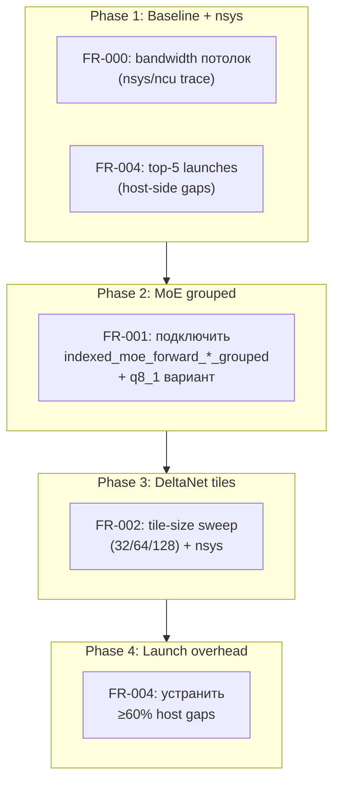

# Plan: Prefill Optimization (All Components)

**Date:** 2026-08-23
**Status:** 📝 Planning
**Priority:** P1
**Specification:** [docs/specs/2026-08-23-prefill-optimization.md](../specs/2026-08-23-prefill-optimization.md)

## Goal

Префилл ≥850 ток/с на RTX 3060 (паритет с llama.cpp). Чанк 512 ≤ 0.6 с (vs текущих 1.86 с). Decode не деградирует.

## Current state

### Ключевые файлы (candle-fork):
- `candle-core/src/quantized/cuda.rs` — MMQ dispatch, MoE dispatch (`indexed_moe_forward`, `indexed_moe_forward_dual`)
- `candle-kernels/src/quantized.cu` — MoE ядра: базовые `_q8_1` (используются) + `_grouped` (написаны, не подключены)
- `candle-kernels/src/mmq_gguf/` — MMQ ядра (Q5K/Q6K shared, ~0.3 мс — дёшево)
- `qwen35-batch/src/real/delta_rule_cuda.rs` — DeltaNet CUDA bindings (fused, 466 мс/чанк)
- `qwen35-batch/src/real/delta_rule_batched_cuda.rs` — batched DeltaNet
- `qwen35-batch/src/real/model_weights.rs` — forward_prefill для DeltaNet/Attention/MoE
- `qwen35-batch/src/real/adapter.rs` — prefill_chunk orchestration

### Текущие тайминги (чанк 512, sync-based GPU):
| Компонент | Время | Потенциал |
|---|---|---|
| DeltaNet fused | 466 мс | tile-size sweep |
| Attention FA2 | 300 мс | ✅ verified |
| MoE down (IQ2S/IQ3S) | 280 мс | grouped kernel |
| MoE gate+up (IQ2XXS dual) | 150 мс | grouped kernel |
| Launch overhead | ~650 мс | nsys-driven |
| Shared MMQ (Q5K/Q6K) | ~10 мс | — |

## Solution architecture



## Solution

### Phase 1: Baseline + nsys trace (estimate: 4h)

#### Files:
- [ ] `scripts/nsys_prefill.ps1` — скрипт запуска nsys trace на чанке 512

#### Tasks:
- [ ] FR-000: nsys profile на чанке 512 → теоретический bandwidth IQ2 (GB/s)
- [ ] FR-004-prep: извлечь top-5 launches по host-side gap из nsys trace
- [ ] Зафиксировать baseline: prefill wall, per-component GPU time, host gaps

**Independent check:** `nsys stats --report cuda_gpu_trace` показывает все kernels + gaps

### Phase 2: MoE grouped kernel (estimate: 8h) — ❌ ОТРИЦАТЕЛЬНЫЙ РЕЗУЛЬТАТ

**Результат**: grouped kernel измерен МЕДЛЕННЕЕ базового (43-47 мс vs 29-34 мс @batch=512).
Причина: atomicAdd + shared-memory contention > launch-overhead savings.
Базовое ядро grid=(n, batch, topk) уже имеет good occupancy при batch=512.

Код сохранён (QWEN36_ENABLE_MOE_GROUPED=1 для теста), но disabled by default.
Commit: cab3218a. FR-001 закрывается как отрицательный — базовое ядро достаточно.

**Альтернатива для MoE**: MMQ для MoE (register-level dequant + tensor core GEMM).
Аналогично shared-весам (0.3 мс). Но это требует другой подход — не grouped, а
полная замена indexed_moe_forward на mul_mat_q_mma с expert routing.

#### Files:
- [ ] `candle-kernels/src/quantized.cu` — добавить `indexed_moe_forward_*_q8_1_grouped` (вариант существующего `_f32_grouped` но с q8_1 входом)
- [ ] `candle-core/src/quantized/cuda.rs` — dispatch на `_grouped` при batch > 1

#### Data flow:
```pseudo
// Сейчас: grid=(n, batch, topk) — 2M блоков, per-row
// Grouped: grid=(n, n_experts) — 512 блоков, токены батчатся по экспертам
// shared: tasks[route_tile=256] — токены grouped по expert_id
```

#### Tasks:
- [ ] Добавить `IQ_MOE_Q8_1_GROUPED_EXTERN` макрос в quantized.cu
- [ ] В cuda.rs: `indexed_moe_forward_dispatch` — добавить ветку `_grouped` при batch > 1
- [ ] Parity-тест: MAE ≤ 1e-3 vs CPU dequant golden
- [ ] Env-флаг: QWEN36_DISABLE_MOE_GROUPED=1

**Independent check:** prefill @10K без MoE-grouped vs с ним — wall time сравнение

### Phase 3: DeltaNet tile-size sweep (estimate: 4h) — ✅ Завершён, малый эффект

**Результат**: warps=2 оптимально (1.8 мс vs 2.8 мс для warps=1). Но P3 recurrent = всего 54 мс/чанк.
**Ключевое открытие**: 466 мс "delta" из [pf] — это QMatMul проекции (IQ2 matmuls), НЕ recurrent kernel.
DeltaNet recurrent уже быстр. Tile-sweep даёт <1% wall-time — не значимый рычаг.
Default изменён на warps=2. Commit: cafd407f.

#### Files:
- [ ] `qwen35-batch/src/real/delta_rule_cuda.rs` — конфигурация tile-size через env

#### Tasks:
- [ ] Добавить env QWEN36_DELTA_TILE=32|64|128 (default 128)
- [ ] Sweep: замер 3 вариантов на чанке 512
- [ ] nsys verify: выбрать оптимальный tile-size
- [ ] Parity-тест на каждом варианте

**Independent check:** DeltaNet GPU time ≤ 200 мс/чанк на оптимальном tile

### Phase 4: Launch overhead elimination (estimate: 6h)

#### Files:
- [ ] `qwen35-batch/src/real/adapter.rs` — prefill_chunk: batch multiple ops
- [ ] `candle-core/src/quantized/cuda.rs` — fused launches where possible

#### Tasks:
- [ ] FR-004: устранить top-5 host gaps из Phase 1 nsys trace (≥60%)
- [ ] Проверить: нет ли лишних D2H/H2D между launches
- [ ] Env-флаги для каждого fused launch

**Independent check:** launch overhead ≤ 260 мс/чанк

### Phase 5: Prefill→q8 batched KV (estimate: 8h) [P]

#### Files:
- [ ] `qwen35-batch/src/real/adapter.rs` — seed_slot_batched: direct q8 write
- [ ] `qwen35-batch/src/real/model_weights.rs` — remove single-slot F16 path for prefill

#### Tasks:
- [ ] FR-010: prefill KV → q8 batched напрямую (skip F16 single-slot)
- [ ] Env-флаг: QWEN36_KEEP_SINGLE_KV=1 (уже существует)
- [ ] Parity-тест

**Independent check:** VRAM @24K ≤ 92%, decode ≥ 6 ток/с

### Phase 6: Integration + validation (estimate: 4h)

#### Tasks:
- [ ] Full parity: MAE ≤ 1e-3 на 512-токен промпте
- [ ] Full benchmark: prefill 1K/10K/24K, decode 6K/12K/24K
- [ ] Decode regression check
- [ ] Документация: обновить AGENTS.md, plan

**Independent check:** все критерии успеха из спеки

## Traceability: Requirements → Tasks

| Requirement | Phase | Tasks |
|---|---|---|
| FR-000 | 1 | nsys bandwidth потолок |
| FR-001 | 2 | grouped kernel подключение |
| FR-002 | 3 | tile-size sweep |
| FR-003 | — | ✅ verified (FA2 активен) |
| FR-004 | 1, 4 | nsys trace + gap elimination |
| FR-005 | 2, 3, 4, 5 | parity-тесты на каждой фазе |
| FR-006 | 2, 3, 4, 5 | env-флаги на каждой фазе |
| FR-010 | 5 | prefill→q8 batched |
| FR-011 | 2 | occupancy analysis (fallback) |
| FR-012 | 6 | микро-промпт validation |

## Risks and mitigations

| Risk | Likelihood | Impact | Mitigation |
|------|------------|--------|------------|
| Bandwidth-потолок < 850 ток/с | Medium | High | FR-000 первым делом; если потолок ниже — скорректировать цель |
| Grouped kernel не даёт эффекта | Medium | Medium | Fallback: batched-tile ядро (FR-011) |
| DeltaNet tile sweep без эффекта | Medium | Low | DeltaNet уже fused; возможно bandwidth-bound. Фокус на MoE+overhead |
| Decode деградирует | Low | High | Parity-тесты + decode regression check на каждой фазе |
| Parity сломается на MoE | Medium | High | CPU dequant golden, тест ДО мержа |

## Dependencies

- nsys (NVIDIA Nsight Systems) — для FR-000, FR-004
- llama.cpp — для parity golden (CPU dequant)

## Deferred questions

| Question | Why deferred | When the answer is needed | Who decides |
|---|---|---|---|
| MMQ для MoE-экспертов | Неясно, поддерживает ли llama.cpp; если нет — наш grouped может быть быстрее | После Phase 2 baseline | Архитектор |

## Plan decisions

| # | Question | Decision | Date |
|---|----------|----------|------|
| PD-001 | MoE strategy: grouped vs new batched-tile? | Подключить существующее `_grouped` + q8_1 вариант. Быстрый старт, fallback на batched-tile | 2026-08-23 |
| PD-002 | DeltaNet: tile sweep vs new kernel? | Tile-size sweep + nsys. DeltaNet уже fused, рефакторинг premature | 2026-08-23 |
| PD-003 | Launch overhead: nsys-driven vs CUDA graphs? | nsys-driven. CUDA graphs для prefill — overkill, сначала понять gaps | 2026-08-23 |
