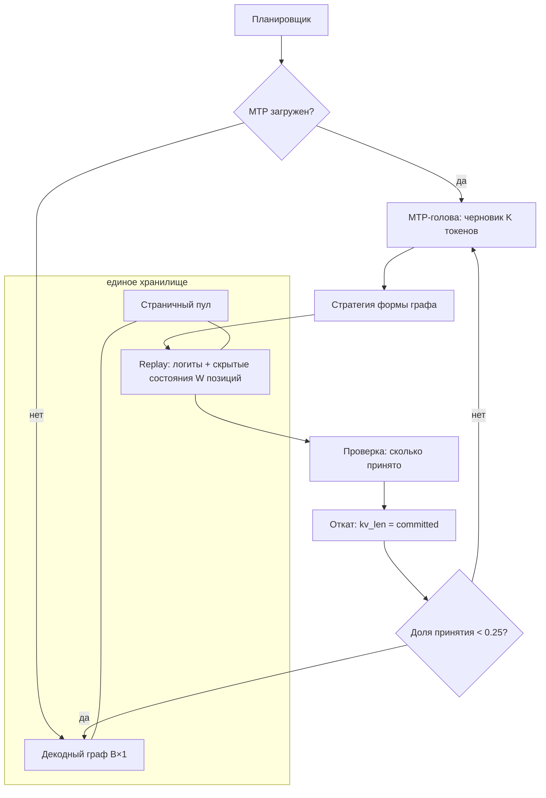

# План: MTP-декод, совместимый с CUDA-графами

**Спека:** [2026-08-27-mtp-cuda-graphs.md](../specs/2026-08-27-mtp-cuda-graphs.md)
**Дата:** 2026-08-27
**Оценка:** 12–16 рабочих дней до включаемого MTP на 27B

## Что уже известно из замеров

Эти числа — основание плана, переизмерять их не нужно.

| путь | шаг (32K) | работа GPU | простой хоста |
|---|---|---|---|
| CUDA-графы | 34.2 мс | ~31 мс | ~3 мс |
| eager | 52.4 мс | ~31 мс | ~21 мс |

На 128K разрыв втрое: 24.7 против 8.3 ток/с. Работа GPU в обоих путях одинакова и совпадает с пределом шины памяти — оптимизировать вычисления нечего.

**MTP на eager-пути убыточен:** доля принятых токенов 87%, итог на 11–42% ниже обычного декода. Причина не в MTP, а в пути: каждый раунд спекуляции платит свои 20 мс простоя.

**Инвариант выхода не держится** (сценарий 1 спеки выполнен). При ширине драфта 1 выход совпадает, при ширине ≥ 2 расходится: позиция расхождения одна и та же для ширин 2, 4 и 8, от seed не зависит. Около 1.2% позиций имеют разрыв между первым и вторым кандидатом меньше 0.1 — на них argmax перекидывается от возмущения в младших разрядах.

## Блокирующее решение владельца

**BD-023 требует совпадения выхода токен в токен. Замер показал, что это недостижимо** при спекуляции шириной ≥ 2, иначе как через инвариантные к размеру батча ядра.

При этом теряется не качество, а воспроизводимость: спекулятивный декод с корректной проверкой даёт **то же распределение**, что обычный, — это свойство алгоритма. Не совпадает лишь конкретная реализация при фиксированном seed.

**Нужно решение: заменить BD-023 новым, требующим совпадения распределения, а не реализации.** До него фазы Ф5–Ф7 выпускать нельзя. Фазы Ф1–Ф4 от него не зависят и делаются параллельно.

## Архитектура



Ключевое отличие от сегодняшнего: **страничный пул обслуживает оба режима**. Сегодня графовый путь работает с пулом, а eager — с отдельным `kv_cache_batched`, и MTP привязан ко второму.

## Фазы

### Ф1. Единое хранилище KV — eager на страничный пул (3–4 дня)

**Зачем первым.** MTP сегодня живёт на batched-пути. Пока путей два, любая работа по MTP делается дважды либо упирается в мост между ними. Плюс это снимает три известных дефекта разом.

**Что меняем:**
- `model_weights.rs` — `forward_decode_batch` читает KV из страничного пула вместо `kv_cache_batched`. Механизм чтения существует: `real/paged_attn.rs` уже вызывает flash-attention со страничным пулом на графовом пути.
- `adapter.rs:1027` — убрать `rehydrate_kv_from_paged` из пути декода: собирать batched-кеш станет не из чего и незачем.
- `model_weights.rs:3057` — `kv_cache_batched` и связанные с ним `kv_mirror`, `f16_prefix`, `invalidate_mirror` удаляются.
- Страничный пул должен создаваться и при выключенных графах (сегодня не создаётся).

**Проверяемые вехи:**
- [ ] При `QWEN36_CUDA_GRAPHS=0` в логе появляется строка `paged pool: window=…` (сегодня отсутствует — проверено).
- [ ] VRAM на 128K без графов падает с 44 383 до ~36 800 МБ, то есть на объём второй копии KV.
- [ ] Выход при выключенных графах совпадает токен в токен с выходом до правки (обычный декод, seed фиксирован).
- [ ] `model_weights.rs:8120` — отказ «int8-пул: обратная миграция не поддержана» удалён вместе с обратной миграцией, и `QWEN36_KV_POOL_Q8=1` работает при выключенных графах.

**Что НЕ произойдёт:** скорость eager не вырастет. Двадцать один миллисекунд простоя — это цена драйверных вызовов, а не хранилища. Ожидать здесь ускорения — ошибка; фаза делается ради единственности пути.

### Ф2. Граф отдаёт скрытые состояния (2 дня)

**Что меняем:**
- `adapter.rs:76` — в `DecodeGraphState` добавить выход `hidden_t` рядом с `logits_t`.
- Захват (`adapter.rs:~1587`) переключить на `forward_embeds_with_hidden` — функция уже существует и используется на eager-пути.
- `verified_target_hidden` (`adapter.rs:220`) наполняется из графового выхода.

**Проверяемые вехи:**
- [ ] После replay графа `hidden_t` содержит ненулевой тензор формы `[B, hidden_size]`.
- [ ] Скрытые состояния из графа совпадают с полученными eager-путём на том же входе с точностью до 1e-3.
- [ ] Декод без MTP не замедлился больше чем на 2%: 29.2 ток/с на 32K, 24.7 на 128K.

### Ф3. Граф принимает W токенов (2–3 дня)

**Что меняем:**
- `DecodeGraphState.ids_t` из `[B, 1]` в `[B, W]`, выходы `logits_t` и `hidden_t` — в `[B, W, …]`.
- Ширина W фиксирована на этапе захвата, недостающие позиции добиваются пустышками.

**Обоснование выбора.** Декод упирается в чтение весов (замерено: 31 мс из 34.2), поэтому проверка W позиций стоит почти столько же, сколько одной. Дополнение пустышками практически бесплатно, зато форма графа перестаёт зависеть от фактической глубины драфта — и адаптивная ширина, которая уже есть в `scheduler.rs`, работает без пересборки графа.

**Проверяемые вехи:**
- [ ] Replay с W=4 возвращает 4 строки логитов и 4 скрытых состояния.
- [ ] Время шага при W=4 без MTP превышает время при W=1 не более чем на 15% — подтверждение того, что лишние позиции дёшевы.
- [ ] Число захватов графа не растёт при смене фактической глубины драфта.

### Ф4. Откат отвергнутых позиций (2 дня)

**Что меняем:**
- Проверочный проход пишет W позиций в пул; после решения о принятии `kv_len` слота сдвигается к числу принятых.
- Ввести понятие **запечатанной страницы**: страница допускается к хешированию и вытеснению только когда подтверждённая длина прошла её конец. Это же требование стыка с кешем префиксов (FR-021 спеки кеша).
- Обработать границы: обрыв запроса, вытеснение слота, усечение по BD-017, нехватка места до конца окна.

**Проверяемые вехи:**
- [ ] После раунда `kv_len` слота равен числу принятых токенов.
- [ ] Обрыв соединения между записью драфта и завершением проверки откатывает `kv_len` к последнему подтверждённому.
- [ ] При остатке до границы окна меньше W ширина уменьшается либо раунд идёт обычным декодом; переполнения нет.
- [ ] Автотест: 200 раундов со случайной долей принятия, `kv_len` ни разу не разошёлся с числом принятых.

### Ф5. Снятие PD-204 (1–2 дня)

**Что меняем:**
- `adapter.rs:1331` — убрать `self.mtp.is_some()` из условия ухода на eager. Мультимодальность (`multimodal[slot].is_some()`) остаётся: mrope — отдельная задача.
- Подключить MTP-раунд к графовому пути.

**Проверяемые вехи:**
- [ ] При загруженном MTP счётчик replay графа больше нуля (сегодня ноль).
- [ ] Декод с MTP на 128K **не ниже 24.7 ток/с** — уровня графов без MTP. Ниже означает, что фаза не достигла цели.
- [ ] Целевое значение: не ниже 37 ток/с при доле принятия 0.87, замеренной разведкой.

### Ф6. Замер и выбор стратегии формы (2 дня)

Реализуется вторая стратегия — правка параметров узлов готового графа (`cuGraphExecKernelNodeSetParams`, около 1 мкс против 2 мс на пересборку) — и сравнивается с фиксированной шириной.

**Порог остановки:** если фиксированная ширина дала меньше 20% прироста относительно графов без MTP, вторая стратегия не реализуется, а замысел пересматривается.

**Проверяемые вехи:**
- [ ] Таблица: две стратегии × три длины контекста, декод, доля принятия, VRAM.
- [ ] Выбор по умолчанию зафиксирован решением с числами; отвергнутая стратегия остаётся доступной настройкой.

### Ф7. Артефакты и подключение к серверу (2 дня)

- `forge-convert` пакует MTP в Q8_0 для 4B, 9B и 27B.
- Загрузка сверяет скрытый размер и число голов с моделью и отклоняет чужой артефакт.
- Сервер принимает путь настройкой, грузит по требованию (BD-027).
- Откат на обычный декод при доле принятия ниже 0.25 за окно из 32 раундов.

**Проверяемые вехи:**
- [ ] Три артефакта Q8_0 по 15 тензоров, проходят валидацию профиля.
- [ ] Артефакт от 4B, поданный к 9B, отклоняется с указанием несовпадающего размера.
- [ ] Поле `mtp` в ответе API содержит `enabled: true` и ненулевые счётчики.
- [ ] Запрос с нулевой долей принятия обслуживается не более чем на 10% дольше, чем без MTP.

## Порядок и параллельность

```
Ф1 (хранилище) ──┬──> Ф4 (откат) ──┐
                 │                  ├──> Ф5 (снятие PD-204) ──> Ф6 (стратегии)
Ф2 (hidden) ─────┴──> Ф3 (W токенов) ──┘
                                          Ф7 (артефакты) — параллельно с Ф2–Ф6
```

Ф1 и Ф2 независимы и идут одновременно. Ф7 не зависит ни от чего, кроме `forge-convert`, и может выполняться параллельно всему.

## Чего этот план не решает

**Скорость eager-пути.** Двадцать один миллисекунда простоя остаётся: это цена ~2700 драйверных вызовов на токен, и убрать её можно только графами. План не чинит eager, он выводит MTP из-под него.

**Мультимодальность с MTP.** Блокировка PD-204 для mrope сохраняется.

**Многослотовый режим.** Отложен по решению владельца до доведения одного слота.

**Инвариант выхода.** Токен в токен не достигается; требуется решение по BD-023 (см. выше).

## Риски

| риск | вероятность | что делаем |
|---|---|---|
| Ф1 замедлит графовый путь при переводе на общее хранилище | средняя | веха Ф2 требует сохранения 29.2 / 24.7 ток/с; при просадке откатываем и разделяем чтение |
| Дополнение пустышками окажется дороже расчётного | низкая | веха Ф3 меряет это прямо: рост шага при W=4 не более 15% |
| Захваченный граф с W позициями съест много VRAM | средняя | замерить размер exec на целевой карте 12 ГБ до Ф6; при дефиците — стратегия правки узлов вместо пула форм |
| Доля принятия на 27B окажется ниже разведанных 0.87 | низкая | разведка мерила на 27B; при падении срабатывает откат из Ф7 |
