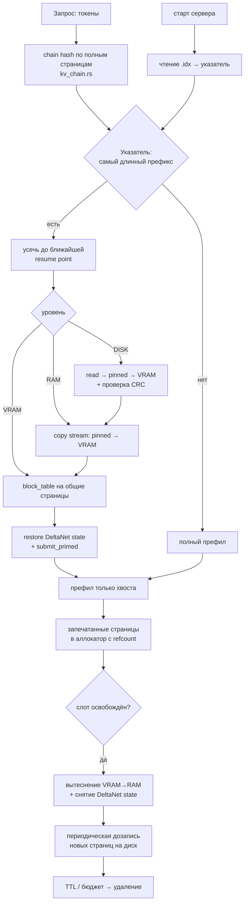

# Plan: Многоуровневый кеш KV — VRAM, RAM, диск

**Дата:** 2026-08-27
**Статус:** 📝 Planning
**Приоритет:** P0
**Спецификация:** [docs/specs/2026-08-27-tiered-kv-cache.md](../specs/2026-08-27-tiered-kv-cache.md)
**Смежная спека:** [docs/specs/2026-08-27-mtp-cuda-graphs.md](../specs/2026-08-27-mtp-cuda-graphs.md) (FR-021)

## Цель

Найти уже посчитанный префикс до префила, поднять его страницы в VRAM за доли секунды
и пережить перезапуск. Опорное число: префил 256K — 173 с, перекачка того же в int8 по
PCIe 4.0 x16 при закреплённой памяти — 0.35 с.

---

## 0. Результаты разведки (сделано, работы не требует)

Три вопроса спеки закрыты чтением кода. Два ответа меняют объём работы, один — замысел.

### 0.1 Отложенный вопрос «что такое `[pg] chunk … hit=1 lru=1`» — закрыт

Это **не кеш KV**. Это LRU **CUDA-графов префила**:
`adapter.rs:1485` печатает строку, `adapter.rs:102-144` объявляют `PrefillGraphState` и
`PGRAPH_LRU = 8`, ключ LRU — пара `(T, slot)`. `hit` — попадание в готовый *граф* под эту
длину чанка и этот слот, `lru` — сколько графов сейчас держим. Ни одного токена KV этот
механизм не переиспользует. **Сценарий 1 не начат.**

### 0.2 Зато частично сделано другое — и по другому замыслу

| Что | Где | Состояние |
|---|---|---|
| `PrefixCache` — LRU по бюджету, ключ = хеш всего промпта + сверка токенов | `src/prefix_cache.rs` (147 строк, с тестами) | Написан, **выключен намертво**: `config.rs:328` и `engine_batched.rs:171` падают при `PREFIX_CACHE_MIB != 0` |
| `BatchScheduler::submit_primed` — приём слота с готовым префиксом | `scheduler.rs:219` | Написан, **вызывающих нет** |
| `slot_snapshot` / `inject_slot_snapshot` | `adapter.rs:441,447` | Написаны, **вызывающих нет** |
| `snapshot_state` / `restore_state` (полный state модели) | `model_weights.rs:6456,6474` | Работают |
| `checkpoint_slot_batched` / `restore_slot_batched` (per-slot) | `model_weights.rs:6688,…` | Работают (их использует MTP-откат) |
| `migrate_kv_to_paged` / `rehydrate_kv_from_paged` / `set_kv_len_batched` | `model_weights.rs:8092,8071` | Работают; `rehydrate` **не умеет int8-пул** (`bail!` на `k_scale.is_some()`) |
| `StateSnapshot::size_bytes` — учёт байтов для бюджета | `model_weights.rs:4501` | Работает |
| `ModelFingerprint::compute(architecture, metadata, tensor_manifest, file_size)` | `model_profile.rs` | Готовый корень цепочки под FR-002 |

Существующий `PrefixCache` — точное совпадение **всего** промпта, только RAM, без цепочки
хешей и без диска. Он покрывает подмножество сценария 1 и по ключу несовместим с цепочкой.
Решение плана: **не выбрасывать, а заменить** — `PrefixCache` становится частным случаем
(совпадение на последней странице) внутри нового указателя, а его LRU-по-бюджету и защита
от коллизии сверкой токенов переезжают как есть.

### 0.3 Неизменяемость страниц — держится не везде. Три места

Замысел «снепшот = дозапись» опирается на то, что страница после записи не меняется.
Проверил по коду: **логически** это верно, **физически** — нет, и есть три пробоя.

**(а) Аллокатора страниц не существует.** Физическая страница считается арифметикой:
`adapter.rs:1344-1348` (префил) и `adapter.rs:1574-1584` (декод) строят таблицу как
`bt[bidx*mb + j] = slot*max_blocks + j`. Слот владеет фиксированным диапазоном физических
страниц; следующий запрос в том же слоте пишет ровно поверх них. Ни свободного списка, ни
счётчика ссылок. **Разделить страницу между слотами сегодня невозможно** — это отдельный
этап работы (Э4), а не деталь.

**(б) Переполнение окна переписывает последнюю страницу.**
`quantized.cu:6996` в `kv_append_paged_f16`: при `len >= window` делается `len = window - 1`,
то есть последняя позиция последней страницы переписывается на каждом шаге. В `_multi`
варианте (`quantized.cu:7040`) в том же случае просто `return`. Обе ветки помечены
«host falls back». Значит **последняя страница мутабельна, когда контекст дошёл до окна**.

**(в) MTP — пробой, который ещё только придёт.** Сегодня MTP уходит на eager-путь
(`adapter.rs:1331`: `if self.mtp.is_some() … return Ok(None)`), пул не трогается, откат идёт
через `restore_slot_batched` по batched-кэшу (`model_weights.rs:6688`). Спека
`2026-08-27-mtp-cuda-graphs.md` снимает ровно этот запрет — и тогда проверочный проход
запишет W позиций в пул, а отказ отмотает `kv_len` назад, и следующий раунд напишет поверх.

**Правило, закрывающее все три и отвечающее на FR-021:**

> Страница считается **запечатанной** (может быть захеширована, вытеснена, записана на диск,
> разделена между слотами) только когда подтверждённый водяной знак прошёл её конец:
> `kv_len_committed >= (page_index + 1) * PAGE_SIZE`, причём `kv_len_committed` — длина
> **после** `speculative_accept`, а не после `speculative_verify`. Незапечатанная последняя
> страница не попадает в цепочку никогда.

Отсюда же следствие для (б): при `kv_len == window` последняя страница никогда не
запечатывается, и кеш её просто не видит. Ничего дополнительно чинить не нужно.

### 0.4 RoPE запечён в страницы

`model_weights.rs:3833-3878`: в пул уходит `k_rope` — K уже после RoPE по абсолютной позиции.
Страница поэтому валидна **только на своём абсолютном смещении**. Для поиска по префиксу это
безвредно (префикс всегда начинается с нуля), но означает: переиспользовать блок на другом
смещении нельзя, и **скользящее окно BD-017 (выкидывание середины) обнуляет весь хвост кеша** —
после сдвига ни одна страница за точкой выреза не годится. Это надо сказать вслух в приёмке
сценария 1, иначе на длинных диалогах попадания внезапно исчезнут.

### 0.5 Главное, чего спека не учла: модель гибридная

Спека считает контекст = страницы внимания. Для Qwen3.6-27B это неверно.
`(layer_idx+1) % full_attention_interval != 0 → DeltaNet` (`model_weights.rs:4446`),
интервал по умолчанию 4 → на ~64 блока приходится **16 слоёв внимания и ~48 слоёв DeltaNet**.
У DeltaNet — рекуррентное состояние (`DeltaNetStateSnap { conv_buf, ssm_state }`,
`model_weights.rs:1221`), и оно:

- **не страничное и не приростное** — это катящееся состояние, снять его можно только целиком
  и ровно в той позиции, с которой хотим продолжить;
- **O(1) по длине контекста**: `ssm_state = n_v_heads · head_v_dim²` f32 на слой,
  `conv_buf = (conv_kernel-1) · channels`. По комментарию в `adapter.rs` — «DeltaNet ~8MB/слой/слот
  на 27B», то есть **порядка 380 МиБ на одну точку возобновления**. Цифру обязательно замерить
  в Э1, а не брать на веру.

Что это меняет:

- Запись кеша — это **не** «страницы 0..N», а **«страницы 0..N + состояние DeltaNet в точке N»**.
- Возобновиться можно только там, где состояние DeltaNet снято. Точки возобновления **редкие**:
  одна на запись (хвост) плюс, по настройке, через шаг. Снимать на каждой границе страницы
  нельзя — 380 МиБ на 64 токена.
- Бюджет RAM тратится на состояния DeltaNet, а не на страницы: контекст 256K в int8 — 8.66 ГБ
  страниц против 0.38 ГБ состояния, но десять диалогов по 4K — это 0.16 ГБ страниц против
  3.8 ГБ состояний. **Оба бюджета считать раздельно.**
- Цепочка хешей по страницам остаётся — она находит совпадение; но найденная длина совпадения
  усекается вниз до ближайшей точки возобновления.

Плюс, парадоксально, это же — конкурентное преимущество: llama.cpp гибридные модели не кеширует
вовсе (`forcing full prompt re-processing due to recurrent memory`), о чём уже написано в шапке
`src/prefix_cache.rs`.

### 0.6 Где живёт код

`Qwen3.6 27B/Cargo.toml` тянет `../candle-fork/qwen35-batch`, а текущая работа по движку идёт
в `../yttri-forge/engine/qwen35-batch` (у `yttri-forge` remote `candle` смотрит обратно в
`candle-fork`). Файлы разошлись — `adapter.rs` в двух деревьях разный. **До начала Э1 решить,
в какое дерево кладём и когда серверный `Cargo.toml` переключается.** Иначе Э6 не соберётся.

Прочее: адаптер `!Send`, всё CUDA живёт в одном std-потоке `dispatch_loop`
(`engine_batched.rs:229-258`) — уровни RAM/диск могут быть своим потоком, но копирование
VRAM↔RAM обязано запускаться из dispatch-потока. Понятия «сессия» в API нет; под FR-013
берём имя ключа из `QWEN36_API_KEYS` (BD-021) как идентификатор сессии.
`cudarc 0.19` уже даёт `CudaContext::alloc_pinned` → `PinnedHostSlice`, `new_stream`,
`CudaEvent::record` — новых зависимостей под закрепление памяти и отдельный поток не нужно.

---

## 1. Модель данных (пересмотренная)

```
Запись кеша (entry) — одна цепочка от корня
  root_hash      : отпечаток (model_id, quant, kv_dtype, PAGE_SIZE, rope_base)
  pages[]        : [ { chain_hash, prev_hash, tokens[64], payload } ]  ← неизменяемы
  resume_points[]: [ { page_index, deltanet_state, kv_len } ]          ← редкие, ~380 МиБ
  owner          : имя ключа | SHARED
  last_used      : отметка времени
  pinned_by      : число активных запросов (0 → можно вытеснять)

Уровни: VRAM (страницы в пуле) | RAM (закреплённый буфер) | DISK
Точка возобновления существует на том же уровне, что и её страницы, либо ниже.
```

Ключевое отличие от спеки: без `resume_points` запись бесполезна, и её объём считается
отдельным бюджетом.

## 2. Архитектура



---

## 3. Этапы

Э1–Э3 не трогают ни `paged_kv_cuda.rs`, ни `adapter.rs` — идут параллельно работам по MTP.
Э4 — единственный, который конфликтует с MTP по файлам; ставить после того, как MTP
приземлится, либо согласовывать посменно.

### Э1. Хеш-цепочка, отпечаток конфигурации, замер DeltaNet (оценка: 1 д)

Ничего, кроме нового файла. Пула не касается.

**Файлы:**
- [ ] `engine/qwen35-batch/src/real/kv_chain.rs` — новый
- [ ] `engine/qwen35-batch/src/real/mod.rs` — `pub mod kv_chain;`

**Задачи:**
- [ ] `pub struct ChainRoot { model_fingerprint: u64, kv_dtype: u8, page_size: u32, rope_base: u32 }`
      + `fn from_profile(&ModelProfile) -> ChainRoot` — берёт готовый `ModelFingerprint::compute`,
      своего хеша по метаданным не изобретаем (FR-002)
- [ ] `pub fn chain(root: &ChainRoot, tokens: &[u32]) -> Vec<u64>` — по одному хешу на **полную**
      страницу; неполный хвост не хешируется вовсе (FR-001, критерий «в кеш попадают только
      полные страницы»)
- [ ] `pub fn chain_incremental(root, tokens, known: &[u64]) -> …` — считает только новые звенья,
      чтобы дописанная реплика не пересчитывала цепочку с нуля
- [ ] `pub const fn sealed_pages(kv_len_committed: usize) -> usize` — правило §0.3, единственное
      место в коде, где оно записано; из него же зовётся MTP-путь (FR-021)
- [ ] Замерить фактический размер `StateSnapshot` DeltaNet на 27B (`size_bytes()` уже есть) —
      вписать число сюда и в спеку

**Independent check:** `cargo test -p qwen35-batch kv_chain` — юнит-тест: (1) цепочка от разных
`ChainRoot` не пересекается; (2) дописанная страница не меняет предыдущие звенья;
(3) `chain_incremental` даёт то же, что `chain`; (4) хвост в 63 токена не даёт звена.
Плюс микробенч: цепочка на 256K токенов — вписать миллисекунды, бюджет FR-004 — 50 мс.

---

### Э2. Указатель кеша и уровни RAM/диск — без GPU (оценка: 3 д)

Страница здесь — непрозрачный блок байтов. Ни CUDA, ни пула. Проверяется на любой машине.

**Файлы:**
- [ ] `src/kv_tier/mod.rs` — новый: `TieredKvCache`, публичный фасад
- [ ] `src/kv_tier/index.rs` — `chain_hash → EntryRef`, поиск самого длинного префикса
- [ ] `src/kv_tier/store_ram.rs` — уровень RAM (в Э2 — обычный `Vec<u8>`, закрепление в Э3)
- [ ] `src/kv_tier/store_disk.rs` — формат на диске, CRC, восстановление
- [ ] `src/kv_tier/policy.rs` — TTL, бюджеты, LRU, `pinned_by`
- [ ] `src/kv_tier/crc.rs` — CRC32C
- [ ] `src/config.rs` — новые настройки (см. ниже), снять `bail!` на строке 328
- [ ] `src/prefix_cache.rs` — **удалить** после переезда LRU-по-бюджету и сверки токенов в `policy.rs`

**Формат на диске (закрывает отложенный вопрос спеки):**

Два файла на запись, в каталоге `KV_CACHE_DIR/<root_hash>/<entry_hash>/`:

- `pages.kv` — только дозапись. Записи фиксированного размера:
  `[u64 chain_hash][u32 page_index][u32 payload_len][u32 crc32c][payload]`.
  Новые страницы диалога — `write` в конец, `fsync`. Дозапись пропорциональна приросту (D-002).
- `dir.idx` — каталог страниц и точек возобновления: смещения, длины, `chain_hash`, `kv_len`.
  Пишется в `dir.idx.tmp` и **переименовывается** после `fsync` файла `pages.kv`.
- `state/<page_index>.dn` — состояние DeltaNet точки возобновления, тем же
  «дозапись + rename» протоколом.

Почему так, а не файл на страницу: совпадение префикса — это всегда **непрерывный прогон
страниц от нуля**, поэтому читаем пачками; 4096 отдельных файлов на контекст 256K дали бы
4096 открытий вместо одного `read`.

Целостность при убийстве процесса (FR-009, критерий «убит посреди записи»): `dir.idx`
атомарен через `rename` и никогда не описывает больше, чем уже сброшено `fsync`-ом в
`pages.kv`. Оборванный хвост `pages.kv` каталогом не описан → невидим и затирается следующей
дозаписью. CRC на каждую страницу остаётся против порчи на носителе: не сошлась — запись
отбрасывается целиком, контекст считается префилом.

Восстановление при старте (FR-007, FR-008) читает **только `dir.idx`**, ни одной страницы.
100 ГБ снепшотов — это тысячи мелких `dir.idx`, а не 51200 seek-ов по данным.

CRC32C — через `std::arch::_mm_crc32_u64` под `#[target_feature(enable = "sse4.2")]`, десяток
строк, с программным табличным запасным путём. Новой зависимости не берём: `sha2` (уже есть)
даёт ~1 ГБ/с, на 8.6 ГБ это восемь секунд — не годится; аппаратный CRC32C даёт >10 ГБ/с.

**Задачи:**
- [ ] `index.rs`: поиск самого длинного совпавшего префикса по цепочке из Э1, с усечением до
      ближайшей точки возобновления (FR-003)
- [ ] `policy.rs`: два независимых бюджета — под страницы и под состояния DeltaNet; вытеснение
      по обоим основаниям, TTL RAM→диск, TTL 3 суток диск→удаление (FR-010, FR-011, FR-014)
- [ ] `policy.rs`: `pinned_by` — запись, занятая активным запросом, не вытесняется (FR-012)
- [ ] `policy.rs`: политика разделения — `owner` = имя ключа либо `SHARED`; при запрете поиск
      фильтрует чужие записи на **всех трёх** уровнях (FR-013, сценарий 5)
- [ ] `store_disk.rs`: дозапись, каталог, CRC, восстановление, удаление по TTL
- [ ] `config.rs`: `KV_CACHE_DIR`, `KV_CACHE_RAM_PAGES_MIB`, `KV_CACHE_RAM_STATE_MIB`,
      `KV_CACHE_DISK_GIB`, `KV_CACHE_RAM_TTL_SEC`, `KV_CACHE_DISK_TTL_SEC` (умолчание 3 сут),
      `KV_CACHE_SHARING` = `off|same-key|shared-prefix-only`

**Independent check:** `cargo test -p qwen36-server kv_tier` без GPU:
- запись N страниц → дозапись 2 → на диск ушли **ровно две** (D-002, критерий сценария 3);
- порча байта в `pages.kv` → запись отброшена, не выдана;
- обрыв: писать `pages.kv` и убить процесс до `rename` — при следующем открытии видно старое
  состояние, без ошибок (отдельный `#[test]`, форкающий дочерний процесс);
- бюджет: сутки нагрузки эмулируются синтетическим прогоном, расход не превышает настройки;
- разделение: запись ключа A не видна поиску ключа B ни на одном уровне.

---

### Э3. Закреплённая память и поток копирования (оценка: 1 д)

Отдельный этап именно потому, что без закрепления весь выигрыш падает втрое (6-10 ГБ/с
против 25), и это надо **измерить**, а не предположить.

**Файлы:**
- [ ] `engine/qwen35-batch/src/real/kv_transfer.rs` — новый: пул закреплённых буферов + поток
- [ ] `engine/qwen35-batch/src/bin/bench_kv_pinned.rs` — новый бенч
- [ ] `engine/qwen35-batch/Cargo.toml` — регистрация бина

**Задачи:**
- [ ] `PinnedPool` поверх `CudaContext::alloc_pinned` (`cudarc 0.19`): буферы кратны размеру
      страницы, переиспользуются, не аллоцируются на каждый перенос
- [ ] Выделенный `copy_stream = ctx.new_stream()` + `CudaEvent` для синхронизации с потоком
      вычислений — перенос обязан прятаться за декодом чужих запросов (FR-005)
- [ ] Явная проверка в рантайме: если `alloc_pinned` не удался — **громкая** запись в лог и
      честное падение скорости, а не тихий откат на страничную память
- [ ] `bench_kv_pinned` меряет H2D и D2H на закреплённой и на обычной памяти, печатает ГБ/с

**Independent check:** `bench_kv_pinned` на yttri-win печатает **≥20 ГБ/с** на закреплённой
(NFR «память действительно закреплена») и заметно меньше на обычной — разница и есть
доказательство. Второй замер: декод в цикле + параллельный перенос 8.66 ГБ на copy-stream,
падение ток/с **≤5%** (критерий сценария 2).

---

### Э4. Аллокатор страниц со счётчиком ссылок (оценка: 3 д)

Самый инвазивный этап: убирает `phys = slot*max_blocks + j`. Конфликтует с MTP по `adapter.rs`.

**Файлы:**
- [ ] `engine/qwen35-batch/src/real/paged_kv_cuda.rs` — `PageAllocator` рядом с `PagedModelCtx`
- [ ] `engine/qwen35-batch/src/real/adapter.rs:1344-1348` — таблица блоков из аллокатора
- [ ] `engine/qwen35-batch/src/real/adapter.rs:1574-1584` — то же на пути декода
- [ ] `engine/qwen35-batch/src/real/adapter.rs:1252` (`reset_slot`) — возврат страниц, а не забвение

**Задачи:**
- [ ] `PageAllocator { free: Vec<u32>, refcount: Vec<u16> }` на `num_blocks` физических страниц
- [ ] `alloc_for(slot, logical_pages) -> Vec<u32>`, `retain(page)`, `release(page)`
- [ ] `block_table` строится из выданных страниц; форма `[capacity_b, max_blocks]` и
      `stage_inputs` **не меняются** — ядра ничего не заметят
- [ ] Разделяемая страница получает `refcount > 1`; в неё никто не пишет, потому что она
      запечатана (§0.3), а запись идёт только в хвост
- [ ] Исчерпание свободных страниц → отказ в приёме запроса, а не тихая порча чужого KV

**Independent check:** существующие `cargo test -p qwen35-batch --features cuda fa2_paged` и
`scheduler_parity` проходят без изменений. Новый тест: два слота с общим префиксом в 2000
токенов, второй берёт страницы первого (`refcount == 2`) — **логиты совпадают до бита** с
прогоном без разделения. Плюс: `reset_slot` возвращает все страницы, `free.len()` вернулся
к исходному (утечки страниц нет — это прямой критерий BD-008).

---

### Э5. Вытеснение VRAM ↔ RAM (оценка: 2 д)

**Файлы:**
- [ ] `engine/qwen35-batch/src/real/kv_transfer.rs` — `evict_pages`, `restore_pages`
- [ ] `engine/qwen35-batch/src/real/adapter.rs` — публичные `evict_slot_pages(slot)` /
      `restore_slot_pages(slot, &[…])`
- [ ] `src/engine_batched.rs` — вызов при освобождении слота

**Задачи:**
- [ ] `evict_pages`: D2H на copy-stream в закреплённый буфер, затем `release` страниц
- [ ] `restore_pages`: `alloc_for` + H2D на copy-stream, `CudaEvent` перед первым чтением
- [ ] Снятие/восстановление точки возобновления DeltaNet: переиспользовать существующие
      `checkpoint_slot_batched` / `restore_slot_batched` (`model_weights.rs:6688`), своего кода
      не писать
- [ ] int8-пул: страницы переносятся **как есть, байтами**, вместе с масштабами `k_scale`/`v_scale`
      (`PagedKvPool.k_scale`) — распаковка не нужна и запрещена. Заметить: сломанный
      `rehydrate_kv_from_paged` (bail на int8) этот путь **не** затрагивает, чинить его здесь не надо

**Independent check:** контекст 256K в int8 вытеснен и поднят обратно — логиты следующего
токена совпадают с прогоном без вытеснения; подъём **≤1.5 с** (критерий сценария 2);
`nvidia-smi` показывает возврат VRAM после вытеснения.

---

### Э6. Сшивание с префилом (оценка: 2 д)

**Файлы:**
- [ ] `engine/qwen35-batch/src/scheduler.rs:219` — снять `debug_assert!(primed_prefix_len + 1 == prompt.len())`:
      сегодня `submit_primed` умеет ровно «всё кроме последнего токена», нужен произвольный префикс,
      и хвост должен уходить обычными чанками, а не одним токеном
- [ ] `engine/qwen35-batch/src/real/adapter.rs:644` (`prefill_chunk`) — ветка «страницы уже в пуле»:
      выставить `kv_len` через `set_kv_len_batched` + `reset_kv_len`, счёт начать со `start_pos`
- [ ] `src/engine_batched.rs:332-400` — поиск в кеше между токенизацией и `submit`
- [ ] `src/engine_batched.rs:171` — снять `bail!`

**Задачи:**
- [ ] После токенизации: цепочка (Э1) → поиск (Э2) → подъём (Э5) → `inject_slot_snapshot` +
      `submit_primed(prompt, max_new, matched_len)`
- [ ] Промах и частичное совпадение — один и тот же путь, разница только в `matched_len`
- [ ] `pinned_by += 1` на время запроса, `-= 1` в `reset_slot` (FR-012)
- [ ] По завершении: запечатанные страницы и точка возобновления хвоста — в кеш
- [ ] Общий системный промпт: если политика `shared-prefix-only`, страницы префикса до первого
      пользовательского сообщения кладутся с `owner = SHARED` (сценарий 5)

**Independent check:** сквозной прогон на yttri-win:
- диалог 8K → дописать реплику → в логе видно, что префилом пошли **только новые токены**;
- два запроса с общим системным промптом 2000 токенов — у второго префил короче на 2000;
- запрос без совпадений — время до первого токена выросло **≤50 мс** относительно baseline;
- возврат к диалогу 256K после освобождения слота — **≤1.5 с** против 173 с.

---

### Э7. Снепшоты на диск, подъём при старте, наблюдаемость (оценка: 2 д)

**Файлы:**
- [ ] `src/kv_tier/mod.rs` — фоновый поток снепшотов
- [ ] `src/main.rs` — восстановление указателя при старте
- [ ] `src/engine_types.rs` / `src/api/openai.rs` / `anthropic.rs` / `responses.rs` — поля ответа
- [ ] `src/api/admin.rs` — endpoint состояния кеша

**Задачи:**
- [ ] Фоновая дозапись новых страниц уровня RAM (FR-006); окно записи выбирается так, чтобы
      не пересекаться с префилом активных запросов
- [ ] Старт: обход `KV_CACHE_DIR`, чтение `dir.idx`, отбрасывание записей с чужим `root_hash`
      (смена модели/кванта/типа KV — FR-002, критерий сценария 1) и просроченных
- [ ] Ответ несёт `cached_tokens` и уровень (`vram|ram|disk`) — FR-020
- [ ] `GET /v1/kv_cache` — занятость трёх уровней, доля попаданий, число вытеснений — FR-021

**Independent check:**
- перезапуск сервера → диалог продолжается без пересчёта (критерий успеха 4);
- восстановление указателя при 100 ГБ на диске **≤10 с** (FR-007);
- снепшот на ходу не поднимает время до первого токена больше чем на **10%**;
- `kill -9` посреди снепшота → сервер поднялся, недописанное отброшено, остальное читается.

---

## 4. Решения плана

| # | Вопрос | Решение |
|---|---|---|
| P-001 | Область `[pg] … hit/lru` (отложенный вопрос спеки) | LRU CUDA-графов префила, к KV отношения не имеет. Сценарий 1 не начат |
| P-002 | Формат на диске (отложенный вопрос спеки) | `pages.kv` (дозапись) + `dir.idx` (atomic rename) + `state/*.dn` на запись. Чтение пачками: совпадение префикса всегда непрерывно от нуля |
| P-003 | Судьба существующего `PrefixCache` | Заменяется. LRU-по-бюджету и сверка токенов переезжают в `policy.rs`, файл удаляется |
| P-004 | Когда страница запечатана | `kv_len_committed >= (page+1)*PAGE_SIZE`, водяной знак — после `speculative_accept`. Одно правило закрывает MTP (FR-021), переполнение окна и разделение страниц |
| P-005 | Состояние DeltaNet | Отдельная сущность записи с отдельным бюджетом. Точки возобновления редкие; длина совпадения усекается вниз до ближайшей |
| P-006 | Контрольная сумма | CRC32C на аппаратной инструкции, ~10 строк. `sha2` слишком медленна (8 с на 8.6 ГБ), новой зависимости не берём |
| P-007 | Идентификатор сессии для FR-013 | Имя ключа из `QWEN36_API_KEYS` (BD-021) |
| P-008 | Формат `block_table` | Не меняется. Аллокатор подставляет другие номера в ту же таблицу — ядра не трогаем |

## 5. Риски

| Риск | Смягчение |
|---|---|
| Э4 пересекается с MTP по `adapter.rs` | Э1–Э3 идут параллельно; Э4 ставится после приземления MTP либо посменно |
| Состояние DeltaNet съедает бюджет RAM быстрее страниц | Раздельные бюджеты (Э2); при исчерпании бюджета состояний запись деградирует до «страницы есть, возобновиться нельзя» и теряет полезность — метрика этого случая нужна в Э7 |
| Скользящее окно BD-017 обнуляет хвост кеша (§0.4) | Заявить явно в приёмке; при усечении середины помечать запись как оборванную и не искать в ней |
| `rehydrate_kv_from_paged` не умеет int8 (`model_weights.rs:8112`) | На путь Э5 не влияет (переносим байты). Но eager-откат при int8-пуле остаётся закрыт — отдельная задача, в этот план не входит |
| Два дерева кода (§0.6) | Решить до Э1 |

## 6. Вне плана

Многослотовый режим с кешем, распределённый кеш, сжатие страниц (P2), упреждающая подкачка
(FR-022) — по спеке отложены. Починка int8-ветки `rehydrate_kv_from_paged` — отдельная задача.
