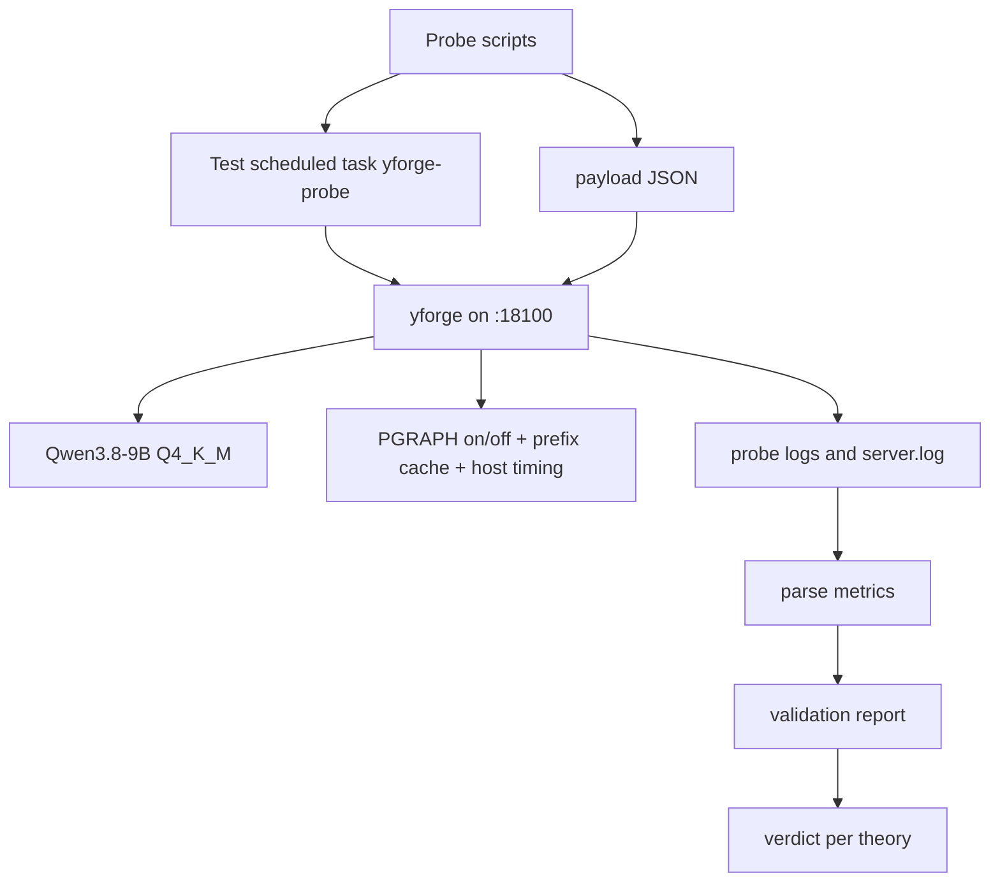

# Plan: Validation of SGLang-inspired serving concepts on yttri-win

**Date:** 2026-09-13
**Status:** 👀 In review (validation executed; reusable harness remains TD-001)
**Priority:** P1
**Specification:** [docs/specs/2026-09-13-sglang-serving-concepts-validation.md](../specs/2026-09-13-sglang-serving-concepts-validation.md)

## Goal

Проверить на реальном runtime yttri-win, какие SGLang-концепции дают
измеримый выигрыш для нашего Candle/yttri-forge сервера, и выдать verdict
adopt/defer/reject до начала реализации.

## Current state

- Research: `docs/research/2026-09-13-sglang-concepts.md`.
- Prefix cache: `src/prefix_cache.rs`, включён в `.env` через
  `PREFIX_CACHE_MIB=8192`; события `[pcache] primed/snap saved/miss`.
- Scheduler: `../yttri-forge/engine/qwen35-batch/src/scheduler.rs`,
  `PREFILL_CHUNK=512`.
- Overlap diagnostics: `src/engine_batched.rs`, `HOST_TIMING=1` даёт
  `[host] steps=48 step=...ms sample=...ms/call drain=...ms/step`.
- Prefill graph: `PGRAPH=on/off`, реализация в
  `../yttri-forge/engine/qwen35-batch/src/real/adapter.rs`.
- Test harness: `scripts/bench.ps1` уже умеет TTFT, prefill tok/s,
  concurrent throughput и VRAM.
- Runtime host: `ssh yttri-win`,
  `D:\Projects\yttri-inference\qwen36-server`, бинарник
  `target\release\yforge.exe`.
- Production scheduled task `\qwen36-inference` сейчас Ready и порт `18099`
  не слушается. Тесты идут отдельным task на `18100`.

## Solution architecture



## Solution

### Layer 1 — test harness on yttri-win

#### Files:
- [ ] `scripts/windows/sglang_probe.ps1` — запускает isolated test instance,
  отправляет payloads, снимает TTFT/VRAM/логи, пишет JSON.
- [ ] `scripts/windows/sglang_probe_env.ps1` — создаёт временный env-файл
  тестового инстанса из production `.env`, переопределяя только
  `PORT/HOST/SLOTS/PREFIX_CACHE_MIB/PGRAPH/HOST_TIMING/TRACE/MTP`.
- [ ] `scripts/windows/sglang_probe_run.bat` — launcher для отдельной
  scheduled task с redirect в probe log.

#### Commands:

| Command | Input | Output | Description |
|---|---|---|---|
| `sglang_probe_env.ps1 -Variant prefix-on` | production env path, variant | probe env file | Изолированный env без изменения production |
| `sglang_probe_run.bat -EnvFile <path> -LogFile <path>` | env, log | process output | Запуск yforge на `18100` |
| `sglang_probe.ps1 -Variant <name>` | variant | `metrics.json`, `run.log` | Полный сценарий и сбор метрик |

#### Data structures (pseudocode):

```pseudo
ProbeRun {
    variant: String,          // prefix-hit | pgraph-on | pgraph-off | host-timing | determinism
    port: Int,                // 18100
    binary_sha256: String,
    model_path: String,
    env: Map<String,String>,
    started_at: Timestamp,
    metrics: List<Metric>,
    log_path: String,
}

Metric {
    name: String,             // ttft_ms | prefill_tps | decode_tps | vram_mib | host_sample_ms
    value: Float,
    unit: String,
    scenario: String,
}
```

### Layer 2 — measurement scenarios

#### Files:
- [ ] `tests/fixtures/sglang-probe-prompt-1k.json`
- [ ] `tests/fixtures/sglang-probe-prompt-4k.json`
- [ ] `tests/fixtures/sglang-probe-prompt-8k.json`
- [ ] `docs/research/2026-09-13-sglang-validation-report.md` — итоговый отчёт
  с verdict.

#### Scenario matrix:

| Variant | PGRAPH | Prefix cache | HOST_TIMING | MTP | Что доказываем |
|---|---|---|---|---|---|
| `baseline` | off | 0 | 0 | 0 | Чистый eager baseline |
| `prefix-on` | on | 8192 | 0 | 0 | Ценность prefix cache |
| `pgraph-on` | on | 0 | 0 | 0 | Ценность prefill graph |
| `pgraph-off` | off | 0 | 0 | 0 | Контроль для A/B |
| `host-timing` | on | 8192 | 1 | 0 | Headroom для overlap |
| `determinism` | on | 0 | 0 | 0 | Batch-shape sensitivity |

## Implementation phases

### Phase 0: Read-only reconnaissance и baseline (estimate: 1 h)
- [x] Зафиксировать SHA-256, mtime, размер `yforge.exe` и модель на
  yttri-win.
- [x] Проверить, что `\qwen36-inference` не запущен и `18100`/`18099` свободны.
- [x] Снять idle VRAM, shared memory и RAM.
- [x] Сохранить production `.env` без изменений.
- **Independent check:** вывести JSON с бинарником, моделью, task state, VRAM;
  production `.env` hash до и после совпадает.

### Phase 1: Isolated test instance (estimate: 2 h)
- [x] Создан ad-hoc probe env в `logs\sglang-probe-...` (repo harness — TD-001).
- [x] Создан ad-hoc launcher на `18100` (repo harness — TD-001).
- [x] Создан test task `\yforge-sglang-probe` на yttri-win.
- [x] Поднят `baseline`, проверен `[vram] total=... plan(dynamic)`.
- [x] Проверен `/v1/models`.
- **Independent check:** `curl /v1/models` на `18100` отвечает; production
  task и `.env` не изменены.

### Phase 2: Prefix cache experiment (estimate: 2 h)
- [x] Создан ad-hoc `prefix_probe3.ps1` (repo harness — TD-001).
- [x] Отправлен длинный prompt, затем повторный с расширением.
- [x] Собраны TTFT, prompt tokens, `[pcache]` строки.
- [x] Дополнительно проверен divergent branch против repeat.
- **Independent check:** hit-run содержит `[pcache] primed`, miss-run — нет;
  в отчёте есть ΔTTFT.

### Phase 3: Prefill graph A/B (estimate: 3 h)
- [x] Прогнан `pgraph-on` на 1K/4K/8K prompts.
- [x] Прогнан `pgraph-off` на тех же prompts.
- [x] Сравнены TTFT, prefill tok/s, VRAM, строки `[pg]`.
- **Independent check:** одинаковый prompt и модель, различается только
  `PGRAPH`; отчёт содержит A/B таблицу.

### Phase 4: Host timing / overlap headroom (estimate: 2 h)
- [x] Запущено с `HOST_TIMING=1` и `TRACE=1`.
- [x] Прогнан длинный prefill + длинный decode.
- [x] Собраны `[host]` строки и `stats` по шагам.
- [x] Посчитана доля sample+drain от step wall.
- **Independent check:** в логе есть `[host] steps=48 ...`; отчёт содержит
  verdict по overlap.

### Phase 5: Determinism probe (estimate: 2 h)
- [x] Выполнен одинаковый запрос 3 раза при `seed=42` (single-slot).
- [x] Сравнен нормализованный текст.
- [ ] Разные batch shapes не проверены: тестовый профиль single-slot.
- **Independent check:** отчёт содержит stable/different и размер выборки.

### Phase 6: Cleanup и report (estimate: 2 h)
- [x] Остановлен test task, удалены временные env/задача/каталоги.
- [x] Сверено, что production task/env не изменены.
- [x] Написан `docs/research/2026-09-13-sglang-validation-report.md` с
  verdict по каждой теории.
- [x] Обновлён research-документ ссылкой на отчёт.
- **Independent check:** production smoke `/v1/models` после cleanup;
  отчёт содержит команды, метрики и ограничения.

## Traceability: Requirements → Tasks

| Requirement | Phase | Tasks |
|-------------|-------|-------|
| FR-001 | 1 | Isolated task на 18100 |
| FR-002 | 0 | SHA-256, env, command |
| FR-003 | 2 | Prefix miss/hit |
| FR-004 | 3 | PGRAPH on/off |
| FR-005 | 4 | HOST_TIMING |
| FR-006 | 5 | Determinism |
| FR-007 | 6 | Report verdicts |
| FR-008 | 6 | Cleanup |
| FR-010 | 1-5 | Probe scripts |
| FR-011 | 2-5 | Raw logs/JSON |
| FR-012 | 0,2-6 | VRAM before/after |

## Complexity & principle deviations

| Deviation | Principle / simpler alternative | Why justified |
|-----------|--------------------------------|---------------|
| Отдельная scheduled task на yttri-win | Можно запустить foreground через ssh | Scheduled task повторяет production launch path, process переживает ssh, проще cleanup; Start-Process из ssh запрещён scripts/README |
| Использовать текущую 9B-модель вместо целевой 27B | Можно тестировать сразу на 27B | 9B уже в production `.env`, не требует скачивания и позволяет отделить serving mechanics от VRAM-потолка 27B |
| Не проверять MTP сейчас | MTP-артефакт не задан, теория P2 | Тест был бы invalid; оставляем deferred с условием |

## Risks and mitigations

| Risk | Likelihood | Impact | Mitigation |
|------|------------|--------|------------|
| Тестовый инстанс займёт VRAM production | Low | High | Production task не запущен; проверить `nvidia-smi` перед стартом; остановить при конфликте |
| WDDM paging исказит метрики | Medium | High | Снимать dedicated/shared VRAM, не сравнивать через paging, делать pause после teardown |
| PGRAPH fallback неочевиден | Medium | Medium | Парсить `[pg]` и WARN строки; фиксировать фактический path, а не конфиг |
| Prefix cache не даст hit из-за boundary snapshot | Medium | Medium | Второй запрос делать расширением того же prompt; искать `[pcache] primed` |
| `.env` содержит секрет и попадёт в отчёт | Low | High | Не копировать `.env` в repo; новый env без API-ключа, ключ передавать процессу отдельно |
| Тест разойдётся с production-кодом | Medium | Medium | Фиксировать SHA-256 `yforge.exe` и mtime; не собирать новый бинарь без необходимости |

## Dependencies

### Packages / Libraries
- Новых зависимостей нет. Используются `ssh`, PowerShell, существующий
  `yforge.exe`, `curl.exe`, `nvidia-smi`, `scripts/bench.ps1`.

### Related tasks
- T-002 MoE expert offload не блокирует: текущая модель 9B без MoE offload.
- MTP/PD-204 не блокирует: MTP выключен в тестовом профиле.

## Deferred questions

| Question | Why deferred | When the answer is needed | Who decides |
|----------|--------------|---------------------------|-------------|
| MTP+graphs/ReplaySSM на yttri-win | Нет MTP-артефакта для текущей модели, тест был бы invalid | После выбора MTP-профиля или 27B | User / architect |
| Batch-invariant reductions | Сначала нужен determinism verdict; kernel-level проект дорогой | После Phase 5 | User / architect |

## Plan decisions

| # | Question | Decision | Date |
|---|----------|----------|------|
| PD-001 | Как изолировать тесты? | Отдельный env, task `yforge-sglang-probe`, порт 18100; production не менять | 2026-09-13 |
| PD-002 | Какую модель использовать? | Текущую 9B Q4_K_M из production `.env` | 2026-09-13 |
| PD-003 | Переиспользовать ли `bench.ps1`? | Да, как базу для TTFT/prefill/VRAM, расширив probe-скриптом | 2026-09-13 |
| PD-004 | Что считать evidence? | Логи процесса + JSON ответы + nvidia-smi, не только числа клиента | 2026-09-13 |
| PD-005 | Когда менять код runtime? | После отчёта и явных verdict; этот план не реализует radix tree | 2026-09-13 |

## Tech Debt

| # | Description | Phase | Priority |
|---|-------------|-------|----------|
| TD-001 | Probe scripts будут ad-hoc, пока не появится общий test harness для yttri-win | 1 | Low |
| TD-002 | `server.log` общий для production и probe, если probe не переопределит лог | 1 | Medium |
