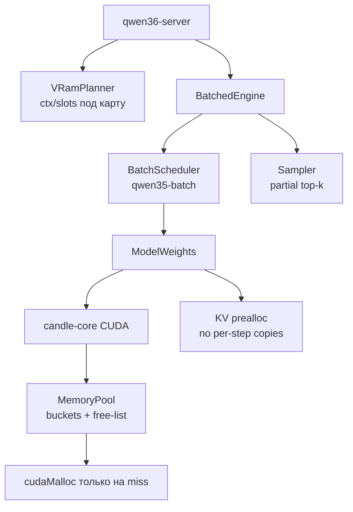

# Specification: CUDA memory management и decode performance

**Date:** 2026-08-10
**Priority:** P0
**Type:** Extension (performance/refactor инференс-стека)

## 1. Problem

Сервер qwen36-server на RTX 3060 12 GB (yttri-win) работает медленно и на грани VRAM:

- 35B-A3B IQ2_XXS (файл 10.76 GB) под нагрузкой потребляет **12032/12288 MiB (98%)** → WDDM paging в системную RAM → коллапс скорости (измерено ранее: 13.4s/step вместо 2.08s на B=4).
- Decode-шаг на CUDA делает десятки `cudaMalloc`/`cudaFree` (candle-core CUDA не имеет memory pool; Metal-арена T-269 существует только на macOS). `cudaMalloc` синхронизирует устройство → GPU util 1-2% при «медленной» генерации.
- Sampler сортирует все 248 320 логитов на CPU на каждый токен каждого слота (10-30 мс/слот/шаг при шаге 175 мс).
- KV cache растёт порциями по 512 токенов с полным копированием; `narrow().contiguous()` копии KV каждый шаг.
- DeltaNet prefill — token-by-token (4096 GPU syncs на чанк), TTFT на длинных промптах — минуты.
- Нет VRAM-планера: сервер стартует с ctx=81920 × 4 слота независимо от карты; OOM/paging обнаруживается только в рантайме.

## 2. Goal

Decode не упирается в аллокации и paging: убрать cudaMalloc из hot path, удерживать VRAM-потребление в пределах карты автоматически, сократить CPU-время сэмплера. Целевые метрики — в разделе 13.

## 3. Current state

Затронутый код (оба репозитория — siblings, сервер path-зависит от форка):

- `candle-fork-qwen35-batch/candle-core/src/cuda_backend/mod.rs` — прямые `dev.alloc`/`cudaMalloc` без пула; `gemm_reduced_precision_f16=false` (F32 аккумулятор, HGEMM уже используется в decode attention после фикса 2026-08-10).
- `candle-fork-qwen35-batch/qwen35-batch/src/real/model_weights.rs` — KV cache batched (`kv_cache_batched`, cap 512, рост с копированием), GQA `broadcast_as().contiguous()` копии per slot per step, DeltaNet `forward_prefill` token-by-token (4096 syncs/чанк), embedding lookup на CPU + H2D каждый шаг.
- `candle-fork-qwen35-batch/qwen35-batch/src/scheduler.rs` — `PREFILL_CHUNK=512` (env `QWEN36_PREFILL_CHUNK`).
- `Qwen3.6 27B/src/sampler.rs` — полный `sort_unstable` 248K логитов.
- `Qwen3.6 27B/src/config.rs`, `engine_batched.rs` — конфиг `QWEN36_CTX`/`QWEN36_SLOTS` без привязки к VRAM.
- Metal scratch-арена (T-269, `model_weights.rs` `scratch_arena`) — эталонный паттерн для CUDA пула.
- Известные измерения: B=2 KV 5.4K — 0.35 s/токен; B=4 KV короткий — 175 ms/step; B=4 27B Q2_K_XL при 98% VRAM — 13.4s/step (paging).

## 4. User scenarios

### Scenario 1: Чат на 12 GB карте без paging (P1)
**As** владелец yttri-win, **I want** сервер, который при старте сам укладывается в VRAM карты, **so that** скорость decode не падает на порядок из-за WDDM paging.

**Steps:**
1. Пользователь запускает сервер с дефолтным конфигом на 12 GB карте.
2. Сервер вычисляет VRAM-бюджет (веса + KV + state + запас), при необходимости снижает ctx/слоты и печатает раскладку.
3. Результат: VRAM used ≤ 90% total на протяжении всего прогона; нет paging-деградации.

**Acceptance criteria (Given / When / Then):**
- [ ] Given 12 GB карта и модель 10.3 GB в VRAM, when старт с default env, then VRAM ≤ 90% после 1000 токенов decode × 4 слота и в stdout есть строка раскладки VRAM.
- [ ] Given запрошенные ctx/слоты не влезают даже после снижения до минимума (1 слот, ctx 2048), when старт, then сервер падает с сообщением, содержащим оценку нехватки в MiB.

### Scenario 2: Decode без аллокационных sync (P1)
**As** пользователь чата, **I want** токены с предсказуемой скоростью, **so that** интерактивная работа не лагает.

**Acceptance criteria:**
- [ ] Given B=4, KV ≤ 1K, when decode 256 токенов, then aggregate tok/s вырастает ≥ 1.5x против baseline-коммита (замер `scripts/bench.ps1` на yttri-win, тот же GGUF).
- [ ] Given любой decode, when включён trace, then число вызовов cudaMalloc за шаг = 0 (инструмент: счётчик аллокаций в пуле).

### Scenario 3: Sampler без полной сортировки (P2)
**As** сервер, **I want** выбор токена за O(vocab) без сортировки, **so that** CPU не является bottleneck при 4 слотах.

**Acceptance criteria:**
- [ ] Given top_k ≤ 64, when сэмплинг, then время sampler'а на токен ≤ 2 мс (замер через Instant в trace).
- [ ] Given фиксированный seed и логиты, when sampler новый vs старый, then выбранные токены совпадают на 10K случайных логит-векторах (top_k=1 детерминизм + property: argmax совпадает всегда).

### Scenario 4: KV cache без per-step копий (P2)
**As** сервер, **I want** KV cache, преаллоцированный на весь ctx, **so that** нет growth-копирований и `narrow().contiguous()` аллокаций на шаг.

**Acceptance criteria:**
- [ ] Given ctx=8192, when decode от 0 до 8192 токенов, then число аллокаций KV-буферов = const (1 на слот на блок), нет реаллокаций.
- [ ] Parity: batched == sequential токены на Qwen3.5-4B (существующий тест `real_qwen35_batch`) зелёный.

### Scenario 5: Fused DeltaNet batch decode (P3, отдельная веха)
**As** сервер, **I want** delta-rule шаг всех слотов одним kernel launch'ем, **so that** decode масштабируется со слотами.

**Acceptance criteria:**
- [ ] Given B=4, when decode, then wall-time шага ≤ 1.3x от B=1.
- [ ] Parity-тесты форка зелёные.

### Scenario 6: Fused DeltaNet prefill (P3, отдельная веха)
**As** пользователь, **I want** TTFT на 5K промпте ≤ 15s на 12 GB карте, **so that** длинные контексты пригодны интерактивно.

**Acceptance criteria:**
- [ ] Given промпт 4096 токенов, when prefill на yttri-win, then wall-time ≤ 15s (baseline: десятки секунд token-by-token).

## 5. Functional requirements

### Must Have (P0)
- **FR-001**: CUDA caching allocator в candle-core: бакеты по размеру, free-list, переиспользование буферов; в hot path decode нет вызовов драйверного alloc/free. Отключаемо env-флагом (emergency revert).
- **FR-002**: VRAM-планер при старте сервера: расчёт веса+KV+state+workspace, авто-снижение ctx → слот до влезания в 90% карты, печать раскладки; fail с оценкой нехватки, если минимум не влезает.
- **FR-003**: Sampler: выбор top-кандидатов без полной сортировки (partial selection), семантика фильтров (top_k/top_p/min_p/penalties/temperature) неизменна.

### Should Have (P1)
- **FR-010**: KV cache: преаллокация на весь ctx при seed_slot, чтение через strides без `contiguous()` там, где matmul это позволяет.
- **FR-011**: Устранение per-step GQA expand-копий (strided/broadcast matmul или expand один раз на шаг на батч).
- **FR-012**: Embedding lookup на устройстве модели (убрать CPU round-trip + H2D sync).

### Nice to Have (P2)
- **FR-020**: Fused DeltaNet batch decode kernel (все слоты одним запуском).
- **FR-021**: Fused DeltaNet prefill kernel (убрать token-by-token).
- **FR-022**: Счётчики аллокаций/пула в trace-выводе (диагностика регрессий).

## 6. Non-functional requirements

- **Performance**: целевые метрики — раздел 13; регрессия любой существующей метрики > 5% = блокер мерджа.
- **Compatibility**: Windows+CUDA 12.4 (yttri-win), Linux+CUDA (4090), macOS+Metal — поведение Metal/CPU путей не меняется (все изменения за cfg/branch).
- **Numerics**: softmax и GEMM-аккумуляторы остаются F32; существующие parity/quality тесты форка зелёные.
- **Observability**: раскладка VRAM и состояние пула печатаются в stdout (BD-014, ничего на диск).

## 7. Data model (conceptual)

```
Entity: MemoryPool (candle-core, CUDA)
  - buckets: Map<SizeClass, FreeList>
  - stats: {allocs, hits, misses, bytes_in_use, bytes_reserved}
  - relation → CudaDevice (владеет)

Entity: VramPlan (qwen36-server)
  - weights_bytes, kv_bytes_per_slot, state_bytes_per_slot, workspace_bytes
  - budget_bytes = 0.9 × total_vram
  - resolution → {ctx, slots} (после авто-снижения)
```

## 8. User interface

Не UI-фича. Изменение, видимое пользователю: строка при старте сервера:

```
[vram] total=12288MiB weights=10500MiB kv=512MiB/slot state=64MiB/slot workspace=256MiB
[vram] plan: ctx=8192 slots=3 (запрошено 81920/4 — снижено: не хватало 2340MiB)
```

## 9. Architecture (overview)



## 10. Out of scope

- Квантование моделей (отдельная тема, ждёт llama.cpp tooling).
- Flash-attention prefill kernel (candle-flash-attn) — оценивается отдельно на 4090.
- MTP/speculative decoding (OQ-3 брифа).
- Изменение API-поверхности сервера.
- Host-offload KV/весов как degraded-режим — сознательно НЕ делаем: прозрачный paging уже показал коллапс 10-30x; VRAM-планер (FR-002) — правильный ответ вместо fallback.

## 11. Deferred questions

| Question | Why deferred | When the answer is needed | Who decides |
|----------|--------------|---------------------------|-------------|
| Точные константы пула (size classes, max reserved) | Зависят от профиля аллокаций, который покажет FR-022 | Перед финализацией FR-001 | Architect (Askid) |
| Fused DeltaNet kernels (FR-020/021): PTX-расширение или переписывание | Нужен профиль после FR-001 — возможно, пул снимет бо́льшую часть overhead | После замеров на 4090 | Askid |

## 12. Spec decisions

| # | Question | Decision | Date |
|---|----------|----------|------|
| D-001 | RAM-fallback при OOM (managed memory) | Отклонён: WDDM уже делает это прозрачно — результат 13.4s/step. Ответ — VRAM-планер, не paging | 2026-08-10 |
| D-002 | Полный rewrite allocator vs тонкий pooling shim | Тонкий shim над `dev.alloc` в candle-core CUDA (меньше кода, emergency revert env-флагом) | 2026-08-10 |
| D-003 | Порядок работ | Планер+счётчики → sampler → пул → KV → fused kernels по остаточному принципу после замеров | 2026-08-10 |

## 13. Success criteria

- [ ] yttri-win (12 GB): 4 слота × 8192 ctx укладываются в ≤ 90% VRAM **или** планер автоматически снижает конфиг до влезания; WDDM paging не наступает (GPU util > 50% под нагрузкой, нет роста RAM working set).
- [ ] Decode B=4 короткий контекст: ≥ 1.5x к baseline 175 ms/step → ≤ 115 ms/step.
- [ ] Decode B=2 KV 5.4K: ≥ 1.3x к baseline 0.35 s/токен → ≤ 0.27 s/токен.
- [ ] Sampler: ≤ 2 мс/токен/слот.
- [ ] Все существующие тесты форка (IQ CUDA 12/12, model_profile 10/10, parity) и сервера (17 lib + 10 API) зелёные.
- [ ] Stability smoke (BD-008): 4 слота × 8K токенов без падений и роста VRAM > 512 MiB.
