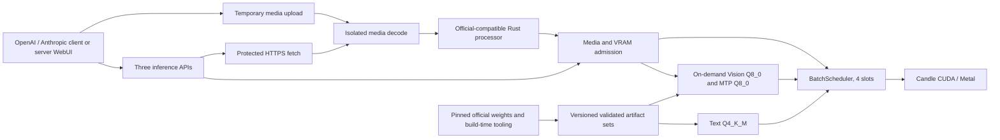

# Specification: Полноценный Qwen3.5-4B — Text, Vision, Video, MTP и собственные artifacts

**Date:** 2026-08-14  
**Priority:** P0  
**Type:** Extension

## 1. Problem

Qwen3.5-4B — основная локальная модель сервера, но текущий runtime использует только text GGUF. Он не выполняет Vision encoder, не принимает изображения и видео и не использует обученный MTP head. Существующий GGUF получен сторонней конвертацией, поэтому происхождение всех компонентов и полнота экспорта не контролируются проектом.

Нужен единый локальный functional release, который воспроизводимо собирается из закреплённой официальной версии Qwen3.5-4B и полноценно обслуживает Text, Vision, Video и MTP через Candle. Интеграция в приложение Yttri не входит в задачу.

## 2. Goal

Сервер должен запускать полный профиль Qwen3.5-4B: текстовые и мультимодальные запросы, video input, нативный Vision encoder и прозрачный MTP decode. Все production artifacts должны воспроизводимо собираться из официальных весов, проходить численные, функциональные, performance и stability gates и публиковаться единым атомарным набором.

Релиз считается готовым только совместно: Text + Vision + Video + MTP + quantization pipeline + server WebUI.

## 3. Current state

### Official source

Закреплённый источник:

```text
repository: Qwen/Qwen3.5-4B
revision:   851bf6e806efd8d0a36b00ddf55e13ccb7b8cd0a
license:    Apache-2.0
```

Официальный профиль:

```text
Type: Causal Language Model with Vision Encoder
Parameters: 4B
Hidden: 2560
Vocab/embedding/output: 248320, tied
Layers: 32
Layout: 8 × (3 × (Gated DeltaNet → FFN) → 1 × (Gated Attention → FFN))
DeltaNet: V heads=32, QK heads=16, head dim=128
Attention: Q heads=16, KV heads=4, head dim=256
Partial RoPE dim: 64
FFN intermediate: 9216
MTP: trained with multi-steps
Native context: 262144
Extended context with scaling: up to 1010000
```

### Local model

```text
D:\Models\yttri\qwen3.5-4b\Qwen3.5-4B-Q4_K_M.gguf
SHA-256: 25082A7DD3776CC3C741C6347D3BD04523F05796607B3FBC32FA3A25DFA1418C
```

Его GGUF metadata и tensors совпадают с официальным text profile, но основной GGUF не содержит Vision или MTP tensors. Vision представлен отдельным `mmproj-Qwen3.5-4B-BF16.gguf`; MTP artifact отсутствует.

### Existing runtime

- `src/engine.rs`, `src/engine_batched.rs`, `src/engine_types.rs` — text-only Engine contract и continuous batch.
- `src/api/openai.rs` — отклоняет `image_url`, `image`, `video`.
- `src/api/responses.rs` — отклоняет `input_image`.
- `src/api/anthropic.rs` — отклоняет `image`, `document`, `video`.
- `src/api/admin.rs` — сканирует text GGUF и исключает `mmproj`.
- `src/vram_plan.rs` — планирует text weights, KV и recurrent state, но не component/media budgets.
- `web/index.html` — text-only WebUI.
- `candle-fork-qwen35-batch/qwen35-batch/src/real/model_weights.rs` — правильный hybrid layout, partial RoPE и text decode.
- `candle-fork-qwen35-batch/qwen35-batch/src/real/tokenizer.rs` — text chat template/tokenizer path.

Рабочая Windows-среда проекта:

```text
source/build/logs/bench: D:\Projects\yttri-inference
models:                 D:\Models\yttri
```

## 4. User scenarios

### Scenario 1: Полный локальный model profile (P0)

**As** оператор локального сервера, **I want** загрузить единый validated profile Qwen3.5-4B, **so that** реальные capabilities и artifacts определяются manifest, а не именами файлов.

**Acceptance criteria:**

- [ ] Given опубликованный profile, when сервер загружает модель, then text Q4_K_M доступен немедленно, а Vision Q8_0 и MTP Q8_0 обозначены как on-demand components.
- [ ] Given profile без Vision или MTP, when он загружен, then text API работает, `/v1/models` сообщает отсутствующие capabilities, media отклоняется до inference, MTP заменяется обычным decode.
- [x] Given повреждённый, неполный или несовместимый manifest/artifact, when начинается загрузка, then component не используется и text availability не теряется.

### Scenario 2: Изображения во всех API (P0)

**As** API-клиент, **I want** передать одно или несколько изображений, **so that** Qwen3.5-4B анализирует их и генерирует текстовый ответ.

**Acceptance criteria:**

- [ ] Given JPEG, PNG, WebP, BMP, TIFF или статический GIF, when он передан через OpenAI Chat, OpenAI Responses или Anthropic Messages, then сервер выполняет official-compatible preprocessing и возвращает text response.
- [ ] Given до 8 валидных изображений по 20 MiB каждое, when request проходит media/VRAM admission, then исходный порядок text/image/video content blocks и соответствующих media markers сохраняется без перегруппировки.
- [ ] Given malformed, unsupported, MIME-mismatched, truncated, oversized или decompression-bomb image, when request валидируется, then inference не начинается и возвращается установленный HTTP status.
- [ ] Given EXIF orientation, ICC profile или alpha channel, when image декодируется, then orientation, sRGB conversion и alpha compositing совпадают с pinned official processor.

### Scenario 3: Видео во всех API (P0)

**As** API-клиент, **I want** передать видео, **so that** модель анализирует временную последовательность и отвечает текстом.

**Acceptance criteria:**

- [ ] Given MP4, MOV, MKV или WebM с H.264, H.265/HEVC, VP9 или AV1, when video проходит admission, then сервер адаптивно выбирает кадры в пределах visual-token budget и выполняет inference.
- [ ] Given animated GIF, when он загружен, then он обрабатывается как video; static GIF обрабатывается как image.
- [ ] Given video до 200 MiB и 10 минут, when decoded/visual budget превышен, then request отклоняется до model inference без скрытого уменьшения качества.
- [ ] Given streaming response, when generation завершается, then final usage сообщает `video_count`, `sampled_frames`, `visual_tokens`, `effective_fps` и `audio_processed=false`.
- [ ] Given video с audio track, when media декодируется, then audio не извлекается и не влияет на model input.

### Scenario 4: Временная загрузка media (P0)

**As** WebUI или SDK-клиент, **I want** загрузить локальный media-файл отдельно, **so that** inference JSON не обязан содержать большой base64 payload.

**Acceptance criteria:**

- [x] Given authenticated multipart или raw-body upload с `Content-Type`, when вызывается `POST /v1/media`, then сервер возвращает одноразовый media ID, привязанный к API-ключу.
- [ ] Given media ID, when он впервые использован в inference request, then он становится недействительным и media bytes удаляются после завершения, отмены или ошибки.
- [x] Given неиспользованный media ID, when проходит 15 минут, then media удаляется и ID перестаёт приниматься.
- [x] Given media ID другого API-ключа, when клиент пытается его использовать, then request отклоняется без раскрытия наличия объекта.
- [x] Given два одновременных claims одного media ID, when они конкурируют, then первый atomic claim получает объект, второй получает `409 Conflict`, а claimed ID не возвращается в available state после cancellation.
- [x] Given 16 pending uploads, 1 GiB занято на temp disk или 2 GiB decoded media RAM, when новый request превышает соответствующий global budget, then он отклоняется до записи/декодирования с `429` или `507`.

### Scenario 5: HTTPS media URL (P0)

**As** API-клиент, **I want** передать публичный HTTPS URL, **so that** локальная предварительная загрузка не обязательна.

**Acceptance criteria:**

- [ ] Given публичный HTTPS URL, when resource укладывается в type/size/time limits, фактический format подтверждён magic bytes/decoder probe и MIME совпадает, then media загружается и обрабатывается.
- [x] Given loopback, private, link-local, reserved или metadata destination, when URL или redirect разрешается, then download отклоняется до соединения с запрещённым адресом.
- [x] Given redirects, when их больше 3 или новый destination не проходит ту же проверку, then download прекращается.
- [ ] Given connect time больше 5 секунд или total time больше 30 секунд, when timeout срабатывает, then request получает HTTP 408 и временные данные удаляются.

### Scenario 6: Прозрачный MTP decode (P0)

**As** пользователь text или media inference, **I want** MTP ускорение без изменения результата, **so that** качество и reproducibility обычного decode сохраняются.

**Acceptance criteria:**

- [ ] Given одинаковый request и seed, when он выполняется с MTP и baseline decode, then generated token IDs совпадают token-for-token для greedy и stochastic sampling.
- [ ] Given B=1 или continuous batch B=2..4, when MTP-capable и fallback slots смешаны, then каждый slot сохраняет свои sampling/RNG semantics и scheduler fairness.
- [ ] Given rejected draft, component error, cancellation или VRAM pressure, when MTP transaction не commit-ится, then model/KV/DeltaNet state, sampler RNG и generated cursor восстанавливаются до последней committed boundary, а slot продолжает обычный decode без изменения output.
- [ ] Given media request, when Vision preprocessing завершён, then MTP может применяться с теми же exact-output требованиями.

### Scenario 7: On-demand components и VRAM safety (P0)

**As** оператор RTX 3060, **I want** Vision и MTP загружать только по требованию, **so that** text model остаётся доступной и WDDM paging не возникает.

**Acceptance criteria:**

- [ ] Given cold Vision/MTP component, when он нужен, then активные requests завершаются, новые admissions приостанавливаются, component загружается, затем admissions возобновляются.
- [ ] Given 60 секунд component idle, when warm TTL истекает, then component выгружается и VRAM возвращается.
- [ ] Given VRAM pressure, when Vision нужен, then MTP выгружается первым и media request проходит только после повторного budget check.
- [ ] Given Vision load failure, when media request ожидает component, then он получает HTTP 503, а text API продолжает работать.
- [ ] Given component load/unload cycle, when цикл повторён 10 раз, then dedicated/shared VRAM после прогрева не имеет монотонного роста.

### Scenario 8: Multimodal WebUI (P0)

**As** пользователь server WebUI, **I want** прикреплять изображения и видео, **so that** полный multimodal workflow доступен без внешнего клиента.

**Acceptance criteria:**

- [ ] Given file picker, drag-and-drop, clipboard paste или HTTPS URL, when media добавлен, then WebUI показывает preview, type, size, upload/progress/error state и позволяет удалить attachment до отправки.
- [ ] Given follow-up в той же вкладке, when пользователь задаёт новый вопрос, then WebUI повторно загружает media bytes из памяти вкладки.
- [ ] Given reload/закрытие вкладки, when история восстановлена, then media bytes/preview отсутствуют, а сообщение содержит только `[Изображение]` или `[Видео]`.
- [ ] Given streaming multimodal response, when приходят text deltas, then существующий delta protocol и thinking UI продолжают работать без специальных progress events.
- [ ] Given keyboard-only или screen-reader user, when он добавляет, проверяет или удаляет attachment, then все controls имеют labels, focus path и status announcements; drag-and-drop и цвет не являются единственным способом действия или индикации.

### Scenario 9: Воспроизводимая сборка и атомарная публикация (P0)

**As** разработчик runtime, **I want** самостоятельно собирать полный artifact set из official revision, **so that** provenance, quantization и полнота компонентов проверяемы.

**Acceptance criteria:**

- [ ] Given clean build root на `yttri-win`, when pipeline получает pinned official revision, then он создаёт Text Q4_K_M, Vision Q8_0 и MTP Q8_0 artifacts и manifest с SHA-256 всех inputs/tools/outputs.
- [x] Given official source index из 738 tensors, when converter строит artifacts, then fail-closed mapping inventory учитывает все 426 language, 297 Vision и 15 MTP source tensors; отсутствующий или неизвестный tensor блокирует set.
- [ ] Given converter без нужного Vision/MTP mapping, when используется project patch, then manifest фиксирует exact converter fork commit и mapping version.
- [ ] Given Vision/MTP quantization, when physical tensors записываются, then Q8_0 применяется только к eligible matrix/conv weights, а norms, biases, scales и profile-marked sensitive tensors сохраняют BF16/F32 dtype.
- [x] Given artifact set, when любой mandatory gate не прошёл, then `current` не меняется.
- [x] Given все mandatory gates passed, when set публикуется, then `current` атомарно указывает на новую versioned directory, а предыдущая версия остаётся доступной для rollback.
- [ ] Given опубликованный set и отключённая сеть, when server запускается, then configs, processor, FFmpeg и model components доступны локально.

### Scenario 10: Hot-switch validated profiles (P1)

**As** оператор, **I want** переключать validated model profiles, **so that** другие модели можно добавлять без изменения API contract.

**Acceptance criteria:**

- [ ] Given hot-switch, when активные requests завершаются, then admissions останавливаются, media IDs удаляются, Vision/MTP выгружаются и новый profile загружается до возобновления API.
- [ ] Given другой profile, when `/v1/models` запрошен, then capabilities и limits отражают именно новый profile.

## 5. Functional requirements

### Must Have (P0)

- **FR-001 — Unified release:** production promotion происходит только для совместно готовых Text, Vision, Video, MTP, artifact pipeline, API и server WebUI.
- **FR-002 — Pinned source:** единственный source revision для первого profile — `Qwen/Qwen3.5-4B@851bf6e806efd8d0a36b00ddf55e13ccb7b8cd0a`.
- **FR-003 — Artifact profile:** release set содержит Text Q4_K_M; eligible Vision/MTP matrix/conv weights имеют Q8_0, а norms, biases, scales и sensitive tensors сохраняют BF16/F32; official BF16 служит correctness reference.
- **FR-004 — Provenance:** manifest фиксирует source revision, file hashes, converter/quantizer revision, fail-closed mapping всех 738 source tensors (426 language, 297 Vision, 15 MTP), processor config, FFmpeg/ffprobe hashes, physical tensor dtypes и validation results.
- **FR-005 — Atomic publication:** versioned set становится `current` только после всех обязательных gates; предыдущий set сохраняется для rollback.
- **FR-006 — Candle runtime:** model, Vision encoder и MTP выполняются нативно в Candle; llama.cpp используется только build-time и как reference.
- **FR-007 — Processor parity:** resize, normalization, patching, multimodal positions/special tokens, EXIF, ICC/sRGB и alpha handling соответствуют pinned official processor; tensor parity измеряется на одинаковых decoded RGB frames, а codec decode/frame selection проверяются отдельными fixtures.
- **FR-008 — Image inputs:** JPEG, PNG, WebP, BMP, TIFF и static GIF поддерживаются во всех трёх API и WebUI.
- **FR-009 — Video inputs:** MP4, MOV, MKV, WebM и animated GIF с обязательной codec matrix поддерживаются во всех трёх API и WebUI.
- **FR-010 — Media sources:** media принимается как base64/data URL, public HTTPS URL или одноразовый upload ID; mixed text/image/video blocks сохраняют исходный порядок.
- **FR-011 — Upload API:** authenticated `POST /v1/media` принимает multipart и raw body; ID single-use, key-bound, TTL 15 минут; первый atomic claim выигрывает, конкурентный claim получает `409`.
- **FR-012 — Media limits:** максимум 8 изображений по 20 MiB и одно видео до 200 MiB/10 минут на request; global budgets — 16 pending uploads, 1 GiB temp disk и 2 GiB decoded RAM; decoded/visual budget дополнительно ограничивается VRAM admission.
- **FR-013 — No hidden degradation:** server не снижает resolution/FPS и не уходит в CPU offload при нехватке budget.
- **FR-014 — Adaptive video sampling:** кадры выбираются по длительности и visual-token budget; usage сообщает фактические параметры.
- **FR-015 — Transparent MTP:** baseline и MTP outputs совпадают token-for-token для fixed-seed greedy/stochastic text/image/video requests; draft verification транзакционно commit-ит или восстанавливает model/KV/DeltaNet state, sampler RNG и generated cursor.
- **FR-016 — Batched MTP:** MTP работает при B=1..4 и допускает одновременные MTP/fallback slots.
- **FR-017 — On-demand components:** Vision и MTP стартуют unloaded, имеют warm TTL 60 секунд и выгружаются при VRAM pressure; Vision имеет приоритет.
- **FR-018 — Safe load barrier:** component load не отменяет активные generation requests и временно блокирует новые admissions.
- **FR-019 — Isolated failure:** Vision failure возвращает 503 только media request; MTP failure включает baseline decode; text service остаётся доступным.
- **FR-020 — Decoder isolation:** malformed, truncated, spoofed или compressed-bomb media, decoder crash, timeout или limit violation не завершает inference server; declared MIME проверяется против magic bytes/probe; decoder не получает сетевой доступ.
- **FR-021 — Pinned codecs:** runtime bundle содержит pinned FFmpeg/ffprobe с SHA-256 и не использует системный `PATH`.
- **FR-022 — HTTPS safety:** downloads игнорируют system proxy, разрешают только проверенный public destination, повторяют validation на redirects и соблюдают 5/30-second timeouts.
- **FR-023 — Cleanup:** media bytes и temp files удаляются после use, TTL, cancellation, error и model switch; contents не сохраняются в logs.
- **FR-024 — Cancellation:** client cancellation прерывает download, decoding, preprocessing, queue wait и generation и освобождает slot/resources.
- **FR-025 — Error map:** malformed/unsupported/MIME mismatch=`400`, decoder/download timeout=`408`, claimed media conflict=`409`, encoded size=`413`, decoded/visual/VRAM budget=`422`, upload concurrency=`429`, component unavailable=`503`, global temp storage exhausted=`507`.
- **FR-026 — API compatibility:** OpenAI Chat image schema, OpenAI Responses `input_image`, Anthropic image source и документированный `input_video` extension поддерживают URL/base64/upload ID.
- **FR-027 — Streaming usage:** standard text deltas не меняются; final usage добавляет `image_count`, `video_count`, `sampled_frames`, `visual_tokens`, `effective_fps`, `audio_processed=false`.
- **FR-028 — Capability metadata:** `/v1/models` публикует vision/video/MTP/native context/media limits; admin detail публикует artifact revisions, quant types и safe component state.
- **FR-029 — Capability fallback:** profile без компонента остаётся text-capable; unsupported media отклоняется до inference; MTP заменяется baseline decode.
- **FR-030 — Stateless WebUI:** attachments живут только в памяти вкладки и повторно загружаются для follow-up; persistent history не содержит media bytes; attachment flow доступен с клавиатуры и screen reader.
- **FR-031 — Text output:** media inputs генерируют text output; media generation и отдельный bounding-box protocol отсутствуют.
- **FR-032 — Offline runtime:** после публикации artifacts server не зависит от Hugging Face, Python или внешнего model service.
- **FR-033 — Workspace isolation:** Windows source/build/logs/bench размещаются только в `D:\Projects\yttri-inference`; model releases — только в `D:\Models\yttri`.
- **FR-034 — Exact source coverage:** unknown, duplicate or missing language/Vision/MTP source tensor blocks artifact publication.
- **FR-035 — Audio exclusion:** video audio track не обрабатывается и не влияет на model input.
- **FR-036 — Objective media suite:** versioned fixtures, prompts и rubrics имеют hashes; OCR/numbers/options проверяются exact, captions — required facts и forbidden hallucinations.
- **FR-037 — Staged validation:** внутренние Text, processor, Vision, Video, MTP, API/UI и stability phases имеют отдельные gates, но частичный set не становится `current`.
- **FR-038 — mRoPE/token parity:** visual token counts, multimodal marker order и position IDs входят в numerical reference gate.
- **FR-039 — Bounded decoding:** HTTP compressed/decompressed bytes, decoder output pixels/frames, process CPU/RAM/time и global temp resources ограничиваются до передачи model runtime.

### Should Have (P1)

- **FR-040 — Metal functional support:** macOS Metal собирается и проходит базовый image/video/MTP functional suite без требования CUDA-level throughput.
- **FR-041 — Profile extensibility:** новый validated model profile подключается без изменения public API schemas.

## 6. Non-functional requirements

### Correctness

- На одинаковых decoded RGB frames preprocessing tensor shapes, visual token counts, marker order и position IDs совпадают с BF16 reference; tensor values tolerance ≤ `1e-5`.
- Isolated Vision quantization gate использует одинаковый Text Q4_K_M backbone: Vision embeddings cosine ≥ `0.995`, nRMSE ≤ `0.10`; final logits cosine ≥ `0.995`; argmax divergence разрешена только при BF16-Vision margin ≤ `0.30`.
- End-to-end official BF16 reference проверяется отдельно functional suite, чтобы Text Q4_K_M noise не выдавался за Vision quantization error.
- Versioned hashed Vision suite покрывает OCR, captioning, chart understanding, spatial reasoning, multi-image и video; exact fields и facts/hallucination rubrics имеют машиночитаемый expected result.
- MTP fixed-seed outputs совпадают с baseline token-for-token, включая rejection, error и cancellation rollback paths.
- Existing text teacher-forcing, full-logit, shrink и replay gates не регрессируют.

### Performance

- Text-only median throughput regression после multimodal integration ≤ `5%`.
- Rust media preprocessing median latency не хуже pinned official processor reference более чем на `20%` на одинаковых decoded RGB inputs; Vision model execution измеряется отдельно для BF16 reference и Q8_0 candidate.
- MTP default promotion требует median throughput ≥ baseline, p95 latency regression ≤ `5%`, accepted draft tokens ≥ `1.2` average. Если gate не пройден, MTP implementation остаётся доступной, но default выключен.
- Image/video first-token latency измеряется отдельно для cold и warm component states; абсолютный threshold не блокирует локальный functional release.

### Memory and stability

- RTX 3060 profile: 4 slots, configured context `32768`, обязательный text gate 4×8K.
- Native context `262144` публикуется как model capability и тестируется отдельным hardware profile с достаточной VRAM; 4×262144 на RTX 3060 не обещается.
- 4-slot image suite, 4-slot small-video suite и mixed image/video B=4 suite завершаются для inputs, прошедших admission, без server crash, CUDA error, malformed stream или shared-memory paging.
- Повторные load/use/unload cycles Vision/MTP не показывают монотонного VRAM роста.
- Media admission выполняется до model inference и до опасных large allocations.
- Global limits: 16 pending uploads, 1 GiB temp disk и 2 GiB decoded media RAM; превышение не создаёт partial orphan files.
- Ten component load/use/unload cycles и mixed Vision/MTP pressure cycle не показывают WDDM shared paging или monotonic committed-memory growth.

### Security and privacy for local use

- API key обязателен для upload и inference.
- URL, filename, SHA-256, prompt и media contents не пишутся в logs.
- Разрешены безопасные числовые metrics: request ID, type/count, bytes, dimensions, frames, visual tokens, phase timings, MTP acceptance/fallback и error category.
- Media decoder ограничен по CPU, RAM, duration и output volume; MIME проверяется по magic/probe; его failure изолирован от server process.
- Internet deployment, TLS, HA и enterprise audit не являются требованиями этого релиза.

### Compatibility

- Windows CUDA — P0 production platform.
- macOS Metal — P1 functional platform.
- OpenAI Chat, OpenAI Responses, Anthropic Messages и server WebUI сохраняют текущие text-only contracts.

## 7. Data model (conceptual)

```text
Entity: ModelProfile
  - id
  - source repository/revision
  - native context
  - capabilities: text, vision, video, mtp
  - media limits
  - relations → ArtifactSet, ProcessorProfile, RuntimeBundle

Entity: ArtifactSet
  - version
  - text artifact + quant
  - vision artifact + quant
  - mtp artifact + quant
  - manifest hashes and gate results
  - publication state: staged | current | rollback

Entity: RuntimeComponent
  - kind: vision | mtp
  - state: unloaded | loading | warm | error
  - warm deadline
  - safe error category

Entity: MediaObject
  - opaque ID
  - owner API-key identity
  - kind: image | video
  - MIME/encoded size
  - created/expiry time
  - state: uploaded | claimed | deleted
  - no persistent content after terminal state

Entity: MediaUsage
  - image_count
  - video_count
  - sampled_frames
  - visual_tokens
  - effective_fps
```

## 8. User interface

Server WebUI добавляет:

- attachment button;
- drag-and-drop zone;
- clipboard image paste;
- public HTTPS URL input;
- image/video preview;
- type/size/progress/error state;
- removal before send;
- memory-only attachment retention for follow-up;
- text placeholder after history reload;
- keyboard focus path, labels и screen-reader status announcements для upload, preview, progress, error и remove.

Thinking/instruct controls, sampling controls, context display и SSE text rendering сохраняются. Drag-and-drop и цвет не являются единственным способом действия или индикации.

## 9. Architecture overview



## 10. Out of scope

- Интеграция в приложение Yttri или его UI.
- Internet-facing deployment, TLS, reverse proxy, HA, enterprise audit и production operations.
- Генерация изображений/видео.
- Отдельный structured bounding-box/region API.
- Training, fine-tuning или изменение official model weights.
- CPU fallback для Vision/MTP при нехватке VRAM.
- Скрытое уменьшение media quality ради прохождения admission.
- Full `262144` context в четырёх слотах на RTX 3060 12 GB.
- YaRN и context больше native `262144`, включая заявленный extended limit `1010000`.
- Гарантия arbitrary GGUF architectures без отдельного validated profile.
- Persistent server-side media/chat storage.
- Audio transcription или любое использование audio track видео.

## 11. Deferred questions

Нет.

## 12. Spec decisions

| # | Question | Decision | Date |
|---|---|---|---|
| D-001 | Порядок поставки | Один release gate для Vision, Video, MTP и artifact pipeline; внутренняя работа может идти фазами | 2026-08-14 |
| D-002 | API/UI scope | Все три APIs и server WebUI; приложение Yttri вне scope | 2026-08-14 |
| D-003 | Modalities | Images и video, text output | 2026-08-14 |
| D-004 | Media sources | Upload/base64/public HTTPS URL | 2026-08-14 |
| D-005 | Media limits | 8 images ×20 MiB; 1 video ≤200 MiB/10 minutes; dynamic decoded/visual budget | 2026-08-14 |
| D-006 | MTP semantics | Fixed-seed exact output; baseline fallback; B=1..4; text и media requests | 2026-08-14 |
| D-007 | Source provenance | Official revision `851bf6e...`; hashes; полный validation при update | 2026-08-14 |
| D-008 | Quant profile | Text Q4_K_M, Vision Q8_0, MTP Q8_0; BF16 reference | 2026-08-14 |
| D-009 | Build tooling | Pinned llama.cpp build-time only; минимальный converter patch при отсутствии Vision/MTP export | 2026-08-14 |
| D-010 | Context profile | RTX 3060: 4 slots, ctx=32768, 4×8K gate; native 262144 — отдельный hardware profile | 2026-08-14 |
| D-011 | Resource failure | Reject before inference; no CPU offload or hidden quality reduction | 2026-08-14 |
| D-012 | Component residency | Vision/MTP on-demand, warm TTL 60 seconds, safe barrier, Vision priority | 2026-08-14 |
| D-013 | Media lifecycle | Single-use key-bound ID, TTL 15 minutes, no permanent storage | 2026-08-14 |
| D-014 | Processor correctness | Full pinned official processor parity | 2026-08-14 |
| D-015 | Decoder | Isolated decoder; pinned FFmpeg/ffprobe; fixed image/video matrix | 2026-08-14 |
| D-016 | Publication | Versioned atomic release and rollback set | 2026-08-14 |
| D-017 | Other models | Manifest-driven validated profiles and capability fallback | 2026-08-14 |
| D-018 | Runtime connectivity | Offline after artifact publication; network only for explicit public HTTPS media URL | 2026-08-14 |
| D-019 | Release level | Local functional release, not production infrastructure | 2026-08-14 |
| D-020 | Platform | Windows CUDA P0; macOS Metal P1 functional | 2026-08-14 |
| D-021 | Video audio | Audio track игнорируется; usage сообщает `audio_processed=false` | 2026-08-14 |
| D-022 | Mixed content | Text/image/video blocks и markers сохраняют исходный порядок | 2026-08-14 |
| D-023 | Functional oracle | Versioned hashed fixtures; exact OCR/numbers/options; required/forbidden facts для captions | 2026-08-14 |
| D-024 | Q8 boundary | Q8_0 только для eligible matrix/conv weights; sensitive tensors остаются BF16/F32 | 2026-08-14 |
| D-025 | Media ID race | Atomic first claim wins; concurrent claim=`409`; claim не откатывается | 2026-08-14 |
| D-026 | Global media budget | 16 pending uploads, 1 GiB temp disk, 2 GiB decoded RAM | 2026-08-14 |
| D-027 | Type validation | Magic bytes + decoder probe; MIME mismatch=`400` | 2026-08-14 |
| D-028 | MTP rollback | Model/KV/DeltaNet, RNG и generated cursor транзакционно восстанавливаются | 2026-08-14 |
| D-029 | WebUI accessibility | Keyboard controls, labels и screen-reader status; no drag/color-only actions | 2026-08-14 |

## 13. Success criteria

- [ ] Pinned official revision reproducibly produces Text Q4_K_M, mixed-dtype Vision-Q8_0 and mixed-dtype MTP-Q8_0 artifacts with complete SHA-256 manifest.
- [ ] Fail-closed source inventory accounts for all 738 official tensors: 426 language, 297 Vision and 15 MTP; unknown, missing or duplicate mapping fails.
- [ ] Artifact tensor/profile audit matches official Qwen3.5-4B architecture, processor, multimodal positions and special tokens.
- [ ] OpenAI Chat, OpenAI Responses, Anthropic Messages and server WebUI pass text, image, multi-image and video tests in stream and non-stream modes.
- [ ] Isolated Vision Q8 numerical gates pass with identical Text Q4 backbone; hashed OCR/caption/chart/spatial/multi-image/video functional suite passes against official BF16 reference.
- [ ] MTP fixed-seed B=1..4 text/media outputs match baseline token-for-token on accept, reject, error and cancellation paths.
- [ ] MTP is default-enabled only if its performance promotion gate passes.
- [ ] Existing text full-logit, deterministic replay, shrink, long-context and API gates do not regress.
- [ ] RTX 3060 completes 4×8K text gate, 4-slot image gate, 4-slot small-video gate и mixed image/video B=4 gate without crash, CUDA errors, malformed streams, paging or monotonic VRAM growth.
- [ ] Ten Vision/MTP cold→warm→unload cycles complete without process failure or retained-memory growth after stabilization.
- [ ] Upload TTL/use/cancel/error/model-switch/racing-claim paths remove temporary media, enforce 16/1-GiB/2-GiB global budgets and preserve text service availability.
- [ ] MIME spoof, truncated media, decompression bomb, decoder crash and output-budget fixtures return mapped errors without server failure.
- [ ] WebUI attachment flow passes keyboard and screen-reader functional checks.
- [ ] `/v1/models` and admin detail report exact profile capabilities, limits, artifacts and component states.
- [ ] Server starts and performs text/image/video/MTP inference offline from a published artifact set.
