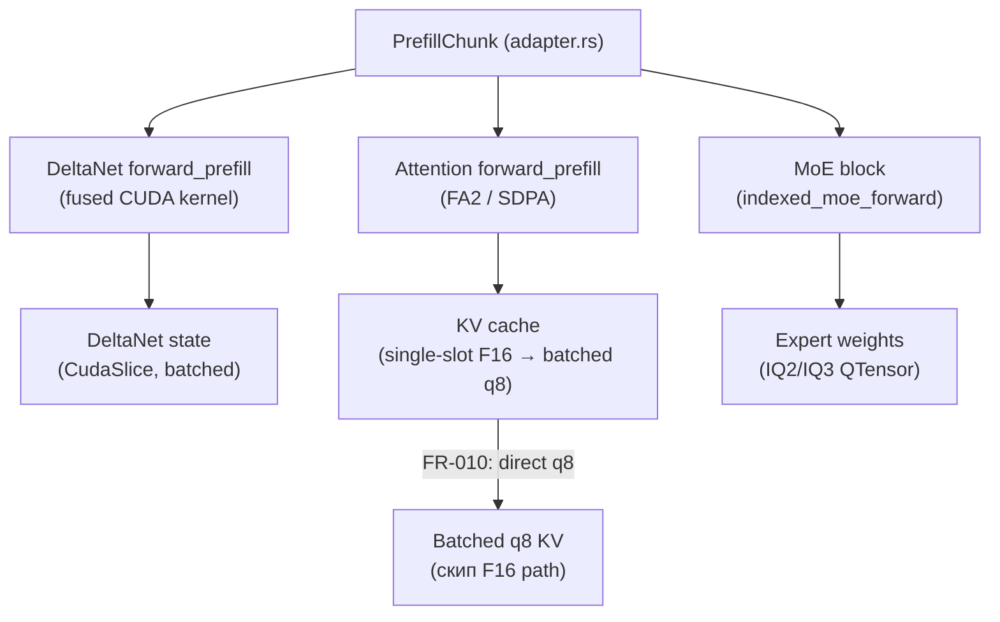

# Specification: Prefill Optimization (All Components)

**Date:** 2026-08-23
**Priority:** P1
**Type:** Performance optimization (extension of M2 parity)

## 1. Problem

Prefill на RTX 3060 работает со скоростью ~300 ток/с против ~850 ток/с у llama.cpp на том же железе и той же модели (Qwen3.6-35B-A3B IQ2_XXS). Разрыв **×2.8**. Чанк 512 токенов занимает 1.86 с вместо целевых ~0.6 с.

Полный GPU-профиль (QWEN36_TRACE_MMQ, sync-based) показывает, что время размазано по трём компонентам почти равномерно — нет единого рычага:

| Компонент | Время/чанк 512 | Доля |
|---|---|---|
| DeltaNet (fused prefill) | 466 мс | 25% |
| Attention (FA2 prefill) | 300 мс | 16% |
| MoE down (IQ2S/IQ3S) | 280 мс | 15% |
| MoE gate+up (IQ2XXS dual) | 150 мс | 8% |
| Shared weights (Q5K/Q6K MMQ) | ~10 мс | ≈0% |
| Launch overhead + misc | ~650 мс | 36% |

Также зафиксирован структурный дефект: prefill пишет KV в single-slot F16-кэш (~480 МиБ @24K) с deep-clone снапшотом, что приводит к 97% VRAM и коллапсу декода на длинном контексте (6-11 ток/с @24K).

## 2. Goal

Достичь паритета с llama.cpp по префиллу: **≥850 ток/с** на RTX 3060 для чанка 512 токенов. Декод не должен деградировать (≥ текущих 9-12 ток/с @12K, ≥6 ток/с @24K).

## 3. Current state

### Файлы (candle-fork):
- `candle-core/src/quantized/cuda.rs` — MMQ dispatch (`mul_mat_q_mma`), MoE dispatch (`indexed_moe_forward`, `indexed_moe_forward_dual`)
- `candle-kernels/src/mmq_gguf/` — MMQ ядра для K-quants + IQ-типов (DEFINE_MMQ_DENSE)
- `candle-kernels/src/quantized.cu` — dequant + MMVQ + indexed_moe ядра
- `qwen35-batch/src/real/delta_rule_cuda.rs` — DeltaNet CUDA bindings
- `qwen35-batch/src/real/delta_rule_batched_cuda.rs` — batched DeltaNet
- `qwen35-batch/src/real/model_weights.rs` — DeltaNet forward, attention forward_prefill, MoE blocks
- `qwen35-batch/src/real/adapter.rs` — prefill_chunk orchestration, seed_slot_batched, clear_single_slot_kv

### Существующая инфраструктура:
- QWEN36_TRACE_MMQ — трейс GPU-времени MoE/MMQ (sync-based, 2026-08-23)
- QWEN36_TRACE — общий трейс (prefill heartbeats, [pf]/[pfa] timings)
- QWEN36_KEEP_SINGLE_KV=1 — env-откат для clear_single_slot_kv
- llama.cpp — эталон для parity

### Известные оптимизации (уже сделано):
- DeltaNet prefill: fused через delta_rule.cu (не token-by-token)
- MMQ для shared-весов: активен (Q5K/Q6K ~0.3 мс)
- MoE: indexed_moe_forward ядра (не MMQ, grid=(n,batch,topk))
- clear_single_slot_kv: освобождение F16 KV после seed (7c9b0fb1)

## 4. User scenarios

### Scenario 1: Длинный промпт (P1)
**As** пользователь API, **I want** TTFT ≤ 30 с на 24K-контексте, **so that** длинные промпты не блокируют ответ на 2.5+ минуты.

**Acceptance criteria:**
- [ ] Given prompt 24K tokens, when POST /v1/chat/completions max_tokens=1, then TTFT ≤ 30 с
- [ ] Given prompt 10K tokens, when same, then TTFT ≤ 12 с
- [ ] Given ctx=40960 slots=2, when decode after 24K prefill, then ≥ 6 ток/с (не хуже)
- [ ] Given prompt 1 token (неполный чанк), when POST /v1/chat/completions, then TTFT ≤ 100 мс
- [ ] Given 2 слота concurrent prefill, when both active, then деградация скорости ≤ 30% vs single-slot

### Scenario 2: Короткий промпт (P2)
**As** пользователь API, **I want** TTFT ≤ 3 с на 1K-контексте, **so that** короткие запросы отвечают быстро.

**Acceptance criteria:**
- [ ] Given prompt 1K tokens, when POST /v1/chat/completions, then TTFT ≤ 3 с

### Scenario 3: Decode не деградирует (P1)
**As** пользователь API, **I want** decode ≥ текущей скорости после оптимизации префилла, **so that** общая производительность не падает.

**Acceptance criteria:**
- [ ] Given 12K context, when decode, then ≥ 9 ток/с
- [ ] Given 6K context, when decode, then ≥ 25 ток/с
- [ ] Given 24K context, when decode, then ≥ 6 ток/с

## 5. Functional requirements

### Must Have (P0)

- **FR-000**: Baseline-потолок: измерить теоретический bandwidth IQ2-матмулов (GB/s) на sm_86 через nsys/ncu. Если потолок < 850 ток/с — зафиксировать реалистичную цель. ДО любых оптимизаций
- **FR-001**: Оптимизация MoE indexed_moe_forward: grid-рефакторинг с per-row (n,batch,topk) на batched tiles. Цель: down ≤10 мс/слой, dual ≤8 мс/слой. Если FR-000 покажет, что bandwidth-limit выше — скорректировать цель
- **FR-002**: Оптимизация DeltaNet prefill: tile-размер/launch конфигурация. Цель: 466 мс/чанк → ≤200 мс/чанк
- **FR-003**: ~~Attention prefill~~ ✅ Verified: FA2 активен (300 мс/чанк подтверждено профилем). Оставить как мониторинг: если после FR-001/002 attention станет bottleneck — оптимизировать отдельной задачей
- **FR-004**: Launch overhead: nsys trace → top-5 launches по host-side gap. Устранить ≥60% measured host overhead. Цель: ~650 мс → ≤260 мс
- **FR-005**: Каждое изменение покрыто parity-тестом (MAE vs CPU dequant golden ≤ 1e-3 на фиксированном промпте 512 токенов)
- **FR-006**: Каждое изменение имеет env-флаг отката (QWEN36_DISABLE_*)

### Should Have (P1)

- **FR-010**: Prefill→q8 batched KV: запись prefill KV напрямую в q8 batched кэш, минуя single-slot F16. Убирает ~480 МиБ F16 peak @24K
- **FR-011**: MoE grid occupancy: анализ и оптимизация shared-memory/occupancy текущего ядра (если FR-001 не даёт нужного эффекта)
- **FR-012**: Микро-промпт: prefill 1-16 токенов ≤ 100 мс (неполный чанк)

### Nice to Have (P2)

- **FR-020**: Профилирование через nsys/ncu для верификации bottleneck после оптимизаций
- **FR-021**: Документирование оптимального chunk-size (512 vs 1024 vs 2048) на основе профиля

## 6. Non-functional requirements

- **Performance**: префилл ≥850 ток/с (chunk 512 ≤ 0.6 с), decode ≥ текущих уровней. Если FR-000 покажет, что bandwidth-потолок ниже 850 — зафиксировать реалистичную цель
- **Numerical**: MAE vs CPU dequant golden ≤ 1e-3 на prefill outputs (parity-тест обязателен для каждого изменения)
- **Rollback**: env-флаг QWEN36_DISABLE_* для каждой оптимизации
- **Compatibility**: sm_86 (RTX 3060), CUDA 12.x, Windows 11

## 7. Data model

Не применимо — оптимизация вычислений, без изменения модели данных.

## 8. Architecture

## 9. Out of scope

- Оптимизация decode (отдельная задача)
- Изменение модели данных/API
- Поддержка новых GPU/архитектур
- Переход на другой квант (Q4_K_XL и т.д.)

## 10. Deferred questions

| Question | Why deferred | When the answer is needed | Who decides |
|---|---|---|---|
| MMQ для MoE-экспертов (вместо indexed_moe) | Неясно, поддерживает ли llama.cpp MMQ для MoE; если нет — наш indexed_moe может быть быстрее | После baseline-замера FR-001 | Архитектор |
| Tile-размер DeltaNet (32/64/128) | Требует экспериментов на реальном железе; неизвестен без профиля | Во время реализации FR-002 | Разработчик |

## 11. Spec decisions

| # | Question | Decision | Date |
|---|----------|----------|------|
| D-001 | Какой scope: один компонент или все три? | Все три (DeltaNet + attention + MoE) — разрыв размазан, одного ядра недостаточно | 2026-08-23 |
| D-002 | Критерий успеха? | 850 ток/с — полный паритет с llama.cpp. Если FR-000 покажет bandwidth-потолок ниже — скорректировать | 2026-08-23 |
| D-003 | Жёсткие ограничения? | Decode не должен деградировать (≥ текущих уровней на всех длинах) | 2026-08-23 |
| D-004 | Как измерять parity? | MAE vs CPU dequant golden (не llama.cpp GPU — он сам имеет variance) на фиксированном промпте 512 токенов | 2026-08-23 |

## 12. Success criteria

- [ ] FR-000: bandwidth-потолок измерен и зафиксирован (через nsys/ncu)
- [ ] Префилл 24K: TTFT ≤ 30 с (vs текущих ~145 с). Если FR-000 покажет потолок ниже — реалистичная цель
- [ ] Префилл 10K: TTFT ≤ 12 с (vs текущих ~33 с)
- [ ] Микро-промпт (1-16 токенов): TTFT ≤ 100 мс
- [ ] 2 слота concurrent: деградация ≤ 30%
- [ ] Decode @12K: ≥ 9 ток/с (не хуже)
- [ ] Decode @24K: ≥ 6 ток/с (не хуже)
- [ ] Parity: MAE ≤ 1e-3 vs CPU dequant golden
- [ ] Все оптимизации имеют env-флаги отката
