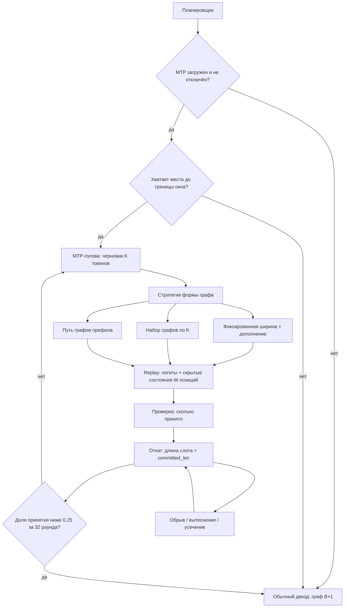

# Specification: MTP-декод, совместимый с CUDA-графами

**Дата:** 2026-08-27
**Приоритет:** P0
**Тип:** Extension (доводка существующей реализации MTP)

## 1. Проблема

MTP-рантайм в forge написан (`engine/qwen35-batch/src/real/mtp.rs`, 484 строки), поддерживает размерности 4B, 9B и Qwen3.8-27B, умеет адаптивную ширину драфта. Но он **не подключён к серверу** — `load_mtp()` вызывается только из диагностических бинарников, настройки для указания артефакта нет. В ответах API поле `mtp` всегда возвращает `enabled: false`.

Подключить его «как есть» нельзя. В `adapter.rs:1331` стоит блокировка PD-204: при загруженном MTP страничный декод через CUDA-графы отключается, движок переходит в eager. Замер на Qwen3.8-27B Q8_0 (RTX 4090 48 ГБ, один слот) показывает, во что это обходится:

| контекст | графы вкл | графы выкл | потеря |
|---|---|---|---|
| 32K | 29.2 ток/с | 19.1 ток/с | −35% |
| 128K | 24.7 ток/с | 8.3 ток/с | −66% |

Без графов расход VRAM на 128K вырастает с 36 789 до 44 383 МБ — графовый пул переиспользует промежуточные буферы, eager выделяет их заново.

Отсюда экономика: при реалистичной доле принятия 0.6–0.7 и глубине драфта 4 формула `S = (1−p^(k+1))/(1−p) / (1+k·c)` даёт ускорение около 2.5×. На 32K это выигрыш (19.1 × 2.5 = 47.8 против 29.2), а **на 128K — регрессия** (8.3 × 2.5 = 20.8 против 24.7). Чтобы MTP хотя бы не замедлял движок на 128K, ему нужно ускорение втрое, что недостижимо при названных параметрах.

**Совместимость с графами — не оптимизация, а предусловие включения MTP.**

## 2. Цель

MTP даёт измеримое ускорение декода на всех моделях и длинах контекста, где он включён, **не жертвуя CUDA-графами** и не нарушая инвариант выхода. Там, где выигрыш не подтверждён замером, MTP не включается — движок работает как сегодня.

## 3. Текущее состояние

**Есть и работает:**
- `engine/qwen35-batch/src/real/mtp.rs` — рантайм одноголового MTP, инварианты семейства (`HEAD_DIM=256`, `ROPE_DIM=64`, `ROPE_BASE=1e7`).
- `engine/qwen35-batch/src/real/model_profile.rs:465` — `MtpProfile`, читает и валидирует 15 тензоров MTP, вычисляет `mtp_block`, разводит тонкий файл 4B и Qwen3.8.
- `engine/qwen35-batch/src/real/adapter.rs` — `load_mtp()`/`unload_mtp()`, поле `verified_target_hidden`, форварды `forward_embeds_with_hidden` и `forward_embeds_mrope_with_hidden`.
- `engine/qwen35-batch/src/scheduler.rs` — ширина драфта (`QWEN36_MTP_WIDTH`, по умолчанию 3, максимум 8), адаптивная ширина (`QWEN36_MTP_ADAPTIVE`), фазовый тайминг (`QWEN36_MTP_TIMING`).
- `engine/qwen35-batch/src/bin/qwen35_mtp_gate.rs` — шлюз совпадения выхода: прогоняет один промпт с MTP и без и сравнивает токены.
- `forge-convert` — `hf_to_gguf_mtp` для упаковки артефактов.

**Мешает:**
- `adapter.rs:1331` — блокировка PD-204, MTP выключает графовый путь.
- `DecodeGraphState` (`adapter.rs:76`) — вход `ids_t` формы `[B, 1]`, выход только `logits_t`. MTP нужны `[B, K+1]` на входе и скрытые состояния на выходе.
- Нет настройки для указания артефакта MTP серверу.
- Нет артефактов MTP в Q8_0 ни для одной из трёх моделей.

**Ориентир для сравнения** (Qwen3.8-27B Q8_0, RTX 4090 48 ГБ, один слот, графы вкл): декод 29.2 / 24.7 / 20.8 ток/с на 32K / 128K / 256K.

## 4. Сценарии

### Сценарий 1: Разведка — держится ли инвариант выхода (P0, блокирующий)

**Как** архитектор, **я хочу** до начала работ выяснить, достижимо ли совпадение выхода токен в токен, **чтобы** не построить работающую вдвое более быструю фичу, которую придётся выбросить из-за BD-023.

**Обоснование.** Проверочный проход считает логиты позиции i в батче ширины W, обычный декод — в батче из одного. Порядок редукции с плавающей точкой зависит от формы батча, поэтому логиты расходятся в младших разрядах, а на почти равных кандидатах argmax перекидывается. Сегодняшний замер int8-KV дал ровно такую картину: тексты разошлись на 92-м символе при 19 тысячах токенов контекста. Существующий шлюз `qwen35_mtp_gate` проверял совпадение в eager-режиме на нынешней форме батча — мы собираемся менять и режим, и форму.

**Шаги:**
1. Прогнать `qwen35_mtp_gate` на длинах 1K, 32K и 128K.
2. Прогнать его же при ширинах драфта 1, 2, 4 и 8.
3. Зафиксировать, при каких сочетаниях совпадение держится, при каких нет и на какой позиции расходится.

**Критерии приёмки:**
- [ ] Given матрица «длина контекста × ширина драфта» из 12 сочетаний, when прогнан шлюз совпадения, then для каждого зафиксировано «совпадает» либо «расходится с позиции N».
- [ ] Given результаты, when совпадение держится во всех сочетаниях, then сценарии 2–7 выполняются как описано.
- [ ] Given результаты, when совпадение не держится хотя бы в одном сочетании, then работа приостанавливается до решения владельца: отменять BD-023 новым решением либо ограничивать область применения MTP теми сочетаниями, где инвариант держится.

### Сценарий 2: Артефакты MTP под каждую модель (P0)

**Как** сопровождающий, **я хочу** получить артефакт MTP того же кванта, что и основная модель, **чтобы** доля принятых токенов не падала из-за огрублённого черновика.

**Критерии приёмки:**
- [ ] Given HF-веса Qwen3.5-4B, Qwen3.5-9B и Qwen3.8-27B, when запущен `forge-convert`, then для каждой получен артефакт MTP в Q8_0, содержащий ровно 15 тензоров.
- [ ] Given артефакт MTP, when его читает `MtpProfile::read_and_validate`, then валидация проходит и `mtp_block` вычислен верно.
- [ ] Given артефакт MTP от другой модели семейства (различаются скрытые размеры 2560 / 4096 / 5120 при общем `head_dim=256`), when он подан к загруженной модели, then загрузка отклоняется с указанием несовпадающего размера — а не принимается с нулевой долей принятия.
- [ ] Given артефакт MTP в Q8_0 и в Q4_0 для одной модели, when замерена доля принятых токенов на одинаковом наборе из 20 промптов, then для Q8_0 она не ниже, чем для Q4_0.

### Сценарий 3: Подключение MTP к серверу с откатом (P0)

**Как** администратор сервера, **я хочу** указать путь к артефакту настройкой и быть уверенным, что MTP не сделает хуже, **чтобы** включение было безопасным по умолчанию.

**Критерии приёмки:**
- [ ] Given заданный путь к артефакту, when сервер обслуживает запрос, then поле `mtp` содержит `enabled: true` и ненулевые `drafted` и `accepted`.
- [ ] Given путь не задан или файл отсутствует, when сервер стартует, then он поднимается штатно, `mtp.enabled` равно `false`, декод идёт обычным путём.
- [ ] Given артефакт, не прошедший валидацию, when сервер стартует, then причина отказа попадает в лог, сервер продолжает работу без MTP.
- [ ] Given запрос, на котором доля принятых токенов за скользящее окно из 32 раундов ниже 0.25, when окно заполнено, then движок переходит на обычный декод до конца запроса и указывает причину в `mtp.fallback_category`.
- [ ] Given запрос с нулевой долей принятия от первого раунда, when он обслужен целиком, then суммарное время не превышает время того же запроса без MTP более чем на 10%.

### Сценарий 4: Совместимость с CUDA-графами (P0)

**Как** пользователь длинного контекста, **я хочу** получать ускорение от MTP без потери графов, **чтобы** декод не оказался медленнее, чем без MTP вовсе.

**Критерии приёмки:**
- [ ] Given MTP загружен, when выполняется декод, then графовый путь не отключается (блокировка PD-204 снята), что подтверждается счётчиком replay в логе.
- [ ] Given одинаковый запрос и seed, when он выполнен с MTP и без него, then идентификаторы сгенерированных токенов совпадают токен в токен (BD-023) — в пределах области, подтверждённой сценарием 1.
- [ ] Given Qwen3.8-27B Q8_0 на 128K, when MTP включён, then декод **не ниже 24.7 ток/с** (текущий уровень с графами без MTP).
- [ ] Given ширина драфта 1, when MTP включён, then поведение совпадает с обычным декодом по выходу, а накладные расходы не превышают 5%.

### Сценарий 5: Целостность KV на границах и при обрыве (P0)

**Как** оператор сервера, **я хочу**, чтобы прерванный раунд не оставлял мусор в кеше, **чтобы** следующий запрос не получил испорченный контекст.

**Обоснование.** Драфт записывает W позиций до того, как проверка решит, сколько из них принять. Между этими моментами запрос может быть прерван клиентом, слот вытеснен, а скользящее окно — усечь контекст по BD-017.

**Критерии приёмки:**
- [ ] Given отвергнутые позиции проверочного прохода, when раунд завершён, then длина KV слота равна числу принятых токенов, а содержимое страниц за этой границей не влияет на последующие раунды.
- [ ] Given обрыв соединения между записью драфта и завершением проверки, when слот освобождается, then его длина откачена к последнему подтверждённому токену.
- [ ] Given слот вытеснен посреди раунда, when он занят новым запросом, then непроверенные позиции предыдущего в нём не видны.
- [ ] Given до границы окна контекста осталось меньше W свободных позиций, when начинается раунд, then ширина драфта уменьшается до доступной либо раунд выполняется обычным декодом — переполнения не происходит.
- [ ] Given усечение по скользящему окну (BD-017) сработало во время раунда, when раунд завершается, then результат совпадает с тем, что дал бы обычный декод после того же усечения.

### Сценарий 6: Выбор стратегии захвата графа по замеру (P0)

**Как** архитектор, **я хочу** сравнить способы совмещения на одинаковом стенде, **чтобы** выбрать не по рассуждению, а по числу.

**Обоснование.** Предварительные оценки в этом проекте систематически промахиваются: эффект графов оценивался в 10–20%, замер дал 35–66%. Поэтому стратегия выбирается замером, а не аргументом.

**Стратегии:**
- **Фиксированная ширина с дополнением** — всегда проверяем ровно W позиций, недостающие добиваем; один захват графа.
- **Набор графов по ширинам** — захват под каждое K, вытеснение LRU, по образцу графов префила с ключом `(T, slot)`.
- **Переиспользование графов префила** — проверка исполняется как префил-чанк длины K+1.
- **Правка параметров узлов в готовом графе** — `cuGraphExecKernelNodeSetParams` меняет указатели и размер сетки в уже собранном графе примерно за 1 мкс против 2 мс на полную пересборку. Один граф обслуживает несколько ширин без дополнения пустышками и без набора захватов. Требует, чтобы форма буферов допускала подмену указателя, а число узлов не менялось.

**Критерии приёмки:**
- [ ] Given общее ядро реализовано (вход `[B, W]`, выдача скрытых состояний, откат KV), when добавляется новая стратегия, then она затрагивает только слой управления формой графа.
- [ ] Given первая реализованная стратегия, when она замерена на 32K и 128K, then при ускорении ниже 20% относительно текущего уровня работа приостанавливается и замысел пересматривается — оставшиеся стратегии не реализуются.
- [ ] Given реализованные стратегии, when каждая замерена на 32K, 128K и 256K, then получена таблица декода, доли принятия и VRAM по всем точкам.
- [ ] Given захват графа, when он выполняется, then ему предшествует прогрев двумя полными проходами, а сам захват защищён RAII-гардом: паника между началом и концом оставляет поток в режиме захвата, после чего падают все вызовы драйвера.
- [ ] Given результаты замера, when выбрана стратегия по умолчанию, then выбор зафиксирован решением с приведёнными числами, а отвергнутые остаются доступны настройкой.

### Сценарий 7: Включение только там, где есть выигрыш (P1)

**Как** пользователь любой из трёх моделей, **я хочу**, чтобы MTP включался лишь когда он ускоряет, **чтобы** не платить за него на конфигурациях, где он не окупается.

**Обоснование.** Выигрыш тем больше, чем сильнее модель упирается в чтение весов. Qwen3.8-27B на 4090 берёт 82–91% предела шины; Qwen3.5-4B на RTX 3060 — около 51%, то есть там время съедают накладные расходы.

**Критерии приёмки:**
- [ ] Given модель и длина контекста, when замер показал ускорение ниже 10%, then MTP для этой конфигурации по умолчанию выключен.
- [ ] Given ширина драфта подбирается автоматически, when доля принятия устойчиво выше 0.8, then ширина растёт в пределах захваченной формы графа.

## 5. Функциональные требования

### Must Have (P0)
- **FR-001**: Матрица «длина контекста × ширина драфта» проверена шлюзом совпадения до начала реализации; область, где инвариант держится, зафиксирована.
- **FR-002**: `forge-convert` пакует артефакт MTP в Q8_0 для Qwen3.5-4B, Qwen3.5-9B и Qwen3.8-27B из закреплённых HF-весов.
- **FR-003**: Загрузка артефакта сверяет скрытый размер, число голов и число kv-голов с загруженной моделью и отклоняет несовпадающие.
- **FR-004**: Сервер принимает путь к артефакту MTP настройкой и грузит компонент по требованию согласно BD-027.
- **FR-005**: Декодный граф принимает `[B, W]` токенов и отдаёт логиты и скрытые состояния всех W позиций.
- **FR-006**: Блокировка PD-204 снята для MTP; графовый путь остаётся активным при загруженном MTP.
- **FR-007**: Отвергнутые позиции откатываются в страничном KV сдвигом длины слота.
- **FR-008**: Обрыв запроса, вытеснение слота и усечение по BD-017 посреди раунда откатывают KV к последнему подтверждённому токену.
- **FR-009**: У границы окна контекста ширина драфта ограничивается доступным числом позиций.
- **FR-010**: При доле принятия ниже 0.25 за окно из 32 раундов движок возвращается к обычному декоду до конца запроса.
- **FR-011**: Выход при фиксированном seed совпадает токен в токен с обычным декодом в области, подтверждённой FR-001.
- **FR-012**: Реализованы стратегии управления формой графа, переключаемые настройкой; после первой действует порог остановки в 20%.
- **FR-013**: Поле `mtp` в ответе API отражает `enabled`, `drafted`, `accepted` и причину отката.

### Should Have (P1)
- **FR-020**: MTP по умолчанию включён только для конфигураций, где замер показал ускорение не ниже 10%.
- **FR-021**: Отвергнутые позиции не попадают в хеш-цепочку кеша префиксов (стык со спекой многоуровневого кеша).
- **FR-022**: Ширина W подбирается автоматически по наблюдаемой доле принятия в пределах захваченной формы графа.

## 6. Нефункциональные требования

**Производительность.** Ориентир — Qwen3.8-27B Q8_0 на RTX 4090 48 ГБ, один слот, графы включены: 29.2 / 24.7 / 20.8 ток/с на 32K / 128K / 256K. С включённым MTP декод не ниже этих значений ни в одной точке; цель — не ниже 45 / 37 / 31 ток/с. На запросе с нулевой долей принятия суммарное время превышает вариант без MTP не более чем на 10%.

**Память.** Загруженный MTP в Q8_0 добавляет не более 400 МБ VRAM для 27B. Расход VRAM с MTP и графами не превышает текущий уровень без MTP более чем на объём артефакта.

**Корректность.** Совпадение токен в токен при фиксированном seed проверяется автотестом на наборе из 20 промптов длиной 1K–128K в области, подтверждённой сценарием 1.

**Совместимость.** На RTX 3060 12 ГБ MTP выгружается при нехватке VRAM раньше Vision (BD-027).

## 7. Модель данных (концептуально)

```
Артефакт MTP
  - 15 тензоров одного блока (внимание + MLP + нормы + fc)
  - квант: совпадает с основной моделью
  - hidden / heads / kv_heads: сверяются с загруженной моделью
  - mtp_block: индекс блока, вычисляется как blocks − nextn
  → валидируется MtpProfile

Раунд спекуляции
  - drafted / accepted: предложено и принято
  - width: ширина драфта в этом раунде
  - committed_len: длина KV после раунда — точка отката
  - fallback_category: причина отката, если был
```

## 8. Архитектура



## 9. Вне рамок

- **Многослотовый режим с MTP** — откладывается до доведения одного слота, по решению владельца.
- **MTP для мультимодальных запросов** — блокировка PD-204 для vision (mrope) остаётся, снимается отдельно.
- **Обучение собственных MTP-голов** — веса входят в выпущенные модели.
- **Смена схемы квантования основной модели** — артефакт MTP подстраивается под модель, не наоборот.
- **Достижение побитовой инвариантности ядер к размеру батча** — если сценарий 1 покажет расхождение, это отдельная работа, а не часть данной спеки.

## 10. Отложенные вопросы

| Вопрос | Почему отложен | Когда нужен ответ | Кто решает |
|---|---|---|---|
| Стратегия захвата графа по умолчанию | Выбор делается по замеру, а не по рассуждению — предварительные оценки в проекте промахивались втрое | После сценария 6, до фиксации значения по умолчанию | Владелец по результатам замера |
| Ширина W по умолчанию | Зависит от выбранной стратегии и наблюдаемой доли принятия | Вместе с выбором стратегии | Архитектор |
| Судьба BD-023 при расхождении выхода | Зависит от результата сценария 1; решать до того, как он получен, значит гадать | Сразу после сценария 1, если расхождение обнаружено | Владелец |

## 11. Решения спеки

| # | Вопрос | Решение | Дата |
|---|---|---|---|
| D-001 | Какой путь совмещения MTP и графов выбрать | Реализовать все четыре и выбрать по замеру. Общее ядро (вход `[B, W]`, выдача скрытых состояний, откат KV) выносится один раз, стратегии различаются только слоем управления формой. После первой действует порог остановки в 20% | 2026-08-27 |
| D-002 | Какой квант у артефакта MTP | Совпадающий с моделью, Q8_0. Квант черновика не влияет на качество выхода — оно защищено проверкой (BD-023), — но влияет на долю принятия, то есть на величину ускорения | 2026-08-27 |
| D-003 | Для каких моделей делать MTP | Для всех трёх, но включать по умолчанию только там, где замер показал выигрыш не ниже 10% | 2026-08-27 |
| D-004 | Считать ли совместимость с графами отдельным этапом | Нет, это предусловие. Без неё MTP на 128K даёт 20.8 ток/с против текущих 24.7, то есть регрессию | 2026-08-27 |
| D-005 | Что с многослотовым режимом | Отложен до доведения одного слота, по решению владельца | 2026-08-27 |
| D-006 | Проверять ли достижимость инварианта выхода до реализации | Да, отдельным блокирующим сценарием. Проверочный проход считает логиты в батче ширины W, обычный декод — в батче из одного; порядок редукции зависит от формы, и на почти-ничьей argmax перекидывается. Строить фичу, которую придётся выбросить из-за BD-023, дороже, чем день разведки | 2026-08-27 |
| D-008 | Ставить ли `ReleaseThreshold = SIZE_MAX` перед захватом графа, как советуют внешние материалы | Нет. У нас это уже пробовалось и обрушило декод: retain=MAX удерживает пиковые префил-транзиенты до 1 ГиБ навсегда, VRAM уходит за 97%, начинается WDDM spill. В `adapter.rs:245` стоит осознанное ограничение в 256 МиБ с этим объяснением. Совет верен для датацентровых карт с запасом и вреден для целевой RTX 3060 12 ГБ | 2026-08-27 |
| D-009 | Квантовать ли MTP-голову или оставить в bf16 | Проверить замером. Внешний материал предлагает оставить bf16: плюс около 0.8 ГБ и 3% к шагу, но доля принятия не проседает, а она входит в формулу ускорения множителем. Критерий: если bf16 поднимает долю принятия более чем на 0.03 против Q8 — оставляем bf16. Разведка намерила 94.5% принятия при ширине 2, терять даже процент ради сотни мегабайт невыгодно | 2026-08-27 |
| D-007 | Какой приоритет у отката при низкой доле принятия | P0, а не P1. Иначе минимальная версия умеет обслуживать запрос медленнее, чем без MTP | 2026-08-27 |

## 12. Критерии успеха

- [ ] Матрица «контекст × ширина» проверена; область, где выход совпадает токен в токен, зафиксирована.
- [ ] Артефакты MTP в Q8_0 собраны для всех трёх моделей, проходят валидацию и отклоняются при подаче к чужой модели.
- [ ] Сервер включает MTP настройкой; при отсутствии артефакта работает как сегодня.
- [ ] Блокировка PD-204 снята: графовый путь активен при загруженном MTP.
- [ ] Декод Qwen3.8-27B Q8_0 на 128K с MTP не ниже 24.7 ток/с; целевое значение 37 ток/с.
- [ ] Запрос с нулевой долей принятия обслуживается не более чем на 10% дольше варианта без MTP.
- [ ] Обрыв, вытеснение и усечение посреди раунда не оставляют непроверенных позиций в KV.
- [ ] Таблица из девяти точек снята, стратегия по умолчанию выбрана и обоснована числами.
- [ ] Расход VRAM с MTP и графами превышает текущий не более чем на объём артефакта.
