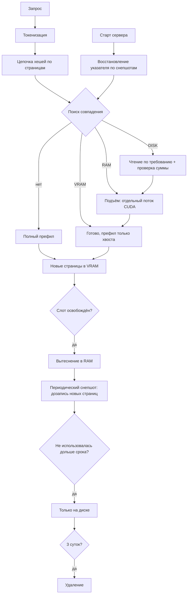

# Specification: Многоуровневый кеш KV — VRAM, RAM, диск

**Дата:** 2026-08-27
**Приоритет:** P0
**Тип:** New feature

## 1. Проблема

Сегодня KV-кеш живёт только в VRAM и только пока слот занят. Из этого следуют три потери.

**Повторный префил в диалоге.** Пользователь отправил реплику, получил ответ, обдумывает следующую. Его контекст всё это время занимает слот — либо слот освобождают, и тогда следующая реплика требует пересчёта всего контекста заново. Замер на Qwen3.8-27B Q8_0: **префил 256K занимает 173 секунды**. Перекачка того же кеша из оперативной памяти по PCIe 4.0 x16 (около 25 ГБ/с при закреплённой памяти) заняла бы 0.69 с в F16 и 0.35 с в int8 — **в 250–500 раз быстрее пересчёта**.

**Число одновременных пользователей упирается в VRAM.** На 48 ГБ помещается один контекст 256K в F16 или два в int8. Остальные ждут в очереди, и каждое возвращение стоит трёх минут.

**Перезапуск сервера обнуляет всё.** После обновления или падения ни один диалог не продолжается без полного пересчёта.

Общие системные промпты сегодня тоже считаются заново на каждый запрос, хотя их KV идентичен между пользователями.

## 2. Цель

Контекст пользователя переживает и освобождение слота, и перезапуск сервера. Возврат к прерванному диалогу стоит долей секунды вместо минут. Общие префиксы считаются один раз.

## 3. Текущее состояние

**Есть и работает:**
- `engine/qwen35-batch/src/real/paged_kv_cuda.rs` (450 строк) — страничный пул: `PAGE_SIZE = 64` токена, `PagedModelCtx` с таблицей блоков `block_table_t` формы `[capacity_b, max_blocks]`, отображающей логический индекс блока в физическую страницу.
- Размер страницы для Qwen3.8-27B: **4 МиБ в F16**, 2 МиБ в int8 (16 слоёв внимания × 2 × 4 kv-головы × 256 × 64 токена). Контекст 256K — 4096 страниц.
- В логах видны `[pg] chunk ... hit=1 lru=1` — какой-то механизм переиспользования страниц уже есть; его область действия предстоит установить.

**Чего нет:**
- Хранения страниц вне VRAM.
- Поиска готового KV по содержимому запроса до префила.
- Переживания перезапуска.
- Учёта общих префиксов между запросами.

**Почему страничная раскладка удобна для задачи:** страницы KV **неизменяемы после записи** — диалог только дописывает новые, старые не меняются. Поэтому вытеснение и снепшот сводятся к копированию и дозаписи страниц, а не к перезаписи кеша целиком.

## 4. Сценарии

### Сценарий 1: Поиск по самому длинному совпадающему префиксу (P0)

**Как** пользователь, продолжающий диалог, **я хочу**, чтобы система нашла уже посчитанную часть моего контекста, **чтобы** префил считал только дописанное.

**Обоснование.** Точное совпадение всего контекста — редкость: типичный случай это дописанная реплика к длинному диалогу. Механизм тот же, что покрывает и общие системные промпты.

**Шаги:**
1. Запрос токенизируется до префила.
2. Токены режутся на страницы по 64; для каждой полной страницы считается хеш, включающий хеш предыдущей — получается цепочка.
3. Поиск идёт по цепочке до первого несовпадения, найденные страницы поднимаются в VRAM.
4. Префил считает только хвост от точки расхождения.

**Критерии приёмки:**
- [ ] Given диалог из N полных страниц в кеше и запрос, дописывающий одну реплику, when запрос обслуживается, then префил обрабатывает только токены после последней совпавшей страницы.
- [ ] Given два запроса с общим системным промптом в 2000 токенов и разными продолжениями, when второй обслуживается, then страницы общего префикса берутся из кеша, а не считаются заново.
- [ ] Given запрос без совпадений, when он обслуживается, then поиск добавляет к времени до первого токена не более 50 мс.
- [ ] Given неполная последняя страница контекста, when она сохраняется, then в кеш попадают только полные страницы.
- [ ] Given смена модели, кванта или типа KV (F16 против int8), when выполняется поиск, then совпадения с записями от прежней конфигурации не находятся.

### Сценарий 2: Вытеснение из VRAM в оперативную память (P0)

**Как** оператор сервера, **я хочу**, чтобы контекст неактивного пользователя освобождал карту, но не пропадал, **чтобы** обслуживать больше людей без потери их истории.

**Критерии приёмки:**
- [ ] Given слот освобождается, when его страницы вытесняются, then они копируются в закреплённую оперативную память, а VRAM освобождается.
- [ ] Given страницы контекста 256K в int8 (8.66 ГБ), when они поднимаются из оперативной памяти в VRAM, then перенос занимает не более 1.5 с.
- [ ] Given копирование страниц, when оно выполняется, then оно идёт отдельным потоком CUDA и не увеличивает время декода активных запросов более чем на 5%.
- [ ] Given бюджет оперативной памяти под кеш задан настройкой, when он исчерпан, then вытесняется наименее недавно использованная запись, а не отклоняется новая.
- [ ] Given память под кеш выделена, when измеряется скорость переноса, then она не ниже 20 ГБ/с — то есть память действительно закреплена, а не страничная.

### Сценарий 3: Снепшоты на диск и подъём при старте (P0)

**Как** администратор, **я хочу**, чтобы кеш переживал перезапуск сервера, **чтобы** обновление или падение не стоило пользователям пересчёта контекстов.

**Обоснование.** Обычная память процесса умирает вместе с процессом. Долговечность даёт только диск. Поскольку страницы неизменяемы, снепшот — это **дозапись новых страниц**, а не перезапись кеша: диалог, выросший на одну реплику, требует записи только новых страниц.

**Шаги:**
1. Периодически новые страницы уровня оперативной памяти дозаписываются на диск.
2. При старте сервер восстанавливает указатель по снепшотам, не поднимая страницы в память.
3. Страницы читаются с диска по требованию, при первом совпадении.

**Критерии приёмки:**
- [ ] Given диалог, выросший с N до N+2 страниц, when выполняется снепшот, then на диск записываются только 2 новые страницы.
- [ ] Given снепшот выполняется, when он идёт, then время до первого токена активных запросов не растёт более чем на 10%.
- [ ] Given сервер перезапущен, when он поднялся, then указатель кеша восстановлен, а поиск по префиксу находит записи, сохранённые до перезапуска.
- [ ] Given восстановление указателя, when сервер стартует, then оно занимает не более 10 с при 100 ГБ снепшотов на диске.
- [ ] Given сервер убит посреди записи снепшота, when он перезапущен, then недописанная запись отбрасывается по несовпадению контрольной суммы, остальные читаются штатно.
- [ ] Given страница читается с диска, when её содержимое повреждено, then запись отбрасывается, а контекст считается префилом — без выдачи испорченного KV.

### Сценарий 4: Вытеснение по времени и по объёму (P0)

**Как** оператор, **я хочу**, чтобы кеш не рос бесконечно, **чтобы** диск и память не заполнились.

**Обоснование.** Правил по времени недостаточно: десяток активных пользователей заполнит оперативную память за час, не дождавшись ни одного срока. Нужны оба механизма.

**Критерии приёмки:**
- [ ] Given запись не использовалась дольше заданного срока, when срок истёк, then она вытесняется из оперативной памяти на диск, оставаясь доступной поиску.
- [ ] Given запись не использовалась 3 суток, when срок истёк, then она удаляется с диска, а поиск перестаёт её находить.
- [ ] Given бюджет уровня исчерпан, when поступает новая запись, then вытесняется наименее недавно использованная, независимо от её возраста.
- [ ] Given бюджеты оперативной памяти и диска заданы настройкой, when сервер работает сутки под нагрузкой, then фактический расход ни разу не превышает заданные значения.
- [ ] Given запись используется активным запросом, when срабатывает вытеснение, then она не вытесняется до завершения запроса.

### Сценарий 5: Разграничение общих и приватных префиксов (P0)

**Как** владелец сервера, **я хочу** управлять тем, что разделяется между сессиями, **чтобы** совпадение содержимого не стало каналом утечки.

**Обоснование.** Если ключ содержательный, два пользователя с одинаковым началом разделят KV. Для общего системного промпта это ровно то, что нужно; для пользовательских данных совпадение по времени отклика выдаёт факт наличия чужого текста в кеше.

**Критерии приёмки:**
- [ ] Given политика разделения задана настройкой, when она запрещает разделение между сессиями, then поиск ограничен записями той же сессии.
- [ ] Given системный промпт помечен как разделяемый, when его запрашивают разные сессии, then его страницы берутся из общего кеша.
- [ ] Given разделение между сессиями запрещено, when запись вытесняется, then она недоступна поиску из других сессий на всех трёх уровнях.

### Сценарий 6: Наблюдаемость (P1)

**Как** оператор, **я хочу** видеть, работает ли кеш, **чтобы** отличать выигрыш от его отсутствия.

**Критерии приёмки:**
- [ ] Given обслуженный запрос, when он завершён, then в ответе указано, сколько токенов взято из кеша и с какого уровня.
- [ ] Given сервер работает, when запрашивается состояние, then доступны занятость каждого уровня, доля попаданий и число вытеснений.

## 5. Функциональные требования

### Must Have (P0)
- **FR-001**: Токены запроса режутся на страницы по `PAGE_SIZE`; для каждой полной страницы считается хеш, включающий хеш предыдущей.
- **FR-002**: Корень цепочки хешей включает идентификатор модели, квант и тип KV.
- **FR-003**: Поиск находит самый длинный совпадающий префикс; префил считает только хвост.
- **FR-004**: Поиск без совпадений добавляет к времени до первого токена не более 50 мс.
- **FR-005**: Страницы вытесняются из VRAM в закреплённую оперативную память и поднимаются обратно отдельным потоком CUDA.
- **FR-006**: Новые страницы уровня оперативной памяти периодически дозаписываются на диск; уже записанные не переписываются.
- **FR-007**: При старте сервер восстанавливает указатель кеша по снепшотам за время не более 10 с при 100 ГБ на диске.
- **FR-008**: Страницы читаются с диска по требованию, а не поднимаются целиком при старте.
- **FR-009**: Каждая запись на диске несёт контрольную сумму; несовпадение приводит к отбрасыванию записи, а не к выдаче повреждённого KV.
- **FR-010**: Вытеснение работает по двум основаниям: истечение срока и исчерпание бюджета уровня.
- **FR-011**: Записи, не использованные 3 суток, удаляются с диска.
- **FR-012**: Запись, используемая активным запросом, не вытесняется.
- **FR-013**: Политика разделения между сессиями задаётся настройкой; при запрете поиск ограничен своей сессией.
- **FR-014**: Бюджеты оперативной памяти и диска задаются настройкой и не превышаются.

### Should Have (P1)
- **FR-020**: Ответ содержит число токенов, взятых из кеша, и уровень, с которого они подняты.
- **FR-021**: Доступны занятость уровней, доля попаданий и число вытеснений.
- **FR-022**: Упреждающая подкачка: при признаке скорого запроса страницы поднимаются заранее.

### Nice to Have (P2)
- **FR-030**: Страницы сжимаются перед записью на диск, если это не удлиняет подъём.

## 6. Нефункциональные требования

**Производительность.** Подъём контекста 256K в int8 (8.66 ГБ) из оперативной памяти — не более 1.5 с, с диска — не более 5 с. Оба на порядки меньше 173 с, которые занимает префил той же длины. Накладные расходы поиска при промахе — не более 50 мс. Перенос страниц не увеличивает время декода активных запросов более чем на 5%, снепшот не увеличивает время до первого токена более чем на 10%.

**Память.** Память под кеш закреплена; скорость переноса не ниже 20 ГБ/с. Бюджеты обоих уровней задаются настройкой и соблюдаются.

**Надёжность.** Убийство процесса в любой момент не приводит к выдаче повреждённого KV: недописанные и повреждённые записи отбрасываются по контрольной сумме.

**Безопасность.** При запрете разделения между сессиями чужие записи недоступны поиску на всех трёх уровнях.

## 7. Модель данных (концептуально)

```
Запись кеша (страница)
  - chain_hash: хеш цепочки до этой страницы включительно
  - prev_hash: хеш предыдущей страницы
  - tokens: 64 идентификатора токенов
  - kv: содержимое страницы (4 МиБ в F16, 2 МиБ в int8 для 27B)
  - tier: VRAM | RAM | DISK
  - last_used: отметка времени
  - session: владелец либо «разделяемая»
  - checksum: для записей на диске

Корень цепочки
  - model_id, quant, kv_dtype
  → цепочки от разных конфигураций не пересекаются
```

## 8. Архитектура



## 9. Вне рамок

- **Многослотовый режим и его взаимодействие с кешем** — отложен до доведения одного слота, по решению владельца.
- **Распределённый кеш между машинами** — задача одного сервера.
- **Кеширование вне KV** (логиты, эмбеддинги) — не рассматривается.
- **Сжатие страниц** — вынесено в P2 и делается, только если не удлиняет подъём.

## 10. Отложенные вопросы

| Вопрос | Почему отложен | Когда нужен ответ | Кто решает |
|---|---|---|---|
| Срок вытеснения из RAM на диск | Зависит от наблюдаемой картины обращений, которой пока нет | После первых суток работы под нагрузкой | Оператор по метрикам |
| Область действия существующего механизма `[pg] chunk ... hit/lru` | Требует чтения кода; возможно, часть работы уже сделана | До начала реализации сценария 1 | Архитектор |
| Формат хранения на диске | Зависит от того, читаем ли мы страницы по одной или пачками | В плане реализации | Архитектор |

## 11. Решения спеки

| # | Вопрос | Решение | Дата |
|---|---|---|---|
| D-001 | Как кешу пережить перезапуск сервера | Подъём с диска при старте плюс периодические снепшоты. Разделяемая память и отдельный демон отклонены: диск даёт долговечность, которой они не дают, и не требует второго процесса | 2026-08-27 |
| D-002 | Как делать снепшоты, если контекст весит гигабайты | Дозаписью новых страниц. Страницы KV неизменяемы после записи, диалог только дописывает — значит снепшот пропорционален приросту, а не размеру кеша | 2026-08-27 |
| D-003 | Как искать готовый KV до префила | Цепочкой хешей по страницам: хеш страницы включает хеш предыдущей. Даёт самый длинный совпадающий префикс, а не только точное совпадение, и тем же механизмом покрывает общие системные промпты | 2026-08-27 |
| D-004 | Достаточно ли вытеснения по времени | Нет, нужны оба основания. Правила по времени не ограничивают расход: активные пользователи заполнят память, не дождавшись ни одного срока | 2026-08-27 |
| D-005 | Что с совпадением префиксов между пользователями | Управляется политикой. Для общих системных промптов разделение полезно, для пользовательских данных это канал утечки по времени отклика | 2026-08-27 |
| D-006 | Поднимать ли весь кеш с диска при старте | Нет, только указатель; страницы читаются по требованию. Иначе старт занял бы минуты на сотне гигабайт | 2026-08-27 |

## 12. Критерии успеха

- [ ] Возврат к диалогу на 256K после освобождения слота стоит не более 1.5 с из оперативной памяти и 5 с с диска — против 173 с префила.
- [ ] Дописанная реплика к диалогу считает префилом только новые токены.
- [ ] Общий системный промпт считается один раз на всех, кто его использует.
- [ ] Перезапуск сервера не приводит к пересчёту сохранённых контекстов.
- [ ] Убийство процесса в любой момент не приводит к выдаче повреждённого KV.
- [ ] Расход оперативной памяти и диска не превышает заданные бюджеты за сутки под нагрузкой.
- [ ] Поиск при промахе добавляет не более 50 мс к времени до первого токена.
