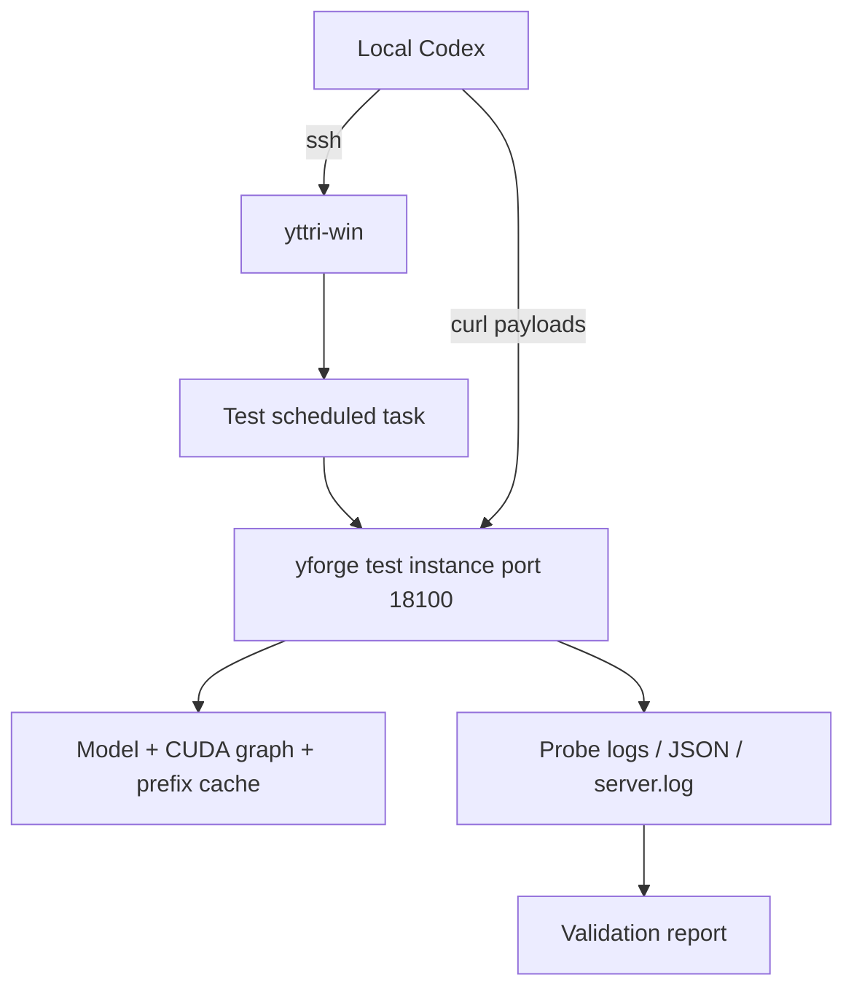

# Specification: Validation of SGLang-inspired serving concepts on yttri-win

**Date:** 2026-09-13
**Priority:** P1
**Type:** Extension — research-to-runtime validation

## 1. Problem

Research-документ [`docs/research/2026-09-13-sglang-concepts.md`](../research/2026-09-13-sglang-concepts.md)
выделил четыре потенциальных преимущества над текущей архитектурой:
hybrid radix cache, overlap scheduler + chunked prefill, breakable/piecewise
CUDA graph и GDN checkpoint/ReplaySSM.

Сейчас это гипотезы, а не проверенные факты:

- неизвестно, сколько именно даёт текущий flat prefix cache на реальной
  agent-нагрузке yttri-win;
- неизвестно, есть ли значимый host/GPU gap, который окупит overlap scheduler;
- неизвестно, даёт ли уже реализованный `PGRAPH` выигрыш на текущей модели и
  какие chunk sizes реально выигрывают;
- MTP/ReplaySSM нельзя проверить на текущем production-профиле, потому что в
  нём `MTP=0`, а артефакт MTP для текущей 9B-модели не задан.

Без этих замеров легко выбрать неверный первый шаг: например, начать с
radix tree там, где основная потеря уже скрыта текущим prefix cache, или с
overlap, где host-фаза составляет малую долю шага.

## 2. Goal

Провести воспроизводимую серию runtime-тестов на yttri-win, которая даст
evidence-backed verdict по каждой проверяемой теории: adopt, defer или reject.
Тесты выполняются на отдельном тестовом инстансе, не меняют production task
`\qwen36-inference` и завершаются отчётом с сырыми метриками и командами.

## 3. Current state

- Research: [`docs/research/2026-09-13-sglang-concepts.md`](../research/2026-09-13-sglang-concepts.md).
- Текущий prefix cache: `src/prefix_cache.rs` — flat hash buckets, host
  snapshots, LRU по байтам, `BLOCK_TOKENS=64`.
- Текущий scheduler: `../yttri-forge/engine/qwen35-batch/src/scheduler.rs` —
  `PREFILL_CHUNK=512`, prefill chunk OR batched decode в одном `step()`.
- Текущий graph path: `PGRAPH=on` включает prefill graph; `CUDA_GRAPHS=1`
  включает decode graphs. Для MTP действует ограничение PD-204 из
  [`docs/specs/2026-08-27-mtp-cuda-graphs.md`](2026-08-27-mtp-cuda-graphs.md).
- Production-хост: `ssh yttri-win`, `D:\Projects\yttri-inference\qwen36-server`,
  бинарник `target\release\yforge.exe`, launch через scheduled task.
- Текущий `.env` на yttri-win: `Qwen3.8-9B-Distill-Q4_K_M`, `CTX=131072`,
  `SLOTS=1`, `MTP=0`, `PREFIX_CACHE_MIB=8192`, `PGRAPH=on`,
  `CUDA_GRAPHS=1`, `KV_POOL_Q8=1`.
- Scheduled task `\qwen36-inference` сейчас в состоянии Ready, порт `18099`
  не слушается.

## 4. User scenarios

### Scenario 1: Prefix cache value on a real agent-like prompt (P1)

**As** maintainer, **I want** измерить TTFT и prefill behavior на промахе и
попадании текущего prefix cache, **so that** понять, является ли radix tree
следующим приоритетом или текущий flat cache уже снимает основную боль.

**Steps:**
1. Запустить отдельный тестовый инстанс `yforge` на порту `18100`.
2. Отправить длинный prompt, затем тот же prompt повторно в том же процессе.
3. Сравнить TTFT, usage, prefill timings и строки `[pcache]` в логе.

**Acceptance criteria (Given / When / Then):**
- [ ] Given тестовый инстанс с `PREFIX_CACHE_MIB=8192`, when один и тот же
  промпт отправлен дважды, then второй запрос показывает cache hit в логе.
- [ ] Given cache hit, when измерен TTFT, then записаны абсолютные значения и
  относительное изменение против miss.
- [ ] Given тест завершён, when открыт отчёт, then указано, достаточен ли
  текущий cache для agent workload или нужен radix/branch-point слой.

### Scenario 2: Prefill graph A/B on the same model (P1)

**As** maintainer, **I want** сравнить `PGRAPH=on` и `PGRAPH=off` на одинаковых
prompt и chunk size, **so that** понять ценность piecewise/graph prefill до
начала новой graph-работы.

**Steps:**
1. Запустить тестовый инстанс с `PGRAPH=on` и фиксированным `PREFILL_CHUNK`.
2. Отправить промпты длиной 1K, 4K и 8K; записать TTFT и prefill tok/s.
3. Повторить с `PGRAPH=off`.
4. Сравнить VRAM и наличие строк capture/replay в логе.

**Acceptance criteria (Given / When / Then):**
- [ ] Given одинаковый prompt и model, when `PGRAPH=on`, then в логе есть
  подтверждение graph path или причина fallback.
- [ ] Given `PGRAPH=off`, when тот же prompt повторён, then получены
  сопоставимые метрики eager path.
- [ ] Given A/B завершён, when открыт отчёт, then указан verdict по
  piecewise prefill: продолжать, отложить или отклонить.

### Scenario 3: Overlap scheduler headroom (P1)

**As** maintainer, **I want** измерить host-фазы внутри шага, **so that**
понять, окупит ли overlap scheduler и result queue инженерные затраты.

**Steps:**
1. Запустить тестовый инстанс с `HOST_TIMING=1` и `TRACE=1`.
2. Отправить несколько генераций, включая длинный prefill и decode.
3. Собрать `host_sample`, `host_drain`, step timings и размеры батча.

**Acceptance criteria (Given / When / Then):**
- [ ] Given `HOST_TIMING=1`, when сделан запрос, then в логе есть per-step
  host timing.
- [ ] Given собранные значения, when посчитана доля host-фаз, then отчёт
  содержит verdict по overlap.
- [ ] Given host-доля ниже согласованного порога, when отчёт принят, then
  overlap откладывается как невыгодный первый шаг.

### Scenario 4: Batch-shape determinism probe (P2)

**As** maintainer, **I want** проверить, насколько текущий runtime
чувствителен к форме батча, **so that** понять необходимость batch-invariant
kernels.

**Steps:**
1. При фиксированном seed выполнить одинаковый запрос несколько раз.
2. Повторить при разном составе слотов/батча, если конфигурация позволяет.
3. Сравнить token IDs или текстовый префикс.

**Acceptance criteria (Given / When / Then):**
- [ ] Given фиксированный seed, when repeat count достаточен, then зафиксирован
  стабильный или нестабильный результат.
- [ ] Given различия, when они локализованы, then отчёт указывает, нужен ли
  batch-invariant reduction как отдельный горизонт.

### Scenario 5: MTP + graph / ReplaySSM probe (P2, deferred)

**As** maintainer, **I want** проверить MTP+graphs и ReplaySSM на yttri-win,
**so that** закрыть наиболее дорогую часть SGLang-концептов.

**Steps:**
1. Дождаться доступного MTP-артефакта для целевой модели.
2. Запустить A/B с MTP=0 и MTP=1.
3. Сравнить decode tok/s, VRAM, graph replay и rollback cost.

**Acceptance criteria (Given / When / Then):**
- [ ] Given MTP-артефакт доступен, when A/B выполнен, then получены метрики.
- [ ] Given артефакта нет, when сценарий проверен, then он остаётся
  сознательно deferred с причиной, а не выдаётся за negative result.

## 5. Functional requirements

### Must Have (P0)

- **FR-001**: Тестовый инстанс запускается на отдельном порту `18100` под
  отдельной scheduled task; production task `\qwen36-inference` не
  модифицируется.
- **FR-002**: Для каждого запуска фиксируются SHA-256/mtime бинарника, имя
  модели, ключевые env и launch command.
- **FR-003**: Prefix-cache test измеряет miss, hit, TTFT, usage/prefill и
  cache-события для одного и того же промпта.
- **FR-004**: PGRAPH test измеряет prefill tok/s для `PGRAPH=on` и
  `PGRAPH=off` на одинаковых prompts.
- **FR-005**: Host-timing test собирает `host_sample`, `host_drain`, step
  duration и batch size.
- **FR-006**: Determinism probe использует фиксированный seed и одинаковый
  payload, сохраняет token IDs или нормализованный текст.
- **FR-007**: Отчёт содержит verdict по каждой теории: adopt, defer или
  reject, с сырыми метриками и путями к логам.
- **FR-008**: После тестов тестовый task/процесс/временные файлы удаляются,
  production `.env` и task не меняются.

### Should Have (P1)

- **FR-010**: Скрипт-обвязка для повторяемого запуска тестов на yttri-win.
- **FR-011**: Сохранение сырых JSON-ответов и логов в
  `D:\Projects\yttri-inference\logs\sglang-probe-<timestamp>\`.
- **FR-012**: Проверка VRAM/WDDM shared memory до и после каждого инстанса.

### Nice to Have (P2)

- **FR-020**: Сравнение с llama.cpp на том же prompt, если бинарник и модель
  доступны без дополнительной установки.

## 6. Non-functional requirements

- **Performance metrics:** TTFT в миллисекундах, prefill/decode tok/s,
  host-доля в процентах, peak VRAM MiB, WDDM shared usage.
- **Reliability:** тестовый инстанс не должен пересекаться с production по
  порту и VRAM; перед стартом проверяется отсутствие процесса и свободная VRAM.
- **Security:** API-ключи не печатаются в отчёт и не сохраняются в новые файлы;
  для curl используется ключ из существующего `.env` только внутри команды.
- **Compatibility:** Windows + CUDA + текущий release `yforge.exe`; Docker/KVM
  не используются.
- **Reproducibility:** payload-файлы и команды сохраняются; SHA-256 бинарника и
  payload фиксируются.

## 7. Data model (conceptual)

```
Entity: Theory
  - id: string
  - statement: string
  - expected_gain: string
  - verdict: adopt | defer | reject

Entity: ExperimentRun
  - id: string
  - theory_id: string
  - command: string
  - binary_sha256: string
  - model_path: string
  - env: map<string,string>
  - started_at/ended_at: timestamp

Entity: Metric
  - run_id: string
  - name: string
  - value: number|string
  - unit: string

Entity: GateDecision
  - theory_id: string
  - decision: adopt | defer | reject
  - threshold: string
  - evidence: list<Metric>
```

## 8. User interface

Пользовательского UI нет. Результат — Markdown-отчёт и сырые логи/JSON на
yttri-win.

## 9. Architecture (overview)



## 10. Out of scope

- Реализация radix tree, branch-point cache или int8 GDN checkpoint.
- Реализация mixed prefill+decode, overlap scheduler или batch-invariant
  reductions.
- Изменение MTP runtime, PD-204 и production-профиля.
- Production cutover, смена модели, загрузка новых артефактов.
- Docker, KVM, `npm run dev:kvm` и другие control-plane сценарии.
- Полный SGLang runtime на yttri-win.

## 11. Deferred questions

| Question | Why deferred | When the answer is needed | Who decides |
|----------|--------------|---------------------------|-------------|
| Проверять ли MTP+ReplaySSM на этой машине | В текущем `.env` `MTP=0`, а MTP-артефакт для 9B-модели не задан; тест был бы invalid | После выбора целевого MTP-профиля или 27B-модели | User / architect |
| Реализовывать ли batch-invariant reductions | Начинать kernel-level проект без exact-output требования нерационально | Перед планированием reproducibility milestone | User / architect |

## 12. Spec decisions

| # | Question | Decision | Date |
|---|----------|----------|------|
| D-001 | Где запускать тесты? | Отдельный тестовый инстанс на `18100`; production task не трогаем | 2026-09-13 |
| D-002 | На какой модели проверять базовые теории? | Production `.env` указывает на отсутствующий `Qwen3.8-9B-Distill-Q4_K_M`; для тестов использован доступный `Qwen3.5-9B-Q4_K_M`, runtime-механики важнее конкретного checkpoint | 2026-09-13 |
| D-005 | Что делать с production drift? | Зафиксировать в отчёте, не исправлять `.env` в рамках validation | 2026-09-13 |
| D-003 | Что считаем обязательным сейчас? | Prefix cache, prefill graph A/B и host timing; determinism — P2; MTP — deferred | 2026-09-13 |
| D-004 | Когда принимаем решение по реализации? | Только после отчёта с метриками и явными verdict по каждой теории | 2026-09-13 |

## 13. Success criteria

- [x] Тестовый инстанс поднят на yttri-win без изменения production task и
  без WDDM paging.
- [x] Собраны метрики для prefix cache, prefill graph A/B и host timing.
- [x] Для каждой проверенной теории есть verdict: adopt, defer или reject.
- [x] В отчёте есть метрики, пути к логам и ограничения; reusable commands
  остаются техническим долгом TD-001.
- [x] Тестовый task/процесс удалены; production-конфигурация не менялась.
